> 이 글은 KBS 추적60분 1454회 **「안전공업 화재 참사 - 우리는 모두 알고 있었다」**를 보고 정리한 글입니다.  
> 원본 영상: [YouTube - KBS 추적60분](https://youtu.be/86OsJPDCgIo)  
> 글에 사용한 방송 캡처의 저작권은 KBS에 있으며, 비평·기록·인용 목적으로 사용했습니다.

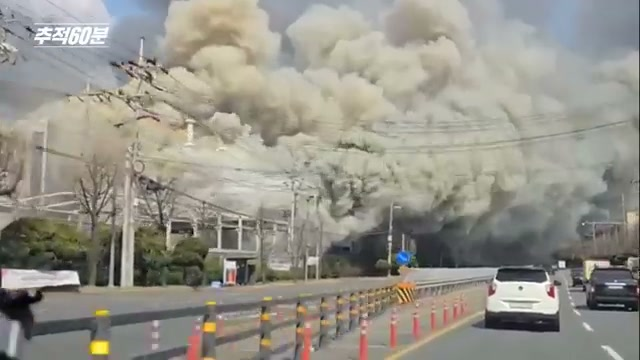

처음엔 또 하나의 화재 뉴스처럼 보였음.

공장에 불이 났고, 소방차가 출동했고, 화면에는 검은 연기가 올라왔다. 그런데 이 사고는 단순한 화재가 아니었음. 14명이 돌아오지 못했다. 더 무서운 건, 방송의 제목처럼 **“우리는 모두 알고 있었다”**는 점임.

조쉬가 묻는다고 생각해보자.

“사람들은 정말 몰랐을까요?”

답은 불편함.

몰랐던 게 아니라, 알고도 멈추지 못했음.

---

## 조쉬: 이 사고, 정확히 무슨 일이었나요?

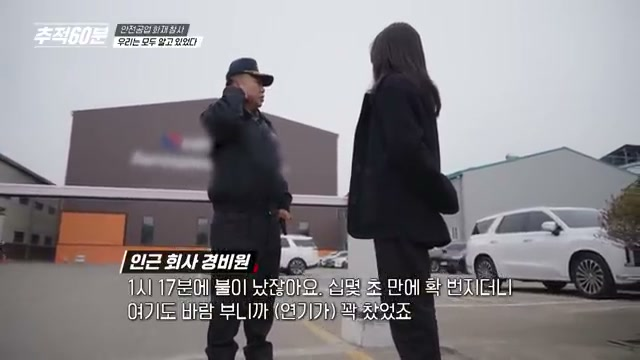

2026년 3월 20일 오후, 대전 대덕구의 자동차 부품 제조업체 안전공업 공장에서 큰불이 났다.

방송에 따르면 불은 순식간에 번졌다. 공장 내부에는 기름때, 배관, 위험물, 복잡한 구조물이 얽혀 있었다. 소방 인력과 장비가 대거 투입됐지만, 결과는 너무 참혹했다.

14명 사망.

숫자로 쓰면 짧다. 하지만 각 숫자 뒤에는 퇴근을 기다리던 가족, 아이, 배우자, 부모가 있었음.

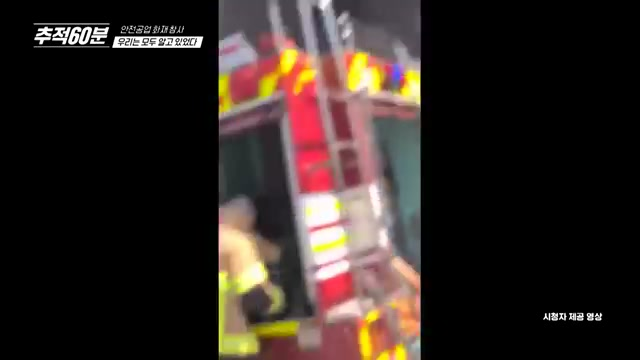

누군가는 창문으로 겨우 빠져나왔다. 누군가는 빠져나오지 못했다. 이 장면이 중요한 이유는 단순함. 화재에서 생사를 가른 것은 ‘운’이 아니라 **구조와 동선**이었기 때문임.

---

## 조쉬: 가족들은 어떤 시간을 보냈나요?

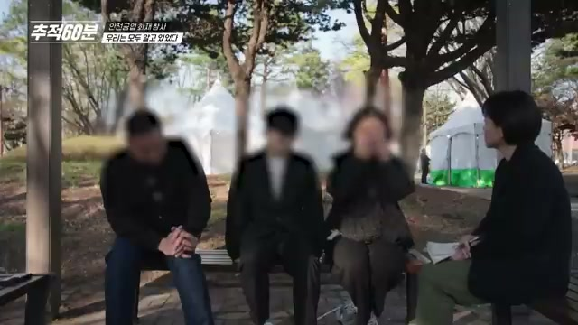

방송에서 가장 오래 남는 장면 중 하나는 유족 인터뷰였다.

다섯 살 막내는 아빠의 죽음을 아직 이해하지 못한다고 했다. 가족들은 “설마 못 나오겠어?” 하고 기다렸지만, 끝내 돌아오지 못했다.

이런 사고를 볼 때 자꾸 ‘안전관리’, ‘법 위반’, ‘소방 점검’ 같은 단어로 말하게 됨. 필요한 말이긴 하다. 근데 그 전에 이건 누군가의 아빠가 집으로 돌아오지 못한 사건임.

그래서 산업재해는 통계가 아니다.

가족의 시간이 끊기는 일임.

---

## 조쉬: 사고 당일, 왜 대피가 늦어졌나요?

방송과 관련 보도에서 반복해서 나온 쟁점은 **경보와 대피**였다.

화재 경보가 울렸지만 금방 꺼졌고, 일부 직원들은 평소 오작동처럼 여겼다고 한다. 이게 핵심임.

위험 신호가 위험 신호로 받아들여지지 않는 현장.

이건 시스템이 이미 망가져 있었다는 뜻이다. 경보기가 울리는 것보다 중요한 건, 사람들이 그 경보를 믿고 움직일 수 있어야 한다는 점임.

경보가 자주 오작동한다면 현장은 이렇게 학습한다.

“또 아니겠지.”

그리고 진짜 사고가 났을 때, 그 몇 초와 몇 분이 생사를 가른다.

---

## 조쉬: 방송은 공장 내부에서 무엇을 봤나요?

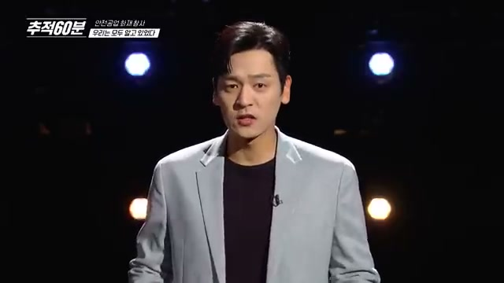

추적60분은 미공개 공장 내부 사진을 바탕으로 사고 원인을 추적했다.

여기서 중요한 건 한 가지임.

화재는 어느 날 갑자기 떨어진 재난이 아니었다.

현장은 오래전부터 위험 신호를 보내고 있었다. 노동자들은 불안감을 느꼈고, 공장에는 화재 위험 요소가 쌓여 있었고, 구조는 점점 더 복잡해졌다.

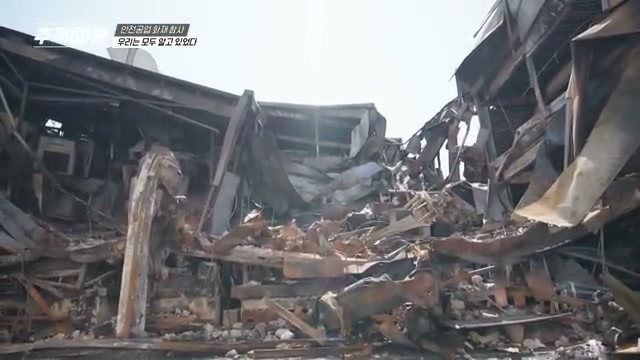

무너진 철골은 사고 이후의 장면이지만, 사실 사고 이전의 문제를 보여준다. 불이 난 뒤에야 구조가 보였다는 것. 살아 있을 때는 보이지 않던 위험이, 죽음 이후에야 증거가 되는 구조.

이게 반복되는 산업재해의 가장 잔인한 패턴임.

---

## 조쉬: 현장 위험은 구체적으로 뭐였나요?

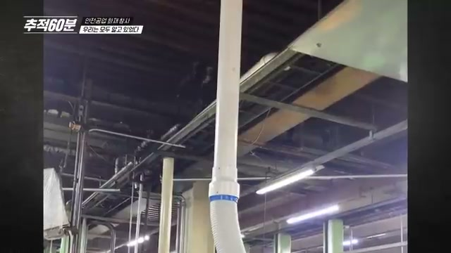

방송은 기름때, 배선, 구조물, 위험물 관리 문제를 함께 짚었다.

공장에서 기름을 쓰는 건 그 자체로 이상한 일이 아님. 문제는 그 기름이 얼마나 관리됐는가다. 기름때가 쌓이고, 환기가 부족하고, 배관이나 전선 주변에 위험 요소가 누적되면 불은 ‘한 지점’에서 끝나지 않는다.

불은 길을 찾는다.

기름때가 길이 되고, 배관이 길이 되고, 샌드위치 패널과 복잡한 구조물이 길이 된다.

그 결과, 사람에게 남는 길은 점점 사라진다.

---

## 조쉬: 왜 빠져나오기 어려웠나요?

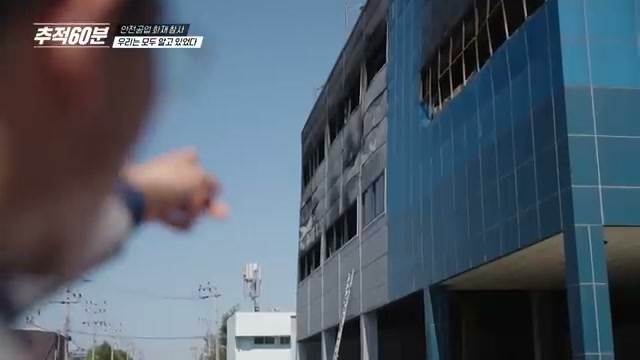

대피가 어려웠던 이유는 하나가 아니었다.

- 경보가 제대로 신뢰되지 않았음
- 연기와 불길이 빠르게 확산됐음
- 내부 구조가 복잡했음
- 일부 공간은 대피로가 충분하지 않았음
- 불법 증축·복층 구조 문제가 드러났음

재난은 보통 한 가지 원인으로 터지지 않는다. 작은 구멍들이 여러 겹 겹치다가, 어느 날 한꺼번에 열린다.

이 사고도 그랬다.

---

## 조쉬: 불법 증축이 왜 그렇게 위험한가요?

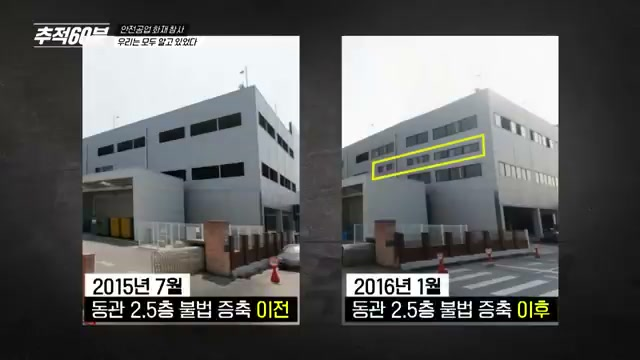

방송에서 가장 충격적인 대목 중 하나는 **서류상 없는 공간**이었다.

공간 효율을 높인다는 이유로 복층 구조물이 만들어졌고, 일부는 불법 증축으로 드러났다. 여기서 문제는 단순히 “허가를 안 받았다”가 아님.

도면에 없는 공간은 구조 대응에서 빠질 수 있다. 점검에서 놓칠 수 있다. 소방 계획에서 빠질 수 있다. 그리고 실제 화재가 나면, 그곳에 사람이 있다는 사실을 늦게 알 수 있다.

건축법 위반은 행정 서류 문제가 아니다.

불이 나면 생존 확률의 문제임.

---

## 조쉬: 나트륨 이야기는 왜 나왔나요?

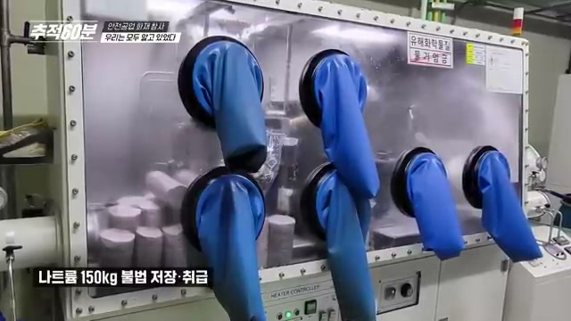

방송은 나트륨 취급 문제도 다뤘다. 자막에는 **허용 기준 15배에 해당하는 나트륨 적발** 내용이 나온다.

나트륨은 물과 격렬하게 반응할 수 있는 물질이다. 그래서 일반 화재처럼 “물을 뿌리면 된다”는 식으로 접근하기 어렵다. 위험물은 존재 자체보다 관리 방식이 중요함.

위험물을 쓰는 회사라면, 그 위험을 전제로 공간·소방·대피·교육 시스템을 더 촘촘하게 짜야 한다.

근데 현실은 반대였던 것처럼 보인다.

위험은 커졌는데, 안전은 따라오지 못했다.

---

## 조쉬: 이 사고가 더 무서운 이유는 뭔가요?

이 사고는 고립된 사건이 아니라는 점이다.

방송은 아리셀 참사와도 연결해 보여준다. 노동자들이 위험을 알고 있었고, 사고 전 신호가 있었고, 구조와 관리의 문제가 있었고, 사고 뒤에야 모두가 “왜 막지 못했나”라고 말하는 패턴.

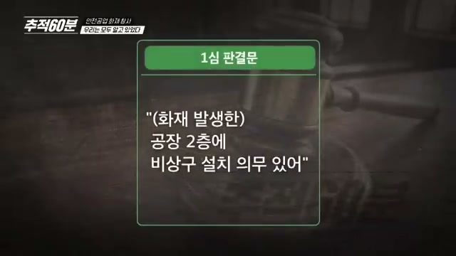

아리셀 참사 이후에도 질문은 같았다.

“왜 또 죽었나?”

그런데 질문이 반복된다는 건, 답도 반복해서 외면됐다는 뜻임.

중대재해처벌법이 생겼다. 점검도 있다. 신고도 있다. 보도도 있다. 하지만 현장에서 실제로 바뀌지 않으면 법은 종이 위에서만 존재한다.

---

## 조쉬: 그럼 결국 누구 책임인가요?

책임을 한 사람에게만 몰아가면 편하다.

“그 회사가 문제였다.”

맞는 말일 수 있다. 하지만 거기서 멈추면 다음 사고를 못 막는다.

이 사고의 질문은 더 커야 한다.

- 위험 신고는 왜 충분히 작동하지 않았나?
- 소방 점검은 왜 핵심 위험 공간을 놓쳤나?
- 불법 증축은 왜 사고 전까지 방치됐나?
- 노동자가 위험을 말했을 때 왜 실제 개선으로 이어지지 않았나?
- 경영진에게 안전은 비용이었나, 생명이었나?

사고는 현장에서 났지만, 사고를 만든 조건은 훨씬 넓게 퍼져 있었다.

---

## 내가 작게나마 한 일

뉴스를 보고 마음이 무거웠다. 그래서 작게나마 기부를 했다.

사진 속 내역은 하나은행에서 사회복지공동모금회 쪽으로 보낸 기부 기록이다. 금액은 **1,000,000원**.

솔직히 이걸 올리는 게 조심스럽다. 기부를 자랑하려는 글처럼 보일까 봐. 그래도 넣는 이유는 하나다.

이런 참사는 보고 분노하는 데서 끝나면 너무 빨리 잊힌다. 누군가는 기록하고, 누군가는 말하고, 누군가는 제도를 바꾸라고 요구하고, 누군가는 가능한 방식으로 유가족과 피해자 곁에 서야 한다.

내가 한 일은 아주 작다.

하지만 아무것도 하지 않는 것보다는 낫다고 믿는다.

---

## 조쉬: 마지막으로, 이 사건을 어떻게 기억해야 할까요?

“우리는 모두 알고 있었다.”

이 말은 누군가를 비난하기 위한 문장이기도 하지만, 동시에 우리 사회 전체에 던지는 질문이다.

위험을 알았을 때 멈출 수 있는가.

노동자가 불안하다고 말했을 때 들을 수 있는가.

비용이 생명보다 앞서려 할 때 제동을 걸 수 있는가.

화재는 2026년 3월 20일에 났다. 하지만 참사의 재료는 그보다 훨씬 오래전부터 쌓이고 있었다.

그래서 이 사고는 한 공장의 화재가 아니다.

안전이 비용으로 밀려날 때, 어느 현장에서든 다시 일어날 수 있는 일이다.

다시는 “알고 있었다”는 말을 사고 뒤에 하지 않았으면 좋겠다.

알았으면, 그 전에 멈춰야 한다.

---

## 참고한 자료

- KBS 추적60분 1454회, [「안전공업 화재 참사 - 우리는 모두 알고 있었다」](https://youtu.be/86OsJPDCgIo)
- SBS 보도: 안전공업 화재 경보기·위험물 관련 보도
- 한겨레 보도: 불법 증축 및 대피 구조 관련 보도
- KBS 뉴스 및 관련 언론 보도

