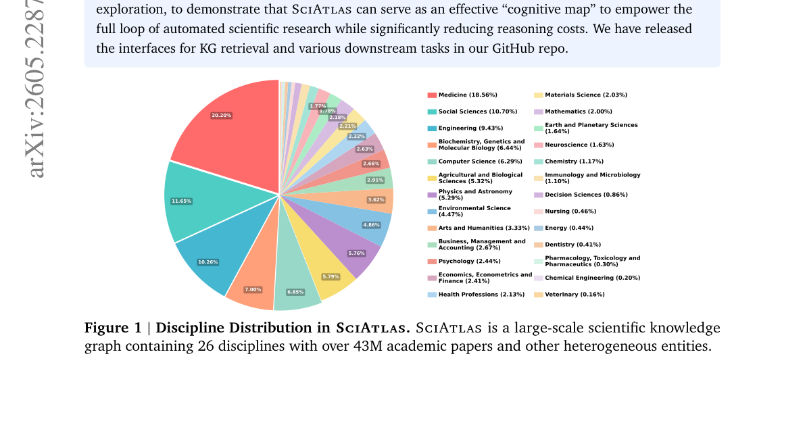
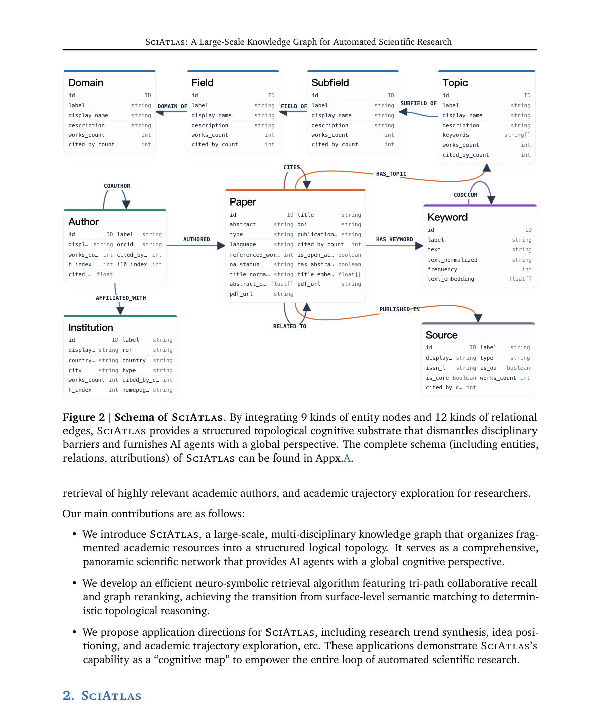

요즘 AI로 논문 검색하다 보면 비슷한 좌절을 만남. Semantic Scholar, Google Scholar 같은 도구는 키워드나 벡터 유사도로 논문을 찾아줌. 비슷한 논문은 잘 찾는데, "이 연구가 어디서 왔고 어디로 가는지"는 못 봄. 인용망, 개념의 진화, 학제간 연결 같은 구조적 관계가 빠져 있음.

1. Deep Research 에이전트들(OpenScholar, AlphaXiv 같은)이 이걸 보완하려고 반복 검색을 돌리는데, LLM을 여러 번 호출하니 비싸고 느리고, 확실한 "인지 지도"가 없으니 복잡한 탐색 경로에서 논리적 환각(hallucination)에 빠지기도 함.

2. 절강대 ZJUNLP 연구진이 이 문제를 근본적으로 접근함. **SciAtlas** — 논문 4,330만 편, 저자 1억 970만 명, 키워드 376만 개, 기관 12만 개를 30억 개의 관계 엣지로 엮은 대규모 학술 지식그래프를 만듦.

3. 단순히 논문을 모아놓은 게 아님. 9종류의 개체 노드(Paper, Author, Institution, Keyword, Source, Topic, Field, Subfield, Domain)와 12종류의 관계 엣지(CITES, AUTHORED, COAUTHOR, HAS_KEYWORD, COOCCUR 등)로 구성된 스키마를 설계함.

4. 논문이 네 가지 층위로 엮임. **의미 층**(인용·관련성), **개념 층**(키워드 공동출현), **방향 층**(Domain > Field > Subfield > Topic 계층), **사회 층**(공동저자·소속기관). 이 네 층이 겹치면서 학제간 연결이 자동으로 드러남.

## 데이터는 어디서 오는가

5. 데이터 소스는 **OpenAlex**. 4억 8,000만 편의 학술 출판물을 담은 완전 오픈소스 라이브러리. 각 논문에 저자, 초록, 기관, 출판일, 인용 수, 주제, PDF URL 같은 메타데이터가 포함돼 있음.

6. 그대로 쓰진 않음. 정규화, 중복 제거, 비영어 논문 필터링, 초록이 너무 짧은 논문 제거를 거침. 저자는 동명이인 문제 때문에 중복 제거를 하지 않는 게 흥미로움.

7. 핵심 공정 하나가 **키워드 추출**. OpenAlex 자체 Concept 엔티티가 6만 5천 개뿐이라 너무 희소하고 "artificial intelligence" 같은 거시적 수준에 머물러 있음. 그래서 Qwen3-30B-A3B-Instruct-2507을 써서 초록에서 논문별로 3~8개 핵심 키워드를 직접 뽑음.

8. 프롬프트 설계가 재밌음. "논문 고유의 용어나 시스템 이름은 피하고, 여러 논문에 재사용 가능한 기본적인 표현을 우선하라"고 지시함. "protein structure prediction"은 좋은 키워드, "hierarchical dual-path adaptive learning framework"는 나쁜 키워드라고 명시적으로 예시를 줌. 요즘 논문들이 과장된 서술(packaging)으로 본질을 가린다는 걸 인지하고 있다는 뜻.

9. 임베딩은 bge-large-en-v1.5로 논문 제목, 초록, 키워드 세 필드에 대해 미리 계산해둠. 검색 시점이 아니라 색인 시점에 계산해두는 접근. 최종적으로 Neo4j에 배포함.

## Neuro-Symbolic 검색: 키워드 + 벡터 + 그래프

10. 여기가 이 논문의 핵심임. 기존 검색이 키워드 매칭이나 벡터 유사도 하나로 끝나는 거라면, SciAtlas는 세 경로를 병렬로 돌려서 그래프 위에서 재랭킹함.

11. **첫째 경로 — 키워드 매칭**: LLM이 쿼리에서 키워드를 뽑고 중요도 점수를 매김. KG에서 정확 매칭과 벡터 매칭을 동시에 돌림. 유사도 임계값(0.7)을 넘는 상위 3개 노드까지 후보로 잡음. 여러 키워드가 같은 노드를 가리키면 최댓값을 취함.

12. **둘째 경로 — 시맨틱 매칭**: 쿼리를 임베딩해서 KG 내 논문 상위 60개를 검색. bge-reranker-large로 재랭킹해 상위 15개를 남김. 입력이 논문 전체면 초록만 뽑아서 임베딩.

13. **셋째 경로 — 타이틀 매칭**: GROBID로 쿼리에서 논문 제목을 추출하고 퍼지 매칭. 시퀀스 매칭(0.65) + 토큰 오버랩(0.35) 가중 합.

14. 세 경로의 후보를 MinMax 정규화로 합친 뒤, 2-hop 서브그래프 전파를 돌림. 논문 중요도는 인용 수의 로그 스케일로 정의. 여기에 Random Walk with Restart(RWR)를 돌려서 토폴로지적 깊이 추론을 함.

15. 최종 점수는 초기 관련성(35%), 그래프 토폴로지 지지(45%), 인용 중요도(20%)의 가중 선형 결합. 엣지 가중치도 세밀하게 설정돼 있음 — CITES가 1.00, RELATED_TO가 0.90, AUTHORED가 0.80, COAUTHOR와 COOCCUR이 각각 0.60.

16. 핵심 차이는 LLM을 여러 번 호출하지 않는다는 것. 그래프 구조 자체가 인지 지도 역할을 해서, 확정적(deterministic)인 연관 관계 발견이 가능함. Deep Research 에이전트처럼 반복적으로 LLM을 호출하면서 환각에 빠지는 문제를 회피하는 구조.

## 활용 시나리오 6가지

17. **문헌 리뷰**: 학회·저자·기관별 권위도를 기준으로 맞춤형 검색. 단순 키워드가 아니라 그래프 구조를 활용해 관련 논문 네트워크를 탐색.

18. **아이디어 포지셔닝**: 새로운 연구 아이디어를 입력하면, 기존 연구와의 유사성·차이점을 자동으로 분석. 선행 연구와의 차별성을 객관적으로 평가할 수 있음.

19. **아이디어 생성**: 서로 다른 도메인의 개념을 그래프 위에서 연결해 새로운 연구 방향을 제안. 학제간 융합 연구를 찾을 때 특히 유용.

20. **연구 트렌드 예측**: 시간에 따른 발전 궤적을 KG 위에서 요약. 어느 분야가 어디로 가는지 구조적으로 파악.

21. **관련 저자 검색**: 인용 수와 저자 순서를 기준으로 쿼리와 관련성이 높은 연구자를 랭킹. 협업자를 찾을 때 유용.

22. **연구자 프로파일링**: 한 연구자의 논문을 클러스터링해서 통합 프로필을 생성. 단순히 논문 리스트가 아니라 연구 궤적을 보여줌.

## 한계와 방향

23. 아직 Neo4j 인터페이스가 주라서 CLI 도구와 에이전트 스킬을 추가할 계획임. 원자적 지식, 정리, 코드, 데이터셋까지 KG에 통합하겠다는 로드맵도 제시.

24. 업데이트 방식은 두 가지. OpenAlex API로 실시간 추가, 또는 2개월 단위 changefile로 주기적 갱신. GROBID로 PDF에서 메타데이터를 뽑는 대안도 제공함.

25. 벤치마크와 평가가 아직 부족함. 에이전트 과학자(agent scientist)를 정량 평가할 전용 벤치마크를 만들겠다고 함.

## 왜 중요한가

26. 요즘 "AI로 과학 연구 자동화"가 유행어가 됐는데, 대부분 LLM에 검색 결과를 여러 번 먹이면서 추론을 돌리는 구조임. 비싸고, 느리고, 환각에 취약함. SciAtlas는 다른 접근을 함 — 검색 대상 자체를 구조화된 그래프로 만들어서, LLM 없이도 확정적 연관 관계를 찾을 수 있게 만듦.

27. 물론 4,300만 편 논문을 Neo4j에 올리는 건 가볍지 않은 인프라 작업임. 개인 연구자가 로컬에서 돌리기엔 무거움. 하지만 그래프 기반 학술 검색이 어느 방향으로 가야 하는지를 명확하게 보여주는 설계라 평가할 수 있음.

28. GitNexus가 코드베이스를 지식그래프로 만들어 코딩 에이전트에 먹이는 거라면, SciAtlas는 논문 전체를 지식그래프로 만들어 연구 에이전트에 먹이는 거임. 같은 방향의 다른 적용. 그래프 구조 자체가 "인지 지도"가 되어 준다는 관점이 두 프로젝트의 공통된 통찰.

---

**참고자료**
- [SciAtlas: A Large-Scale Knowledge Graph for Automated Scientific Research (arXiv 2605.22878)](https://arxiv.org/abs/2605.22878)
- [GitHub: zjunlp/SciAtlas](https://github.com/zjunlp/SciAtlas)
