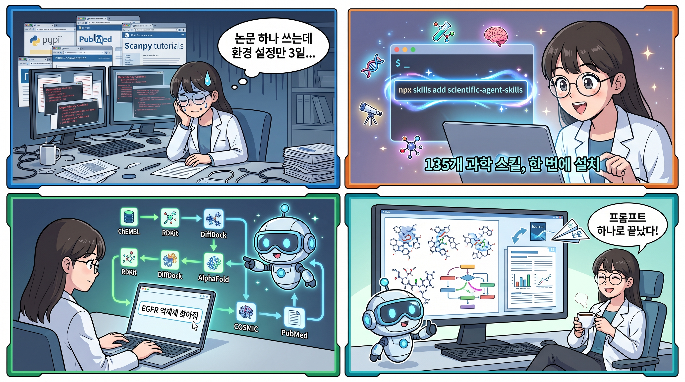

> K-Dense가 공개한 **Scientific Agent Skills**는 Cursor, Claude Code, Codex, Gemini CLI 등 AI 코딩 에이전트를 연구 파트너로 만들어주는 135개 스킬 컬렉션이다. 생물정보학부터 신약 개발, 임상 연구, 천문학까지 — 복잡한 다단계 과학 워크플로를 프롬프트 하나로 실행할 수 있게 해준다.



---

## 문제의식: 연구자의 시간은 어디서 사라지나

과학 연구에 AI를 도입하려는 연구자들이 겪는 공통된 문제:

- **환경 설정에 며칠을 쓴다** — 패키지 의존성 충돌, API 문서 탐색, 데이터베이스 연동 설정
- **단일 도구만 쓴다** — 모르는 패키지는 안 쓰게 되고, 결과적으로 워크플로가 단편적이다
- **멀티스텝 파이프라인이 어렵다** — ChEMBL 검색 → RDKit 분석 → DiffDock 도킹 → 리포트 생성을 하나로 묶는 게 거의 불가능하다

Scientific Agent Skills는 이 간극을 메운다. **AI 에이전트가 이미 아는 것의 범위를 크게 넓혀서, 프롬프트 하나로 복잡한 과학 워크플로를 실행할 수 있게 만드는 것.**

---

## 135개 스킬, 무엇이 들어있나

### 100개 이상의 과학·금융 데이터베이스

통합 database-lookup 스킬 하나로 78개 공개 데이터베이스에 직접 접근한다: PubChem, ChEMBL, UniProt, COSMIC, ClinicalTrials.gov, FRED, USPTO 등. 여기에 DepMap, Imaging Data Commons, PrimeKG, Hugging Science(17개 과학 도메인의 데이터셋·모델·데모 카탈로그) 같은 전용 스킬이 추가된다.

BioServices(~40개 생물정보학 서비스), BioPython(Entrez를 통한 38개 NCBI 하위 데이터베이스), gget(20개 이상 유전체 데이터베이스) 같은 멀티 데이터베이스 패키지도 포함.

### 70개 이상의 최적화된 Python 패키지 스킬

RDKit, Scanpy, PyTorch Lightning, scikit-learn, BioPython, PennyLane, Qiskit, OpenMM, MDAnalysis, scVelo, TimesFM 등 — 큐레이션된 문서, 예제, 모범 사례를 포함.

에이전트가 어떤 Python 패키지든 쓸 수 있지만, 이 스킬들이 정의된 패키지는 **더 강하고 더 안정적인 성능**을 보여준다.

### 17개 과학 도메인

| 도메인 | 예시 |
|--------|------|
| 🧬 생물정보학 & 유전체학 | 시퀀스 분석, 단일세포 RNA-seq, 유전자 조절 네트워크 |
| 🧪 화학정보학 & 신약 개발 | 분자 속성 예측, 가상 스크리닝, ADMET 분석, 도킹 |
| 🔬 단백질체학 & 질량분석 | LC-MS/MS 처리, 펩타이드 식별, 단백질 정량 |
| 🏥 임상 연구 & 정밀의료 | 임상시험, 약물유전체학, 치료 계획 |
| 🧠 헬스케어 AI | EHR 분석, 의료 영상, 임상 예측 모델 |
| 🖼️ 의료 영상 & 디지털 병리 | DICOM 처리, 전체 슬라이드 이미지 분석 |
| 🤖 머신러닝 & AI | 딥러닝, 강화학습, 베이지안 방법 |
| 🔮 재료과학 | 결정 구조 분석, 상태도, 대사 모델링 |
| 🌌 물리 & 천문학 | 천체 데이터 분석, 좌표 변환, 우주론 계산 |
| ⚙️ 엔지니어링 & 시뮬레이션 | 이산사건 시뮬레이션, 다목적 최적화 |
| 📊 데이터 분석 & 시각화 | 통계, 네트워크, 시계열, 출판 품질 도표 |
| 🌍 지리공간 & 원격탐사 | 위성 영상, GIS, 공간 통계 |
| 🧪 실험실 자동화 | 액체 핸들링, 장비 제어, LIMS 연동 |
| 📚 과학 커뮤니케이션 | 문헌 리뷰, 피어 리뷰, 논문 작성, 포스터 |
| 🔬 멀티오믹스 & 시스템생물학 | 다중 모달 데이터 통합, 경로 분석 |
| 🧬 단백질 엔지니어링 | 단백질 언어모델, 구조 예측, 서열 설계 |
| 🎓 연구 방법론 | 가설 생성, 과학적 브레인스토밍, 연구비 작성 |

---

## 실전 예시: 프롬프트 하나로 신약 개발 파이프라인

가장 인상적인 건 **다단계 워크플로를 하나의 프롬프트로 실행**하는 것이다.

**목표**: EGFR 억제제 발굴 (폐암 치료)

**프롬프트 하나로 실행되는 파이프라인**:

1. ChEMBL에서 EGFR 억제제 쿼리 (IC50 < 50nM)
2. RDKit으로 구조-활성 관계 분석
3. datamol로 개선된 유사체 생성
4. DiffDock으로 AlphaFold EGFR 구조에 가상 스크리닝
5. PubMed에서 내성 메커니즘 검색
6. COSMIC에서 돌연변이 확인
7. 시각화 및 종합 리포트 생성

**사용된 스킬**: ChEMBL, RDKit, datamol, DiffDock, AlphaFold DB, PubMed, COSMIC, 과학 시각화

이 정도 파이프라인을 수동으로 구성하면 며칠이 걸린다. Scientific Agent Skills를 설치한 에이전트에게는 **프롬프트 하나**면 충분하다.

---

## 설치 방법

### 방법 1: npx (모든 플랫폼)

```bash
npx skills add K-Dense-AI/scientific-agent-skills
```

### 방법 2: GitHub CLI (v2.90.0+)

```bash
gh skill install K-Dense-AI/scientific-agent-skills
```

특정 에이전트를 지정할 수도 있다:

```bash
gh skill install K-Dense-AI/scientific-agent-skills --agent cursor
gh skill install K-Dense-AI/scientific-agent-skills --agent claude-code
```

### 사전 요구사항

- Python 3.11+ (3.12+ 권장)
- uv (Python 패키지 매니저)
- Agent Skills 표준을 지원하는 클라이언트 (Cursor, Claude Code, Codex, Gemini CLI 등)
- macOS, Linux, 또는 WSL2가 설치된 Windows

---

## 보안: 스킬이 강력한 만큼 주의도 필요

스킬은 AI 에이전트에게 임의 코드를 실행하고, 패키지를 설치하고, 네트워크 요청을 보낼 수 있는 권한을 준다. K-Dense는 다음 조치를 취하고 있다:

- 모든 기여는 리뷰 프로세스를 거침
- Cisco AI Defense Skill Scanner로 매주 보안 스캔 실행
- [SECURITY.md](https://github.com/K-Dense-AI/scientific-agent-skills/blob/main/SECURITY.md)에 최신 결과 공개

사용자 측의 권장 사항:

- 필요한 스킬만 설치할 것
- 설치 전 SKILL.md를 읽을 것
- 커뮤니티 기여 스킬은 기여 이력을 확인할 것
- 제3자 스킬은 로컬에서 스캔할 것

---

## K-Dense 생태계

Scientific Agent Skills는 K-Dense 생태계의 핵심이다:

|  | 이 리포지토리 | K-Dense Web | K-Dense BYOK |
|--|---------------|-------------|--------------|
| 스킬 | 135개 | 200개 이상 | 135개 |
| 설정 | 수동 설치 | 제로 설정 | 직접 API 키 |
| 컴퓨트 | 내 컴퓨터 | 클라우드 GPU 포함 | 내 컴퓨터 + Modal |
| 출력 | 코드와 분석 | 출판 준비 완료 리포트 | 코드와 분석 |
| 가격 | 무료 (MIT) | 무료 시작 | 무료 (오픈소스) |

---

## 생각할 점

### 강점

- **범위의 압도적 넓이**: 17개 과학 도메인, 135개 스킬, 100개 이상 데이터베이스를 단일 컬렉션으로 제공
- **Agent Skills 표준 준수**: 특정 에이전트에 종속되지 않고 개방형 표준 사용
- **실전 예제 풍부**: 각 스킬에 SKILL.md, 코드 예제, 모범 사례 포함
- **보안 의식**: 주간 스캔, 기여 리뷰, 책임 있는 설치 가이드

### 한계

- **커뮤니티 기여 품질 편차**: K-Dense 직접 작성 스킬과 커뮤니티 스킬 간 리뷰 깊이 차이
- **GPU 워크로드**: 로컬 환경에서는 계산 집약적 스킬(가상 스크리닝, 분자 동역학 등) 실행에 한계
- **생태계 종속성**: Agent Skills 표준 자체가 초기 단계

---

## 링크

- **GitHub**: [github.com/K-Dense-AI/scientific-agent-skills](https://github.com/K-Dense-AI/scientific-agent-skills)
- **K-Dense 공식**: [k-dense.ai](https://k-dense.ai)
- **K-Dense BYOK**: [github.com/K-Dense-AI/k-dense-byok](https://github.com/K-Dense-AI/k-dense-byok)
- **시작하기 영상**: [YouTube 튜토리얼](https://youtu.be/ZxbnDaD_FVg)
- **Agent Skills 표준**: [agentskills.io](https://agentskills.io/)
- **X/Twitter**: [@k_dense_ai](https://x.com/k_dense_ai)

---

과학 연구에 AI를 쓰고 싶은데 "어디서부터 시작해야 할지" 막막했다면, Scientific Agent Skills가 가장 실용적인 출발점이 될 수 있다. 135개 스킬을 한 번에 설치하고, 프롬프트 하나로 EGFR 억제제를 찾거나 단일세포 RNA-seq을 분석하는 시대. 환경 설정보다 연구 자체에 시간을 쓸 수 있게 만든다는 점에서, 분명 주목할 만한 방향이다.
