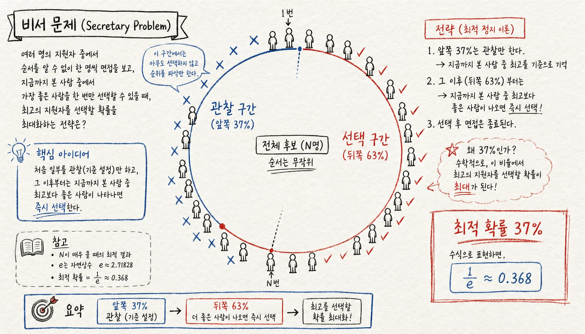

선택의 순간은 항상 불편하다.

지금 이 후보가 최선인지 모른 채 결정해야 하고, 한번 거절하면 돌아올 수 없음.

수학은 이 상황에 명쾌한 답을 냄. **전체의 37%만 보고 나머지에서 골라라.**

---

1. **비서 문제란**

면접관이 N명의 지원자를 순서대로 면접한다. 규칙은 단 두 가지.

- 매 면접 직후 합/불합을 즉시 결정해야 함
- 한번 탈락시킨 사람은 다시 부를 수 없음

목표는 N명 중 가장 뛰어난 사람을 뽑는 것. 몇 번째 사람에서 결정을 내려야 최선이냐는 게 핵심 질문임.

'비서 문제'라는 이름 외에도 결혼 문제(marriage problem), 술탄의 지참금 문제(sultan's dowry problem), 구글 게임(googol game) 등으로도 불림.

2. **37% 규칙**

최적해는 생각보다 단순함.

처음 N × 37% 명은 무조건 탈락시키되 기준으로만 사용함. 그 이후엔 앞서 본 사람들보다 더 뛰어난 첫 번째 사람을 즉시 선택함.

37%는 수학 상수 1/e(= 1/2.718... ≈ 0.368)에서 나옴.

이 전략을 따르면 최고 후보를 뽑을 확률이 정확히 **약 37%**가 됨. 랜덤하게 고를 때보다 훨씬 높고, 이론적으로 이 이상은 불가능함.

3. **왜 37%인가**

N명 중 최고를 뽑을 확률을 수식으로 정리하면 관찰 구간 k를 어디서 끊느냐에 따라 달라짐.

k/N → 1/e일 때 확률이 최대가 됨. N이 커질수록 최적 비율은 정확히 1/e에 수렴함.

N = 10이면 4번째 이후부터 선택.
N = 100이면 37번째 이후부터 선택.
N이 무한히 크면 정확히 앞 36.8%를 관찰 구간으로 씀.

4. **현실 적용**

이 문제는 수학 퍼즐이 아님. 실제 의사결정에서 같은 구조가 반복됨.

집 구하기 — 집은 보통 그 자리에서 계약 여부를 말해야 함. 처음 몇 개는 시장 감각을 익히는 용도로만 보고, 이후 최선의 집이 나오면 바로 잡는 게 수학적으로 맞음.

연애 — 평생 만날 사람의 수를 예상하고 37% 구간이 끝나는 나이 이후부터 진지하게 결정하라는 적용도 있음. (물론 현실은 훨씬 복잡함)

채용 — 면접관이 처음 몇 명은 기준 설정용으로 보고, 이후 그 기준을 넘는 첫 후보를 채용하는 방식이 37% 규칙과 정확히 일치함.

5. **한계**

현실과 다른 전제 두 가지가 있음.

첫째, 후보들이 완전히 순위를 매길 수 있어야 함. 현실에서 사람 비교는 그렇게 단순하지 않음.

둘째, 한번 거절하면 돌아올 수 없다는 전제. 실제로는 다시 연락하거나 오퍼를 되살리는 경우가 있음.

그래도 이 문제가 강력한 이유는 불확실한 순차적 선택에서 탐색(exploration)과 활용(exploitation)의 균형을 수학적으로 보여주기 때문임.

6. **핵심**

너무 빨리 고르면 더 나은 선택을 놓치고, 너무 늦게 고르면 기회를 날림.

37%가 그 균형점임.

관찰에 써야 할 시간과 결정에 써야 할 시간을 구분하는 것 — 이게 비서 문제가 알려주는 것임.

---

*참고: Secretary problem, Wikipedia — Optimal stopping theory 분야*
