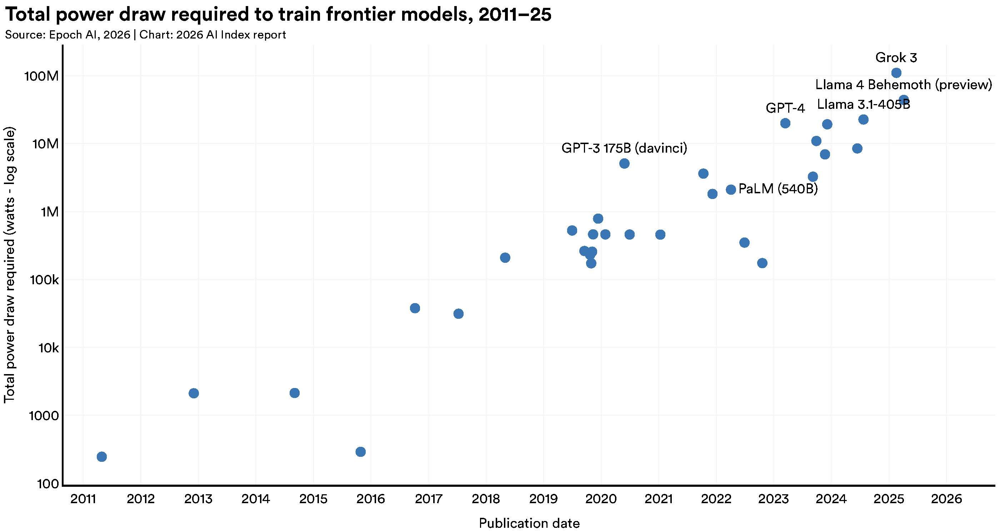
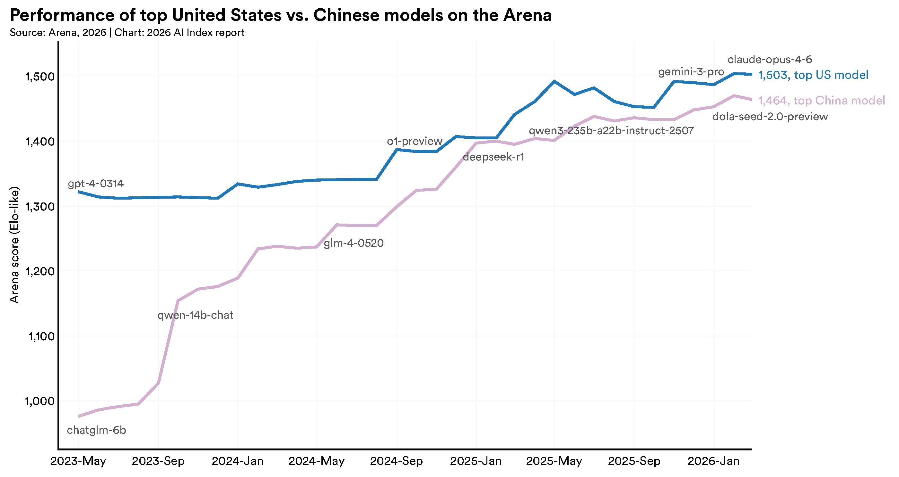
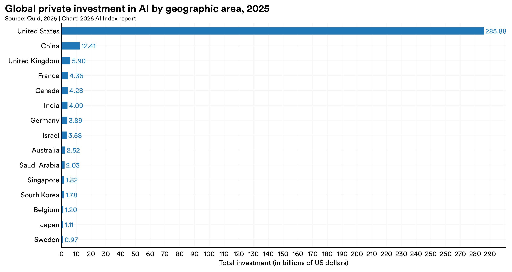
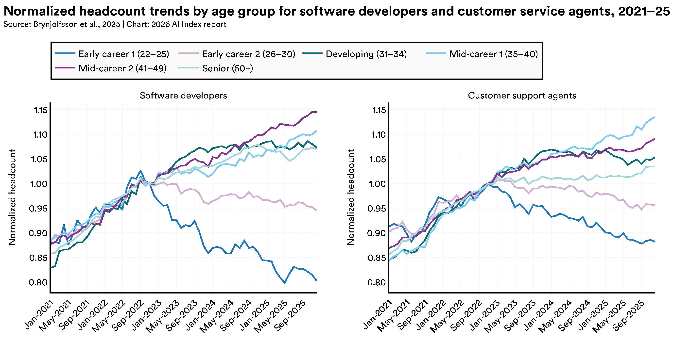
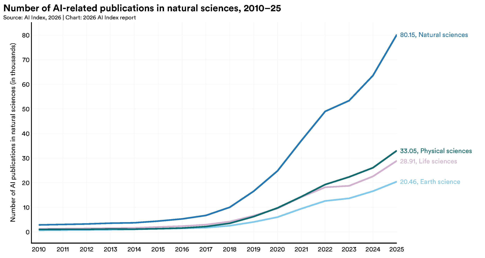
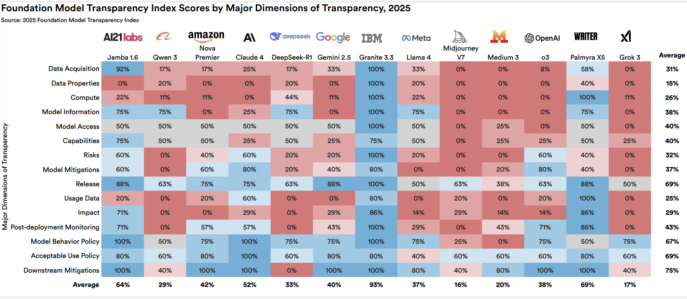
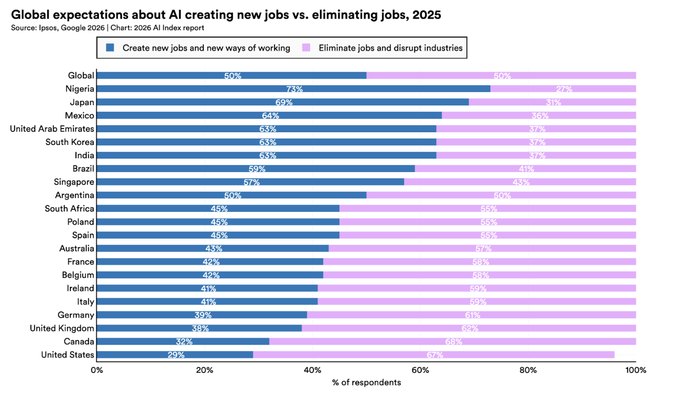
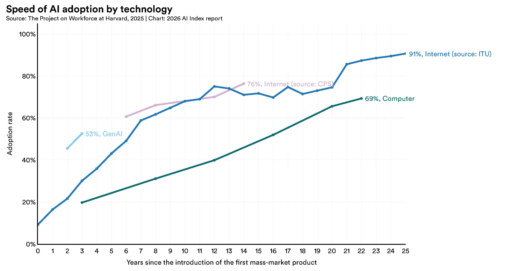
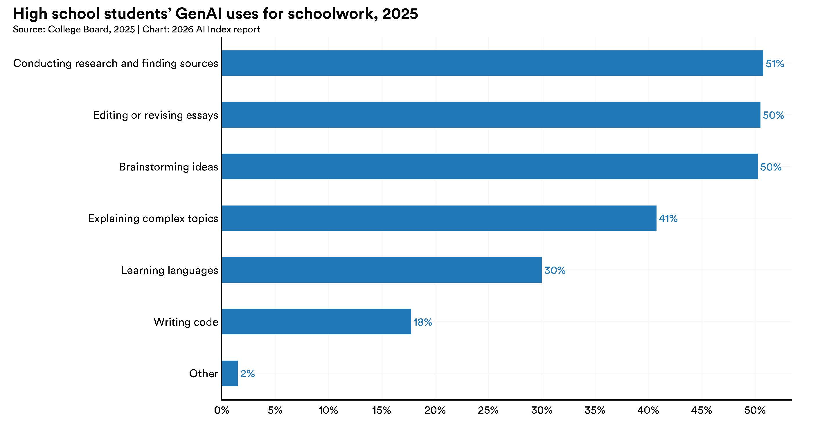
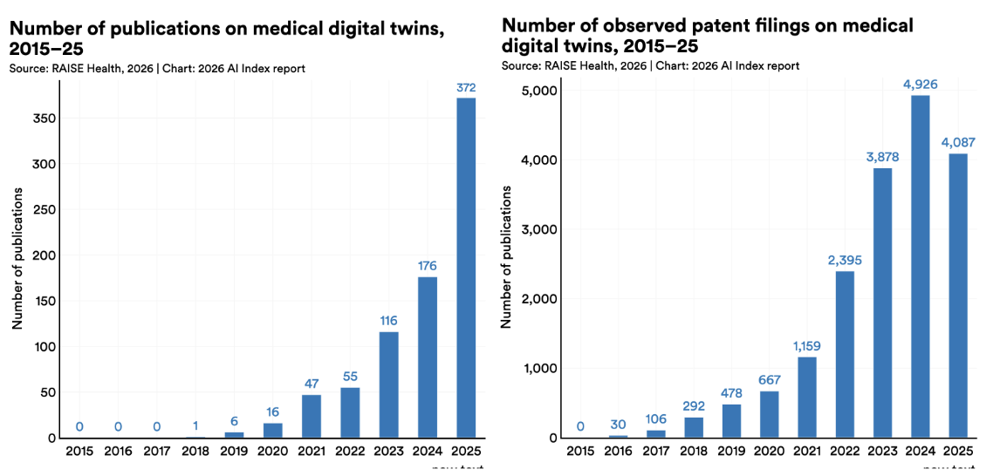

> 원문: [Inside the AI Index: 12 Takeaways from the 2026 Report](https://hai.stanford.edu/news/inside-the-ai-index-12-takeaways-from-the-2026-report)  
> 출처: Stanford HAI

스탠퍼드 HAI가 공개한 **AI Index 2026**은 지금 AI가 어디까지 왔는지, 무엇이 빨라지고 무엇이 흔들리는지를 아주 압축적으로 보여주는 자료입니다. 원문은 짧지만 밀도가 높아서, 이번 글에서는 **원문 흐름을 유지한 채 한국어로 번역하고**, 각 항목이 왜 중요한지도 함께 풀어보겠습니다.

원문의 첫 문장은 이 분위기를 잘 보여줍니다.

> 올해 AI Index 보고서는 AI의 능력은 빠르게 진전하고 있지만, 그것을 측정하고 관리하는 우리의 능력은 그만큼 따라가지 못하고 있음을 보여준다.

Stanford HAI가 학계와 산업계 전문가 운영위원회와 함께 만든 이 보고서는 2017년부터 AI의 기술 성능, 연구 생산성, 사회적 영향, 대중 인식까지 추적해 왔습니다. 이번 2026년판은 특히 **과학적 성과, 환경 비용, 인재 이동, 노동시장 충격, 투명성 저하**를 함께 묶어 보여준다는 점에서 인상적입니다.

아래부터는 원문 12개 포인트를 순서대로 옮기고, 필요한 곳에 짧은 해설을 덧붙였습니다.

---

## 1. 전기를 먹는 모델들 (Power-Hungry Models)

AI의 성능이 좋아질수록 환경 부담도 커집니다. Grok 4의 추정 학습 배출량은 **CO2 환산 72,816톤**에 이르렀는데, 이는 자동차 **1만 7천 대를 1년간 운행**할 때의 온실가스 배출량과 비슷한 수준입니다. AI 데이터센터 전력 용량은 **29.6GW**까지 올라, 최대 수요 시 미국 뉴욕주 전체를 가동하는 데 필요한 전력과 맞먹습니다. 또한 GPT-4o의 연간 추론용 물 사용량만으로도 **1,200만 명의 식수 수요**를 넘길 수 있다는 추정이 나옵니다.

쉽게 말해, 올인원 AI 시스템 전체의 누적 전력 수요는 **스위스나 오스트리아의 국가 전력 소비량**과 비교될 정도입니다.

이 대목은 교육 현장에서도 중요합니다. “AI가 똑똑해진다”는 이야기만 하면 반쪽짜리 이해가 됩니다. 이제는 **성능과 지속가능성**을 같이 가르쳐야 합니다.

---

## 2. 중국과 미국, 격차가 거의 사라지다 (China/US: The Lead Evaporates)

오랫동안 미국은 모델 규모, 성능, 연구, 인용 등 여러 지표에서 다른 지역을 앞서 왔습니다. 하지만 이제 중국이 미국의 강력한 대항축으로 올라오면서, **미국 우위가 거의 사라진 수준**에 이르렀다고 보고서는 말합니다.

2025년 초 이후 미국과 중국 모델은 성능 순위 최상단을 여러 차례 주고받았습니다. 2025년 2월에는 DeepSeek-R1이 잠시 미국 최상위 모델과 어깨를 나란히 했고, 2026년 3월 기준 Anthropic의 최상위 모델 리드도 **2.7%포인트**에 불과했습니다.

다만 미국은 여전히 **상위권 모델 수와 고영향 특허**에서 앞서고, 중국은 **논문 수, 인용 수, 특허 총량, 산업용 로봇 설치**에서 앞섭니다.

즉, 이제 AI 경쟁은 “미국 독주”보다 **양강 체제의 정교한 경쟁**으로 보는 편이 맞습니다.

---

## 3. 미국의 인재 흡인력이 약해지고 있다 (America’s Draw Fades)

미국은 여전히 세계에서 가장 많은 AI 연구자와 개발자가 모여 있는 나라입니다. 하지만 **미국으로 유입되는 AI 인재 흐름은 급격히 둔화**하고 있습니다. 미국으로 이동하는 AI 학자는 2017년 이후 **89% 감소**했고, 최근 1년만 놓고 봐도 **80% 감소**했습니다.

이 변화는 단순한 통계가 아니라, 앞으로의 연구 생태계와 산업 주도권에도 영향을 줄 수 있습니다. 돈만 많다고 인재가 계속 몰리는 시대가 아니라는 뜻입니다.

---

## 4. 수학 올림피아드는 풀지만, 시계는 잘 못 본다 (AI Can Win a Mathematical Olympiad But Can’t Tell Time)

AI는 전반적으로 더 많은 벤치마크에서 더 높은 점수를 받고 있습니다. 최전선 모델은 이제 **박사급 과학 문제, 멀티모달 추론, 경시 수학** 같은 항목에서 인간 수준에 도달하거나 넘어섰습니다. 실제 업무 과제를 수행하는 에이전트 성공률은 Terminal-Bench 기준 **2025년 20%에서 77.3%**로 크게 뛰었고, 사이버보안 문제 해결 에이전트는 **2024년 15%에서 93%** 수준까지 올라왔습니다.

하지만 모든 능력이 고르게 성장하는 것은 아닙니다. AI는 여전히 **영상으로부터 학습하기, 일관되고 현실적인 영상 생성, 시계 읽기, 다단계 계획 수립, 금융 분석, 일부 전문가급 시험**에서는 약점을 보입니다. 로봇도 가정 내 실제 집안일에서는 아직 멉니다. 빨래 개기나 설거지 같은 과업의 성공률은 **12%** 수준에 그칩니다.

이 부분은 “AI가 다 한다”는 과장과 “아직 멀었다”는 반발이 동시에 왜 나오는지를 잘 설명해줍니다. 둘 다 일부는 맞습니다.

---

## 5. AI 투자 급증 (The AI Investment Surge)

AI로 들어가는 자금은 계속 커지고 있습니다. 2025년 전 세계 기업의 AI 투자 규모는 **5,817억 달러**로 전년 대비 **130% 증가**했습니다. 민간 투자도 **3,447억 달러**로 **127.5% 증가**했습니다.

미국은 **2,859억 달러**로 중국 **124억 달러**의 **23.1배**에 달하는 투자를 집행했습니다. 다만 보고서는 민간 투자만으로 비교하면 중국의 실제 투입 규모를 과소평가할 수 있다고 지적합니다. 중국은 정부 유도 펀드와 국가 전략형 투자펀드를 통해 대규모 자금을 계속 AI에 투입하고 있기 때문입니다.

돈은 여전히 AI 방향을 바꾸는 가장 강한 힘 중 하나입니다. 다만 이제는 **민간자본 + 국가전략 자본**을 함께 봐야 판이 보입니다.

---

## 6. 신입이 먼저 흔들린다 (An Entry-Level Squeeze)

AI로 인한 생산성 향상이 나타나는 분야에서, 동시에 **초급 인력 고용 감소**도 나타나고 있습니다. 22세에서 25세 사이 소프트웨어 개발자 고용은 2024년 이후 **거의 20% 급감**했습니다. 반면 더 연차가 높은 동료들의 인원은 늘었습니다. 고객 서비스처럼 AI 노출도가 높은 직군에서도 비슷한 패턴이 반복됩니다.

기업 설문을 보면 경영진은 이런 변화가 더 가속될 것으로 예상하고 있습니다. 계획된 인력 감축 폭이 최근 실제 감축 폭보다 더 큽니다. 즉, 노동시장 충격은 막연한 예측이 아니라 **이미 특정 계층에서 시작된 현실**입니다.

교육자 입장에서는 이 지점이 아주 중요합니다. 학생들에게 AI 활용법만 가르칠 것이 아니라, **초급 일자리 구조 변화 속에서 어떤 역량이 살아남는지**까지 같이 다뤄야 합니다.

---

## 7. 과학자이자 실험실 조수가 된 AI (AI as Scientist and Lab Assistant)

AI는 이제 논문 초안을 쓰거나 숫자를 검토하는 보조 도구를 넘어, **실제 과학적 발견 과정**으로 들어가고 있습니다. 자연과학, 물리과학, 생명과학에서 AI 관련 논문은 전년 대비 **26~28% 증가**했습니다.

대표적으로 올해는 AI가 처음으로 **기상 예측 파이프라인 전체를 엔드투엔드로 수행**했습니다. 실시간 기상 관측값을 받아 최종 온도, 바람, 습도 예측까지 바로 출력한 것입니다. 천문학 분야에서도 첫 **기반모델(foundational model)** 이 등장해 10개 망원경에 걸친 관측 자동화를 지원했습니다.

이 흐름은 “AI가 연구를 돕는다”에서 “AI가 연구 프로세스 안쪽으로 들어온다”로 단계가 바뀌고 있음을 보여줍니다.

---

## 8. 더 강할수록 더 불투명하다 (Power and Opacity)

오늘날 가장 강력한 모델일수록 오히려 **덜 투명**합니다. 거대하고 강한 모델은 점점 소수 대형 AI 기업에 집중되고 있고, 이 기업들은 훈련 코드, 데이터셋 규모, 파라미터 수 같은 핵심 정보를 점점 더 공개하지 않고 있습니다.

주요 AI 기업이 학습 데이터, 컴퓨트, 역량, 위험, 사용 정책을 얼마나 공개하는지 측정하는 **Foundation Model Transparency Index**의 평균 점수는 지난해 **58점에서 올해 40점**으로 떨어졌습니다. 가장 강력한 모델일수록 공개 정보가 가장 적다는 점도 강조됩니다.

좋은 모델과 책임 있는 모델이 자동으로 일치하지 않는다는, 꽤 불편한 사실입니다.

---

## 9. AI를 좋아하면서도 불안해한다 (Feelings on AI: Frenemies?)

대중의 AI 감정은 점점 더 복합적이 되고 있습니다. 글로벌 설문에서 AI의 이점을 낙관적으로 본 비율은 **52%에서 59%**로 올랐습니다. 동시에 AI에 대한 불안감도 **2%포인트 증가해 52%**가 됐습니다.

특히 미국은 다른 나라보다 더 경계심이 강합니다. 미국인은 자기 일자리가 AI로 더 좋아질 것이라고 보는 비율이 **33%**에 그쳐 글로벌 평균 **40%**보다 낮았습니다. 반대로 AI가 일자리를 만들기보다 없앨 것이라고 예상하는 비율은 높았습니다. 정부가 AI를 잘 규제할 것이라는 신뢰도도 조사 국가 중 최저권인 **31%**였습니다.

이 결과는 “AI에 대한 수용”이 단순 찬반이 아니라, **기대와 불안이 동시에 커지는 상태**임을 보여줍니다.

---

## 10. 생성형 AI, 인터넷보다 빠르게 퍼지다 (Generative AI: More Popular Than the Internet?)

AI 도입은 역사적으로도 매우 빠른 속도로 퍼지고 있습니다. 생성형 AI는 **3년 만에 인구의 53%**가 사용하는 수준에 도달했는데, 이는 개인용 컴퓨터나 인터넷보다 더 빠른 보급 속도입니다.

물론 나라마다 속도 차이는 있습니다. 싱가포르는 **61%**, 아랍에미리트는 **54%**로 예상보다 높은 도입률을 보였고, 미국은 **28.3%**로 24위에 머물렀습니다. 또 2026년 초 기준 미국 소비자가 생성형 AI 도구에서 얻는 추정 가치는 **연 1,720억 달러**에 이르렀고, 사용자 1인당 중간 가치도 2025년에서 2026년 사이 **3배**로 뛰었습니다.

이건 “사람들이 재미로 잠깐 쓰는 기술” 단계를 이미 지났다는 뜻입니다.

---

## 11. 학교는 늦고, 사람들은 먼저 배우고 있다 (The Self-Education Wave)

정규 교육은 AI 활용 속도를 따라가지 못하고 있지만, 사람들은 생애 전 단계에서 AI를 배우고 있습니다. 미국의 고등학생과 대학생 **5명 중 4명**은 이미 학교 관련 과제에 AI를 사용합니다. 하지만 중학교와 고등학교 중 절반만 AI 정책을 갖고 있고, 교사 중 그 정책이 명확하다고 답한 비율은 **6%**에 불과합니다.

학교 밖에서는 전문가들이 프롬프트 같은 소프트 스킬부터 더 기술적인 능력까지 적극적으로 익히고 있습니다. AI 엔지니어링 역량 학습 속도가 가장 빠른 국가는 **아랍에미리트, 칠레, 남아프리카공화국**으로 나타났습니다.

이 항목은 코난쌤 쪽 주제와도 정확히 맞닿아 있습니다. 지금 필요한 건 “AI 사용 금지/허용”의 단순 규칙이 아니라, **무엇을 어떻게 배워야 하는가에 대한 실제 교육 설계**입니다.

---

## 12. 의사의 조수가 된 AI (AI Is Your Doctor’s Assistant)

AI는 이미 병원 안으로 들어왔습니다. 환자 진료 내용을 자동으로 정리해 임상 노트를 작성하는 도구는 2025년에 널리 도입됐고, 여러 병원 시스템에서 의사들은 문서 작성 시간이 **최대 83% 감소**했다고 보고했습니다. 번아웃 감소 효과도 함께 나타났습니다.

다만 특정 도구를 넘어선 임상 AI의 실제 가치는 아직 조심스럽게 봐야 합니다. 500편이 넘는 임상 AI 연구를 검토한 결과, 거의 절반이 실제 환자 데이터가 아니라 **시험형 문제**를 기반으로 했고, 진짜 임상 데이터를 사용한 연구는 **5%**에 불과했습니다.

한편 의료 AI의 또 다른 성장 영역은 **데이터 트윈(data twins)** 입니다. 이는 개별 환자와 연결된 동적 계산 표현으로, 시간이 지나면서 업데이트되며 예측, 시뮬레이션, 치료 최적화를 돕습니다. 관련 논문 수는 2015년 거의 0에서 2025년 **372편**까지 늘었고, 엄격한 임상시험이 있었던 일부 사례에서는 초기 결과도 유망했습니다.

---

## 마무리, 2026년 AI는 더 강해졌고 더 복잡해졌다

Stanford HAI의 이번 정리는 한 문장으로 요약하면 이렇습니다.

> **AI는 더 강해졌지만, 더 비싸지고, 더 불투명해졌고, 더 빨리 사회를 흔들고 있다.**

과학 연구는 빨라지고, 생성형 AI는 인터넷보다 빠르게 퍼지고, 의료 현장과 교육 현장, 노동시장까지 영향이 깊어지고 있습니다. 동시에 환경 비용은 커지고, 투명성은 낮아지고, 초급 노동시장은 먼저 흔들리고 있습니다.

그래서 2026년의 AI 논의는 이제 “되느냐 안 되느냐”가 아닙니다. **어디에 먼저 들어오고, 누가 먼저 영향을 받고, 무엇을 같이 관리해야 하느냐**의 문제입니다.

교육, 정책, 산업, 콘텐츠 어느 관점에서 보더라도 이번 보고서는 꼭 한 번 읽어볼 만합니다.

## 원문 링크
- Stanford HAI 기사: <https://hai.stanford.edu/news/inside-the-ai-index-12-takeaways-from-the-2026-report>
- AI Index 2026 보고서: <https://hai.stanford.edu/ai-index/2026-ai-index-report>
