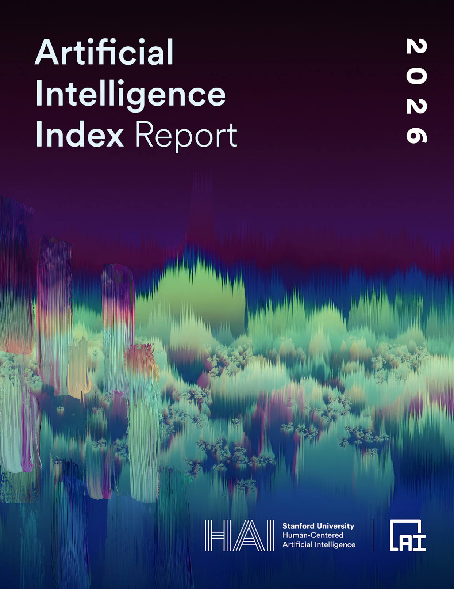

> 원문: [AI Index | Stanford HAI](https://hai.stanford.edu/ai-index?utm_id=97760_v0_s00_e0_tv4)  
> 함께 보면 좋은 원문: [2026 AI Index Report](https://hai.stanford.edu/ai-index/2026-ai-index-report)

Stanford HAI의 **AI Index** 메인 페이지는 단순 소개 페이지 같지만, 사실 올해 AI를 어떻게 읽어야 하는지 아주 명확한 문제의식을 던집니다. 핵심은 한 문장입니다.

> **AI가 할 수 있는 일은 빠르게 커지는데, 그것을 관리하고 평가하고 이해할 준비는 그 속도를 따라가지 못하고 있다.**

메인 페이지와 2026 보고서 소개 문구를 기준으로, 블로그 독자가 꼭 읽어야 할 중요한 내용만 추려 정리해봤습니다.

---

## 1. 올해 AI 논의의 핵심은 “성능”보다 “격차”다

Stanford HAI는 2026 AI Index를 소개하면서, 지금의 AI를 이렇게 진단합니다.

- 기술 능력은 계속 좋아지고 있고
- 투자는 더 빨라지고 있으며
- 사회 전반의 도입도 빠르게 확산 중이지만
- 이를 **통제하고 평가하고 이해할 제도와 프레임워크는 뒤처지고 있다**

이 말은 굉장히 중요합니다. 이제 AI 담론은 “모델이 얼마나 똑똑한가”만 보면 안 됩니다. **거버넌스, 평가, 교육, 투명성, 사회 수용 구조가 얼마나 준비되어 있느냐**가 진짜 핵심이 됐습니다.

---

## 2. AI Index는 왜 중요한가

AI Index는 Stanford HAI가 운영하는 **독립적 연례 보고 프로젝트**입니다. 학계와 산업계 전문가가 함께 참여해, AI 발전을 단순 주장이나 마케팅이 아니라 **데이터 시각화와 원본 분석**으로 추적합니다.

이 보고서가 다루는 범위는 꽤 넓습니다.

- 연구와 개발
- 기술 성능
- 윤리와 책임성
- 경제와 노동시장
- 교육
- 정책과 거버넌스
- 다양성
- 대중 인식

즉, AI Index는 “새 모델 리뷰”가 아니라 **AI 시대 전체를 읽는 계기판**에 가깝습니다.

---

## 3. 2026 리포트가 던지는 가장 큰 경고

메인 페이지의 2026 리포트 소개 문구를 풀어쓰면, 올해의 AI는 다음 세 문장으로 요약됩니다.

### 3-1. 능력은 더 빨라졌다
AI는 과학, 추론, 생산성, 생성형 도구 영역에서 더 강해졌습니다. 성능 향상은 더 이상 실험실 내부의 이야기가 아니라, 실제 산업과 일상으로 번지고 있습니다.

### 3-2. 확산 속도도 빨라졌다
투자는 증가하고, 기업 도입은 확대되고, 생성형 AI는 소비자에게 빠르게 퍼지고 있습니다. 기술이 “등장”한 단계를 넘어, 이미 사회 구조 안으로 **침투**하고 있다는 뜻입니다.

### 3-3. 그런데 관리 체계는 더 느리다
Stanford는 바로 이 부분을 가장 강하게 지적합니다. 평가 기준, 정책, 규제, 투명성, 영향 측정 체계가 기술 확산 속도를 따라가지 못하고 있습니다. 데이터 투명성이 낮아지는 상황에서, **독립적이고 엄밀한 측정**이 이전보다 훨씬 중요해졌습니다.

---

## 4. 코난쌤 관점에서 특히 중요한 포인트

이 메인 페이지를 교육·콘텐츠 관점으로 읽으면, 특히 세 가지가 크게 보입니다.

### 교육
학생과 교사는 이미 AI를 쓰고 있는데, 학교 정책과 실제 수업 설계는 그 속도를 따라가지 못합니다. 결국 필요한 건 금지냐 허용이냐가 아니라, **무엇을 배우고 무엇을 평가할 것인지에 대한 재설계**입니다.

### 노동과 생산성
AI는 생산성을 올리지만, 동시에 특정 직무와 특히 초급 인력에게는 구조적 압박을 만듭니다. 교육자는 이제 AI 활용법만이 아니라, **AI 이후에도 남는 역량**을 함께 가르쳐야 합니다.

### 정책과 신뢰
기술은 빨리 가는데 정책은 느리고, 모델은 강해지는데 투명성은 낮아집니다. 그래서 AI를 제대로 이해하려면 개별 모델 비교보다, **누가 어떤 데이터를 어떻게 공개하고 어떤 책임 구조 안에서 배포하는지**를 함께 봐야 합니다.

---

## 5. 왜 이 페이지가 단순 소개 페이지가 아닌가

겉보기엔 AI Index 메인 페이지는 “보고서 보러 오세요”에 가까워 보입니다. 하지만 실제로는 Stanford HAI가 AI를 어떤 프레임으로 읽고 있는지 압축해서 보여줍니다.

그 프레임은 이렇습니다.

- AI는 더 강해진다
- AI는 더 널리 퍼진다
- 하지만 사회는 아직 덜 준비됐다

이 세 줄만 이해해도, 올해 나오는 대부분의 AI 뉴스가 왜 동시에 기대와 불안을 부르는지 설명이 됩니다.

---

## 6. 바쁘다면 이렇게 읽으면 된다

AI Index 2026을 처음 보는 사람이라면, 저는 이렇게 읽는 걸 추천합니다.

1. 먼저 메인 페이지에서 **문제의식**을 잡고
2. 그 다음 2026 리포트 소개 문구로 **올해 프레임**을 이해한 뒤
3. 세부 내용은 관심 분야별로 들어가면 됩니다.
   - 교육에 관심 있으면 교육/정책/대중 인식
   - 실무 자동화에 관심 있으면 생산성/경제/도입
   - 연구 트렌드에 관심 있으면 기술 성능/과학 활용

이 순서가 좋은 이유는, 전체 맥락 없이 수치만 읽으면 보고서가 “정보 많지만 정리가 안 되는 문서”처럼 느껴질 수 있기 때문입니다.

---

## 한 줄 결론

> **Stanford AI Index 2026은 “AI가 얼마나 대단한가”를 보여주는 보고서이면서, 동시에 “우리가 그것을 감당할 준비가 얼마나 부족한가”를 보여주는 보고서다.**

이게 바로 이번 메인 페이지에서 발췌해 읽어야 할 가장 중요한 메시지입니다.

## 원문 링크
- AI Index 메인 페이지: <https://hai.stanford.edu/ai-index?utm_id=97760_v0_s00_e0_tv4>
- 2026 보고서: <https://hai.stanford.edu/ai-index/2026-ai-index-report>
- 12개 핵심 요약 기사: <https://hai.stanford.edu/news/inside-the-ai-index-12-takeaways-from-the-2026-report>
