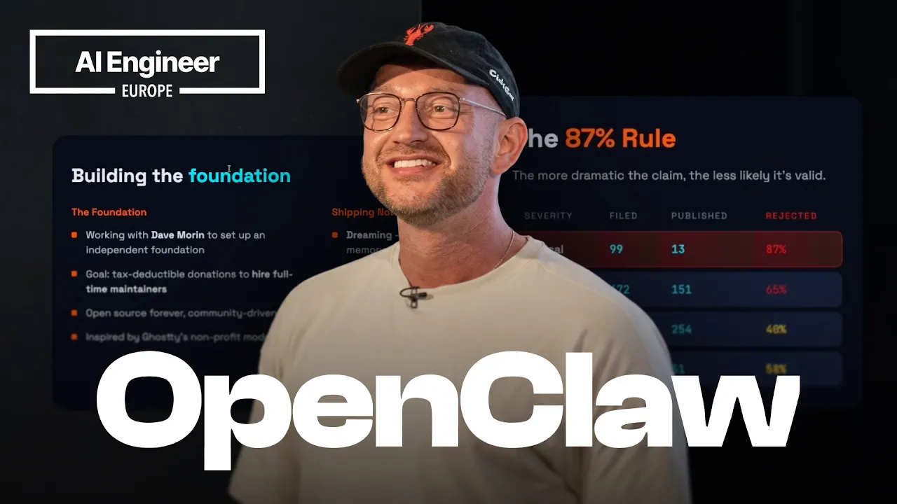
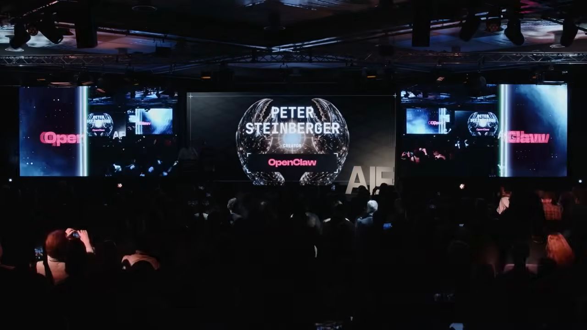
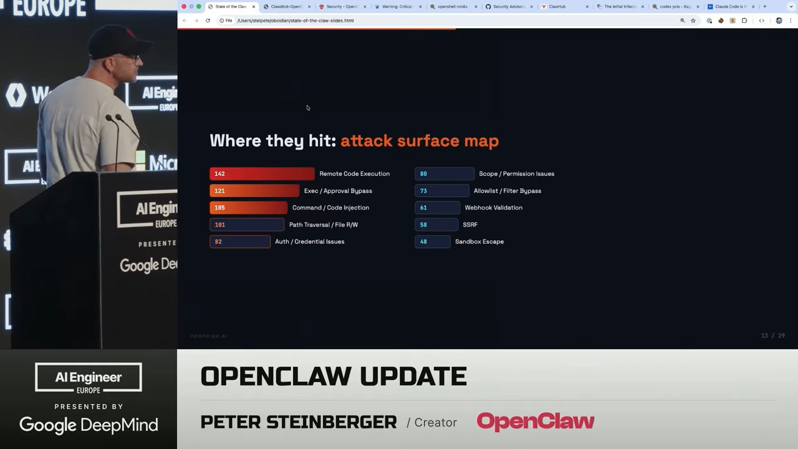
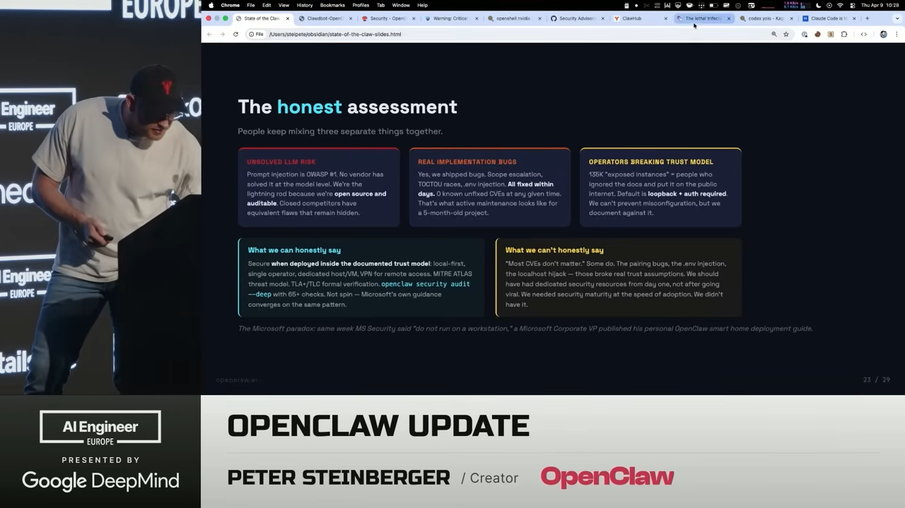
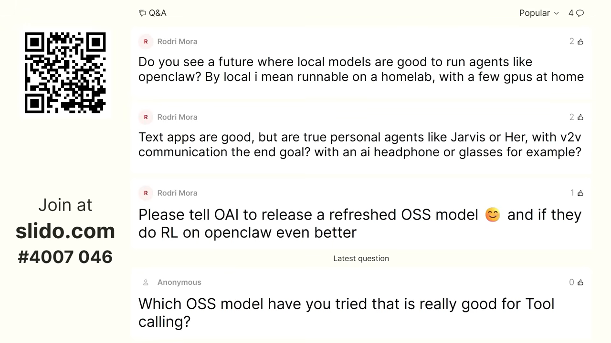

> 원문 영상: [State of the Claw — Peter Steinberger (AI Engineer Europe 2026)](https://www.youtube.com/watch?v=zgNvts_2TUE)

OpenClaw 창시자 Peter Steinberger가 AI Engineer Europe 2026 키노트에서 프로젝트 5개월 현황을 발표했다. 폭발적 성장의 이면에 있는 보안 압박, 재단 설립, 그리고 "완전 자동화 코딩"에 대한 솔직한 견해까지 — 실무자가 알아야 할 핵심만 정리한다.

## 핵심 요약

| 항목 | 수치 |
|------|------|
| 프로젝트 나이 | 5개월 |
| GitHub 커밋 | ~30,000 |
| 기여자 수 | ~2,000명 |
| PR 수 | ~30,000건 |
| 보안 리포트 수신 | 1,142건 (하루 ~16.6건) |
| Critical 등급 | 99건 |
| 공개 처리 | 469건, 60% 해결 |

---

## 1. GitHub 역사상 가장 빠른 성장

OpenClaw은 출시 5개월 만에 GitHub 역사상 가장 빠르게 성장한 소프트웨어 프로젝트가 됐다. 일반적인 오픈소스 프로젝트의 성장 그래프가 하키스틱 모양이라면, OpenClaw은 수직 직선이다. Peter의 친구는 이를 "stripper pole growth"라고 불렀다.

참석자 중 30~40%가 OpenClaw을 사용 중이라고 손을 들었고, 특히 중국(Tencent, ByteDance) 사용자가 다른 어떤 대륙보다 많다는 점이 인상적이다.

**현재 기여 기업:**
- **Nvidia** — 보안 전담 인력 지원, NemoClaw 보안 레이어 개발
- **Microsoft** — Windows 앱, MS Teams 연동
- **Red Hat** — 보안 강화, Docker화
- **Tencent, ByteDance** — 대규모 사용 및 기여
- **Telegram, Salesforce, Slack** — 플러그인 및 연동

---

## 2. 보안: 하루 16.6건의 리포트와 "87% 규칙"

발표에서 가장 많은 시간을 할애한 주제는 **보안**이다. OpenClaw은 지금까지 1,142건의 보안 리포트를 받았다. 이는 Linux 커널(하루 ~8~9건)의 약 2배, curl의 전체 리포트(~600건)의 2배에 해당한다.

### 주요 공격 유형 (슬라이드 기준)

| 유형 | 건수 |
|------|------|
| Remote Code Execution | 142 |
| Exec / Approval Bypass | 121 |
| Command / Code Injection | 105 |
| Path Traversal / File R/W | 101 |
| Auth / Credential Issues | 82 |
| Scope / Permission Issues | 80 |
| Allowlist / Filter Bypass | 73 |
| Webhook Validation | 61 |
| SSRF | 58 |
| Sandbox Escape | 48 |

### Peter의 "87% 규칙"

> "더 크게 소리 지를수록, 실제로는 AI가 생성한 슬롭(slop)일 확률이 높다."

보안 연구자들이 AI 도구로 취약점을 자동 탐색하면서, 실제로는 위험하지 않은 이슈가 CVSS 10.0(최고 등급)으로 보고되는 일이 빈번하다. 예를 들어, 아직 출시되지 않은 iPhone 앱의 읽기 전용 권한이 쓰기 권한으로 에스컬레이션될 수 있다는 이슈가 CVSS 10.0으로 보고됐지만, 실제로는 99%의 사용 시나리오에서 영향이 없다.

### 실제 위협은 따로 있다

- **GhostClaw** — 북한 연계 추정. npm 패키지 이름을 유사하게 만들어 루트킷 배포
- **Axios 공급망 공격** — OpenClaw은 Axios를 직접 사용하지 않지만, Slack/MS Teams 의존성을 통해 간접 영향
- **"Agents of Chaos" 논문** — OpenClaw 아키텍처를 상세히 분석하면서, 정작 보안 권장사항 페이지는 무시한 학술 논문

### 솔직한 평가 (Honest Assessment)

Peter는 세 가지를 구분해야 한다고 강조했다:

1. **LLM 고유 리스크** — 프롬프트 인젝션은 OWASP #1이며, 어떤 벤더도 모델 레벨에서 완전히 해결하지 못했다. OpenClaw은 오픈소스라서 오히려 감사 가능하다.
2. **실제 구현 버그** — 스코프 에스컬레이션, TOCTOU 레이스 등 실제 버그가 있었고, **수일 내에 모두 수정**했다.
3. **운영자의 신뢰 모델 위반** — 135K개의 "노출된 인스턴스"라고 보도되지만, 기본 설정은 localhost + 인증 필수. 잘못된 설치를 막을 수는 없지만, 문서화는 해둔다.

> **"에이전틱 시스템의 법적 삼중 위협(Legal Trifecta): 데이터 접근 + 비신뢰 콘텐츠 + 통신 능력. 이건 OpenClaw만의 문제가 아니라 모든 강력한 에이전트 시스템의 숙명이다."**

---

## 3. OpenClaw 재단: "스위스를 만들고 있다"

Peter는 OpenAI에 합류했지만, OpenClaw은 어떤 한 회사의 소유가 되어서는 안 된다고 확신한다. 그래서 Ghostie 재단 모델에서 영감을 받아 **OpenClaw Foundation**을 설립 중이다.

- **Dave Morin**과 함께 독립 비영리 재단 설립 진행 중
- 목표: 세금 공제 가능한 기부금으로 **풀타임 메인테이너 고용**
- 마지막 장애물: 미국 은행 시스템이 비미국인에게 느리고 복잡하다는 점
- OpenAI는 이 프로젝트를 적극 지원하지만, Peter는 의도적으로 OpenAI 인력 비중을 제한해 독립성을 유지

> "OpenAI가 OpenClaw을 샀다고들 하는데, 사실이 아니다. 내 soul.md는 샀을지 모르겠지만."

---

## 4. AMA 하이라이트: 코딩 워크플로우, 맛(Taste), 그리고 다크 팩토리

키노트 후 Swyx가 진행한 AMA 세션에서 나온 핵심 논점:

### "Closed Claw" 우려에 대해

OpenAI가 오픈소스에 항상 우호적이지는 않았지만, 최근 Codex 오픈소스화, Swarm 공개 등 방향이 바뀌고 있다. OpenClaw은 어떤 모델(대형 클라우드든 로컬이든)과도 작동해야 하며, 이 원칙은 변하지 않는다.

> "A로 시작하는 어떤 탑티어 랩은 소스 유출 시 고소하고, 너무 성공하면 차단한다. OpenAI는 좋은 방향으로 가고 있다."

### 로컬/오픈 모델의 중요성

Peter가 OpenClaw을 만든 핵심 동기 중 하나: **데이터 주권**. 대기업이 Gmail 커넥터로 이메일 전체에 접근하는 것보다, 데이터를 내 통제 하에 두고 필요할 때만 클라우드 모델을 쓰는 것이 낫다.

> "나는 마음으로는 유럽인이다. 자기 데이터는 자기가 소유해야 한다."

### 병렬 에이전트 워크플로우

한때 동시에 10개 세션을 돌리던 유명한 사진이 화제였다. 지금은 fast mode 등 개선으로 5~6개로 줄었다. 이는 토큰 속도가 빨라질 때까지의 **임시 해결책**이라고 설명.

### "다크 팩토리" 완전 자동화는 가능한가?

> "산 정상까지의 길은 절대 직선이 아니다. 매우 구불구불하다. 처음 아이디어가 최종 결과물이 될 가능성은 거의 없다."

파이프라인으로 특정 작업을 자동화할 수는 있지만, **제품의 방향성을 결정하는 것은 여전히 사람의 "맛(taste)"**이다. AI가 PR을 자동으로 머지하면, 제품이 엉뚱한 방향으로 흘러갈 수 있다.

### 맛(Taste)이란 무엇인가?

Peter가 정의하는 두 가지 레벨:

1. **Low level** — "AI 냄새가 나지 않는 것." 글 스타일, UI 디자인에서 AI가 만든 것을 바로 알아차리는 감각
2. **High level** — 디테일에 대한 집착. OpenClaw 시작 시 나오는 재치 있는 로스트 메시지 같은 것. 고수준 프롬프트로는 절대 나오지 않는 요소

> "병목은 여전히 맛(taste)이다."

---

## 실무 시사점

### AI 에이전트를 배포하는 팀이라면

1. **보안은 일상이다** — 오픈소스 에이전트 프로젝트는 하루에 수십 건의 보안 리포트를 받을 수 있다. AI 도구가 발전할수록 이 속도는 더 빨라진다.
2. **CVSS 점수를 맹신하지 말라** — 실제 배포 환경과 사용 시나리오를 기준으로 위험도를 판단해야 한다.
3. **에이전틱 시스템의 삼중 위협을 인지하라** — 데이터 접근, 비신뢰 콘텐츠, 통신 능력이 결합되면 리스크가 생긴다. 이는 모든 에이전트 시스템의 공통 과제다.

### 오픈소스 메인테이너라면

4. **Bus factor를 줄여라** — 다양한 기업에서 기여자를 확보하는 것이 프로젝트 생존의 핵심이다.
5. **재단 모델을 고려하라** — 특정 기업 의존에서 벗어나 중립적 거버넌스를 만드는 것이 장기적으로 유리하다.

### AI 코딩 워크플로우를 쓰는 개발자라면

6. **완전 자동화(다크 팩토리)는 아직 아니다** — 탐색과 반복이 좋은 소프트웨어의 핵심이며, AI는 도구이지 의사결정자가 아니다.
7. **"맛"을 기르는 것이 차별화** — AI가 코드를 쓸 수 있는 시대에, 무엇을 만들지 결정하는 안목이 가장 중요한 역량이 된다.

---

## 마무리

OpenClaw은 5개월 만에 GitHub 역사를 다시 쓰면서 동시에 오픈소스 보안의 새로운 전선을 열었다. Peter Steinberger는 폭발적 성장의 이면에 있는 현실 — AI가 만들어낸 보안 슬롭, 국가 단위 공격, 학술계의 편향된 분석 — 을 솔직하게 공유했다.

가장 인상적인 메시지는 결국 이것이다: AI가 코드를 쓸 수 있는 시대에도, **방향을 결정하는 맛(taste)은 자동화할 수 없다.** 그리고 그 맛은 직접 만들고, 써보고, 느끼는 반복에서만 길러진다.
