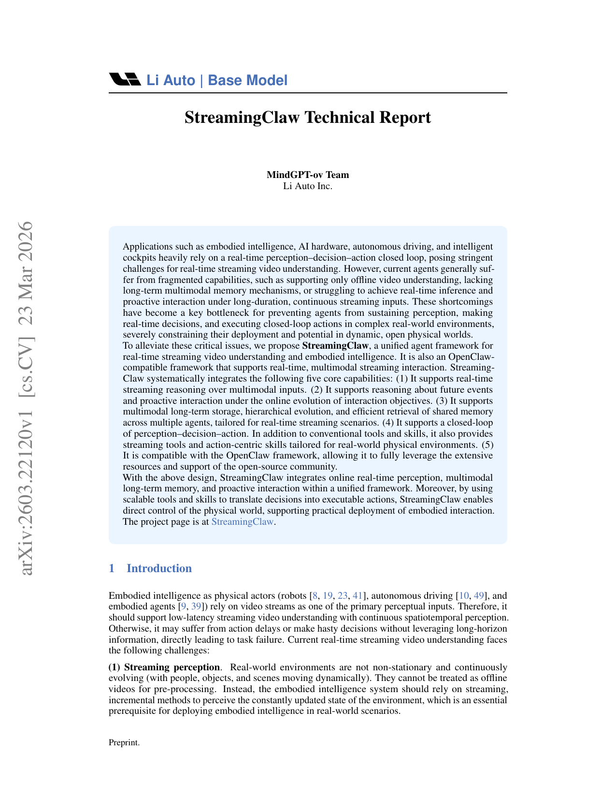
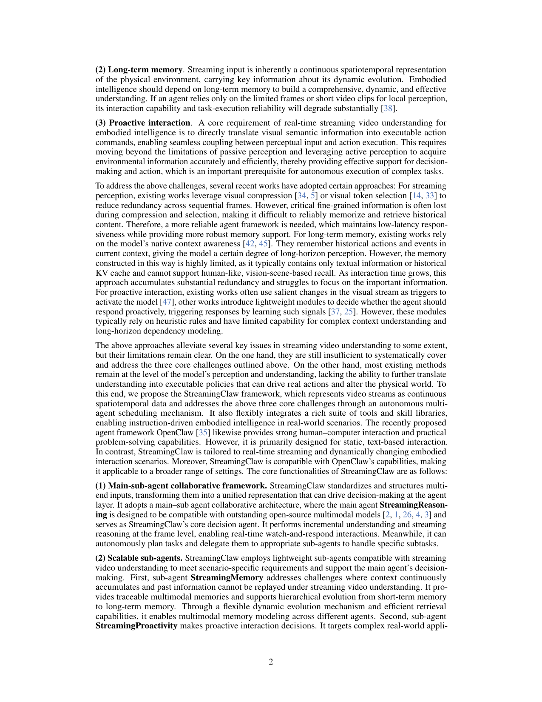
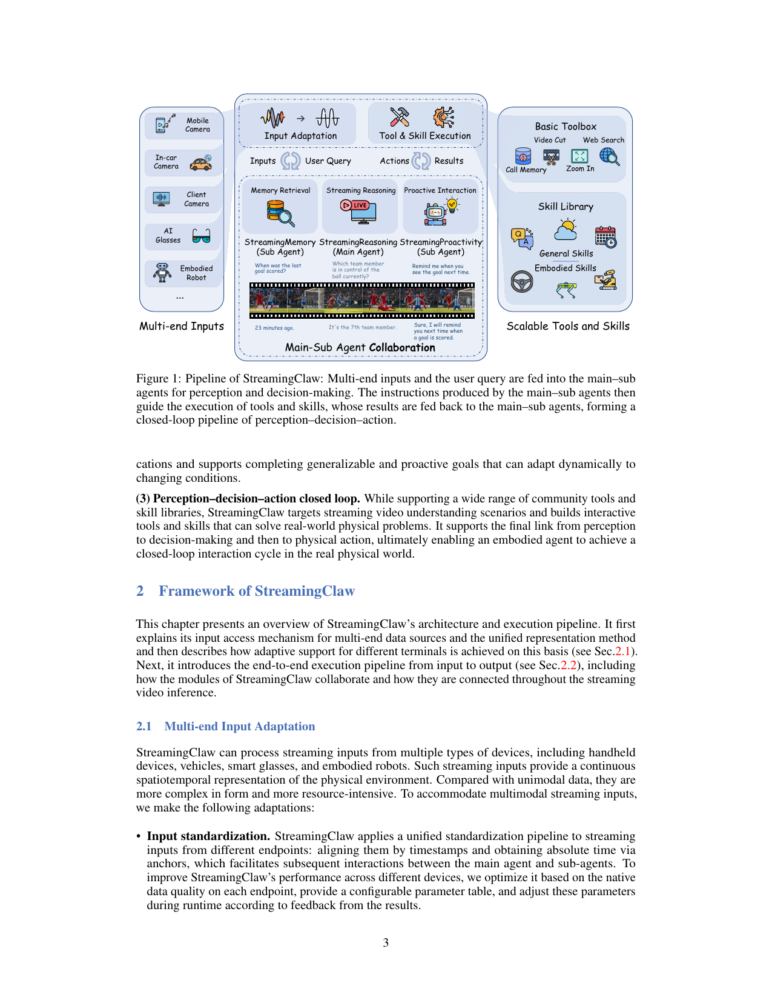
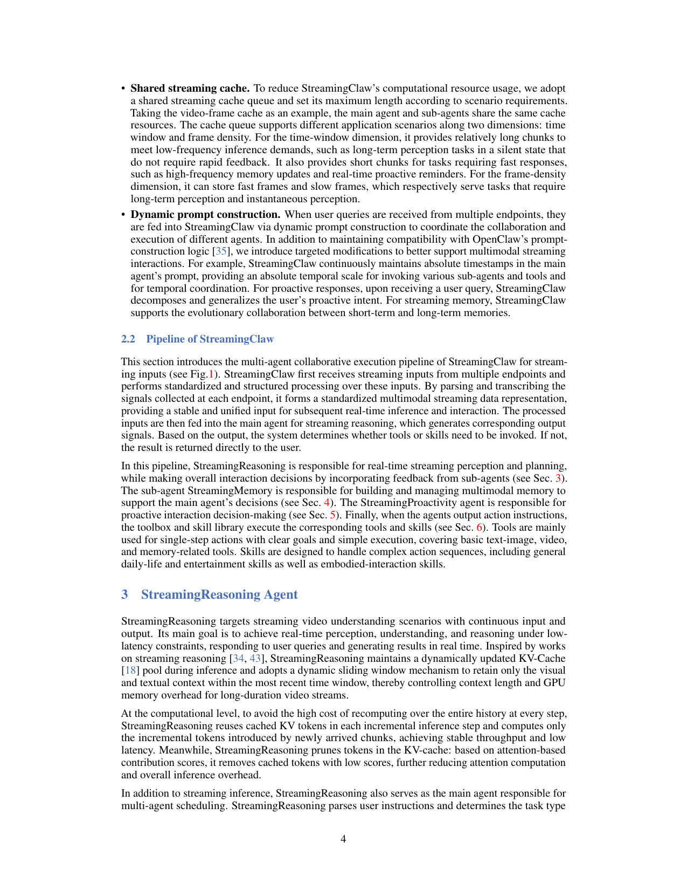

> **원문**: [StreamingClaw Technical Report](https://arxiv.org/pdf/2603.22120) (arXiv:2603.22120, 2026-03-23)
>
> **저자**: MindGPT-ov Team, Li Auto Inc.

## 핵심 요약

- **StreamingClaw** = 실시간 스트리밍 비디오 이해 + 구현 지능을 위한 통합 에이전트 프레임워크
- **OpenClaw 호환** → 오픈소스 커뮤니티 리소스 활용 가능
- 5가지 핵심 기능: 실시간 스트리밍 추론, 미래 예측 및 프로액티브 상호작용, 멀티모달 장기 메모리, 지각-결정-행동 폐루프, OpenClaw 호환

---

## 문제: 실시간 스트리밍 비디오 이해의 3대 도전

### 1. 스트리밍 퍼셉션 (Streaming Perception)

실제 환경은 **비정상적(non-stationary)이고 지속적으로 진화**한다. 사람, 물체, 장면이 동적으로 움직인다. 오프라인 비디오처럼 전처리할 수 없다. 대신 **증분적(incremental) 방식**으로 환경 상태를 지각해야 한다.

### 2. 장기 메모리 (Long-term Memory)

스트리밍 입력은 물리적 환경의 **연속적 시공간 표현**이다. 장기 메모리 없이 제한된 프레임이나 짧은 클립만 사용하면 상호작용 능력과 작업 수행 신뢰성이 크게 저하된다.

### 3. 프로액티브 상호작용 (Proactive Interaction)

핵심 요구사항: **시각적 의미 정보를 실행 가능한 행동 명령으로 직접 변환**. 수동적 지각을 넘어 능동적 지각으로 환경 정보를 획득해야 한다.

---

## StreamingClaw 아키텍처



### 메인-서브 에이전트 협업 구조

| 에이전트 | 역할 |
|----------|------|
| **StreamingReasoning** (메인) | 실시간 스트리밍 지각, 추론, 멀티태스킹 스케줄링 |
| **StreamingMemory** (서브) | 멀티모달 장기 메모리 저장, 계층적 진화, 효율적 검색 |
| **StreamingProactivity** (서브) | 프로액티브 상호작용 결정 |

---

## 1. StreamingReasoning: 실시간 스트리밍 추론

### 스트리밍 추론 메커니즘

**오프라인 비디오 에이전트 → 온라인 스트리밍 버전**으로 변환:

1. **동적 슬라이딩 윈도우**: 시간 윈도우 내 시각/텍스트 컨텍스트만 유지
2. **스트리밍 KV-Cache**: 이전 단계 KV-Cache 재사용 → 증분 토큰만 계산
3. **토큰 프루닝**: 어텐션 점수 기반 저기여 시각 토큰 제거

### 3단계 KV-Cache 프루닝

```
Step 1: 첫 디코딩 → 시각 토큰 KV-Cache 저장 → 상위 p%만 유지
Step 2: 장면 변화 작으면 캐시 업데이트 스킵 (유사도 임계값 활용)
Step 3: 새 토큰 필요 시 → Step 1 반복
```

### 자기 계획 스케줄링 (Self-Planning Scheduling)

```
사용자 쿼리 → 작업 파싱/분류
    ↓
    ├─ 메모리 필요? → StreamingMemory 호출
    ├─ 프로액티브 필요? → StreamingProactivity 호출
    └─ 둘 다 불필요? → 직접 스트리밍 추론
```

---

## 2. StreamingMemory: 멀티모달 장기 메모리



### 기존 메모리 시스템의 문제

| 문제 | 설명 |
|------|------|
| **정보 손실** | 텍스트만 저장 → 시각 정보 손실 |
| **비효율성** | 모든 메모리 컨텍스트 주입 → 토큰 낭비 |
| **경직성** | 메모리 조각화, 중요도 구분 없음 |

### 메모리 노드 정의

```
nt = (z, s, c, τ)t

z = 압축된 비디오 세그먼트
s = 텍스트 요약
c = 상세 설명
τ = 타임스탬프
```

### 계층적 메모리 진화 (HME)

```
세그먼트 → 원자적 행동(Atomic Action) → 이벤트(Event)
    ↓              ↓                      ↓
  단기 메모리    중간 단계              장기 메모리
```

**3가지 효과**:
- **시간적 쿼리 가능성**: 원자적 행동 체인이 시간 순서 보존
- **중복 압축**: 반복 세그먼트 → 이벤트로 통합
- **구조화된 장기 저장**: 이벤트가 안정적인 메모리 청크

### 효율적 메모리 검색

1. **명령 기반 검색**: 질문 유형에 따라 검색 깊이/중단 기준 조정
2. **고동시성 검색**: 후보 매칭, 재순위, 증거 추출 병렬 처리
3. **자기 주도 시간 순회**: 정방향/역방향/현저성 우선 순회

---

## 3. StreamingProactivity: 프로액티브 상호작용



### 두 가지 시나리오

| 시나리오 | 예시 |
|----------|------|
| **시간 인식** | "5분 후 목적지까지 거리 알려줘" |
| **이벤트 그라운딩** | "집에 도착하면 알려줘" |

### 작동 원리

1. **의도 분해**: 사용자 쿼리에서 프로액티브 의도 추출
2. **일반화**: 구체적 조건 → 일반화된 조건으로 변환
3. **모니터링**: 실시간 상태와 조건 매칭
4. **트리거**: 조건 충족 시 자동 응답

---

## 4. 도구와 스킬

### 기본 도구 (Basic Toolbox)

- 비디오 컷
- 웹 검색
- 메모리 호출
- 줌 인

### 스킬 라이브러리 (Skill Library)

| 일반 스킬 | 구현 스킬 |
|-----------|-----------|
| 일상/엔터테인먼트 | 물리적 환경 제어 |
| 정보 검색 | 센서 데이터 처리 |
| 커뮤니케이션 | 로봇 행동 실행 |

### 확장 가능한 구조

- OpenClaw 도구/스킬 생태계와 호환
- 스트리밍 비디오 시나리오에 특화된 도구 추가 가능

---

## 지각-결정-행동 폐루프

```
멀티엔드 입력 (모바일/차량/안경/로봇)
         ↓
    입력 적응
         ↓
    메모리 검색 ←→ StreamingReasoning ←→ 프로액티브 상호작용
         ↓                ↓                      ↓
    도구 & 스킬 실행 ←—— 액션 ——→ 결과
         ↓
    물리 세계 제어
```

---

## 기술적 특징 요약

### 스트리밍 추론

| 기술 | 효과 |
|------|------|
| 동적 슬라이딩 윈도우 | 컨텍스트 길이 제어 |
| 스트리밍 KV-Cache | 저지연, 안정적 처리량 |
| 토큰 프루닝 | GPU 메모리 절감 |

### 메모리 시스템

| 기술 | 효과 |
|------|------|
| 멀티모달 저장 | 시각 정보 보존 |
| 계층적 진화 | 단기→장기 메모리 구조화 |
| 병렬 검색 | 효율적 메모리 접근 |

### 프로액티브 상호작용

| 기술 | 효과 |
|------|------|
| 의도 일반화 | 다양한 조건 처리 |
| 실시간 모니터링 | 적시 개입 |
| 다중 트리거 | 복합 조건 지원 |

---

## 적용 분야

1. **자율주행**: 실시간 도로 상황 인식 및 의사결정
2. **스마트 콕핏**: 운전자 상태 모니터링 및 프로액티브 지원
3. **구현 로봇**: 실시간 환경 인식 및 작업 수행
4. **AI 안경**: 웨어러블 실시간 어시스턴트
5. **홈 IoT**: 스마트홈 제어 및 모니터링

---

## OpenClaw 호환성

StreamingClaw는 **OpenClaw 프레임워크와 호환**되도록 설계되었다:

- 정적 텍스트 기반 상호작용에 특화된 OpenClaw
- StreamingClaw는 **실시간 스트리밍 및 동적 변화** 시나리오에 특화
- 두 프레임워크의 기능을 결합하여 더 광범위한 설정에 적용 가능

---

## 결론

StreamingClaw는 실시간 스트리밍 비디오 이해를 위한 **통합 에이전트 프레임워크**다:

1. **실시간**: 저지연 스트리밍 추론
2. **멀티모달 장기 메모리**: 시각 중심 메모리 저장 및 검색
3. **프로액티브**: 사용자 개입 없이 자동 응답
4. **폐루프**: 지각→결정→행동 완결
5. **확장 가능**: OpenClaw 생태계 활용

---

> **프로젝트 페이지**: [StreamingClaw](https://streamingclaw.github.io/)
>
> **논문**: arXiv:2603.22120
