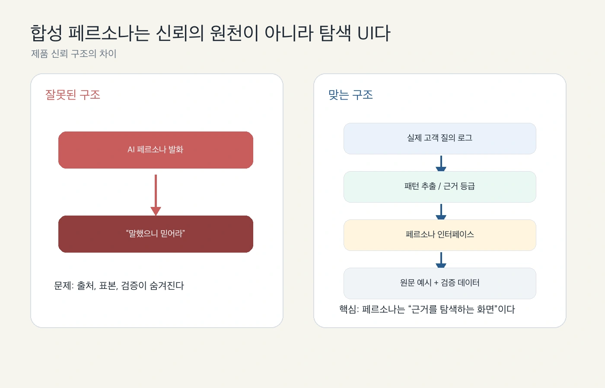
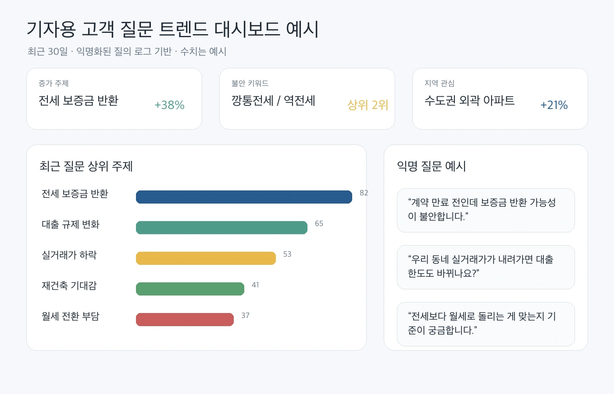
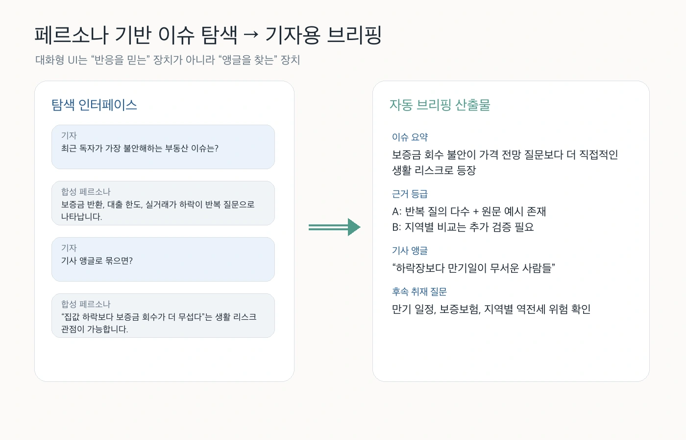

“AI 페르소나와 대화해서 고객 반응을 알 수 있다”는 말은 매력적이다. 기자, 마케터, 기획자 입장에서는 굳이 긴 리서치 보고서를 읽지 않아도 특정 고객군이 무엇을 궁금해하는지 빠르게 물어볼 수 있을 것처럼 보인다.

하지만 이 문장은 그대로 두면 위험하다. 합성 페르소나는 실제 고객이 아니다. 특정 데이터에서 추출한 패턴을 자연어 인터페이스로 보여주는 장치에 가깝다. 그래서 제품의 신뢰 구조를 잘못 잡으면 “AI가 그렇게 말했으니 믿어라”가 되고, 잘 잡으면 “실제 고객 질의 로그에서 이런 패턴이 보였고, 이 페르소나는 그 패턴을 탐색하기 위한 UI다”가 된다.

이 차이가 작아 보이지만 제품 신뢰성에서는 거의 전부다.

## 페르소나를 믿게 만들면 안 된다

가장 흔한 오해는 페르소나를 “대표 고객”처럼 다루는 것이다. 예를 들어 부동산 서비스에 쌓인 고객 질문을 바탕으로 30대 신혼부부, 은퇴 예정자, 전세 세입자 같은 페르소나를 만들었다고 하자. 사용자가 “요즘 제일 불안한 게 뭐야?”라고 물으면 페르소나는 그럴듯하게 답할 수 있다.

문제는 이 답이 실제 고객 발화와 쉽게 섞인다는 점이다.

- 실제 고객이 그렇게 말했는가?
- 여러 질문에서 반복된 패턴인가?
- 특정 지역, 시점, 상품군에 편향된 것은 아닌가?
- 모델이 그럴듯하게 보강한 문장인가?
- 근거가 되는 원문 예시는 몇 개나 있는가?

이 질문에 답하지 못하면 페르소나는 편리한 인터페이스가 아니라 근거 없는 권위가 된다. “AI 페르소나가 말했으니 믿어라”는 구조는 특히 기자나 리서처에게 치명적이다. 취재나 기사 아이디어 발굴에는 쓸 수 있어도, 그 자체를 고객 의견의 증거로 쓰면 안 된다.

## 신뢰의 원천은 질의 로그여야 한다

맞는 구조는 반대다. 먼저 실제 고객 질의 로그가 있고, 그 위에 패턴 분석이 있고, 그 결과를 사람이 탐색하기 쉽게 만든 인터페이스가 페르소나다.

즉 신뢰의 흐름은 이렇게 가야 한다.

1. 익명화된 고객 질의 로그를 모은다.
2. 반복 주제, 증가 추세, 지역/상황별 차이를 추출한다.
3. 각 주장에 근거 등급을 붙인다.
4. 원문 예시와 표본 범위를 함께 보여준다.
5. 합성 페르소나는 이 구조를 대화형으로 탐색하게 해준다.

여기서 페르소나는 신뢰의 원천이 아니다. 신뢰의 원천은 로그, 표본, 원문, 검증 데이터다. 페르소나는 그 근거를 찾고 비교하고 질문을 이어가기 위한 탐색 UI다.

## 기자에게는 “대화형 페르소나”보다 대시보드가 먼저일 수 있다

기자 대상 제품이라면 “고객 페르소나와 대화하세요”보다 “최근 고객 질문 트렌드를 보세요”가 더 신뢰감 있을 수 있다. 기자는 새로운 기사 앵글을 원하지만, 동시에 그 앵글이 실제 독자 관심에서 나온 것인지 확인해야 한다.

이때 기본 화면은 대화창보다 대시보드에 가까워야 한다.

좋은 대시보드는 최소한 다음을 보여줘야 한다.

- 최근 질문 상위 주제
- 갑자기 증가하는 질문
- 지역별 관심 차이
- 고객 불안 키워드
- 익명화된 원문 질문 예시
- 표본 기간과 데이터 출처

이 화면이 있어야 “이건 실제 고객 질문에서 출발했다”는 감각이 생긴다. 그 다음에 페르소나와 대화하게 만들면, 사용자는 페르소나 답변을 사실로 받아들이기보다 대시보드의 패턴을 더 자세히 탐색하는 방식으로 사용할 수 있다.

## 페르소나는 후속 질문을 만드는 데 강하다

그렇다고 페르소나가 쓸모없다는 뜻은 아니다. 오히려 대화형 UI의 장점은 후속 질문을 빠르게 만들 수 있다는 데 있다.

예를 들어 기자가 “최근 독자가 가장 불안해하는 부동산 이슈는?”이라고 묻는다. 시스템은 “보증금 반환, 대출 한도, 실거래가 하락이 반복 질문으로 나타난다”고 답한다. 여기서 중요한 것은 이 답을 그대로 인용하는 게 아니라, 다음 질문으로 넘어가는 것이다.

- 이 불안은 어느 지역에서 더 많이 나타나는가?
- 가격 하락 질문과 보증금 반환 질문은 어떻게 다르게 표현되는가?
- 실제 원문 예시는 무엇인가?
- 기사 앵글로 묶으면 생활 리스크인가, 제도 리스크인가?
- 추가 취재가 필요한 데이터는 무엇인가?

이런 흐름에서는 페르소나가 좋은 탐색 파트너가 된다. 사용자는 대화로 질문을 확장하고, 시스템은 매번 근거로 돌아간다.

## 제품은 답변보다 근거 패널을 더 중요하게 설계해야 한다

이런 제품에서 가장 중요한 UI는 사실 채팅창이 아니다. 답변 옆에 붙는 근거 패널이다.

좋은 근거 패널에는 이런 정보가 있어야 한다.

- 답변이 참조한 원문 질문 예시
- 같은 패턴으로 묶인 질문 수
- 기간, 지역, 세그먼트 범위
- 모델이 요약한 부분과 원문에서 직접 온 부분의 구분
- 근거 등급
- “검증 필요” 표시

특히 기자용이라면 답변을 복사하는 기능보다 원문 예시를 확인하고, 관련 질문 묶음을 열어보고, 데이터의 한계를 바로 볼 수 있는 기능이 더 중요하다. 기사 아이디어는 대화에서 얻을 수 있지만, 기사로 내보낼 근거는 원문과 검증 데이터에서 나와야 하기 때문이다.

## 실패 모드도 명확하다

이 제품은 잘못 만들면 빠르게 위험해진다.

첫째, 페르소나가 너무 사람처럼 말하면 사용자는 실제 고객의 목소리처럼 착각한다. 이름, 나이, 직업, 감정 서사를 많이 붙일수록 몰입감은 높아지지만 근거와 환상의 경계가 흐려진다.

둘째, 원문 예시 없이 요약만 보여주면 데이터 제품이 아니라 스토리 생성기가 된다. “요즘 고객은 이렇게 느낍니다”라는 문장은 그럴듯하지만, 원문과 표본이 없으면 검증할 수 없다.

셋째, 증가율이나 순위를 보여주면서 표본 크기를 숨기면 오해가 생긴다. 질문 3건에서 5건으로 늘어난 것도 +66%다. 그래서 수치에는 항상 기간과 표본 크기가 따라야 한다.

넷째, 페르소나를 고객 조사 대체재로 팔면 안 된다. 이건 정량 조사나 인터뷰를 대체하는 도구가 아니라, 기존 질의 로그에서 탐색할 만한 패턴과 취재 질문을 빨리 발견하는 도구다.

## 그래서 포지셔닝은 이렇게 잡는 게 안전하다

이 제품을 기자에게 설명한다면 “AI 고객 페르소나와 대화하세요”보다 이렇게 말하는 편이 낫다.

> 실제 고객 질문 로그에서 반복되는 관심과 불안을 찾고, 합성 페르소나를 통해 기사 앵글과 후속 취재 질문을 탐색하는 도구.

핵심은 “대화”가 아니라 “로그 기반 탐색”이다.

페르소나는 사람처럼 말할 수 있다. 하지만 제품은 계속 근거로 돌아가야 한다. 원문 예시, 근거 등급, 표본 범위, 검증 데이터가 함께 붙어 있을 때만 대화형 페르소나는 기사 아이디어 발굴용 도구가 될 수 있다.

정리하면 이렇다.

- 페르소나는 고객이 아니다.
- 페르소나는 신뢰의 원천이 아니다.
- 신뢰의 원천은 실제 질의 로그와 검증 가능한 근거다.
- 페르소나는 그 근거를 탐색하는 인터페이스다.
- 기자에게 필요한 것은 “그럴듯한 반응”보다 “검증 가능한 앵글”이다.

AI 페르소나 제품의 성패는 모델이 얼마나 자연스럽게 말하느냐보다, 사용자가 그 답의 근거를 얼마나 쉽게 확인할 수 있느냐에 달려 있다.
