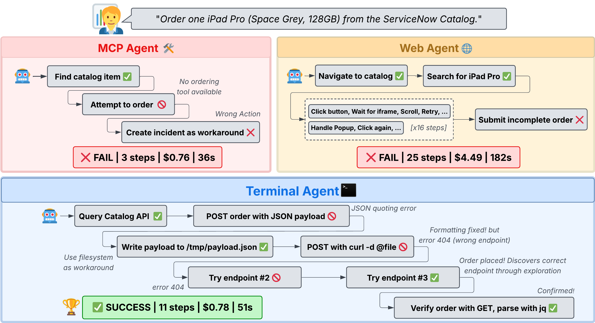
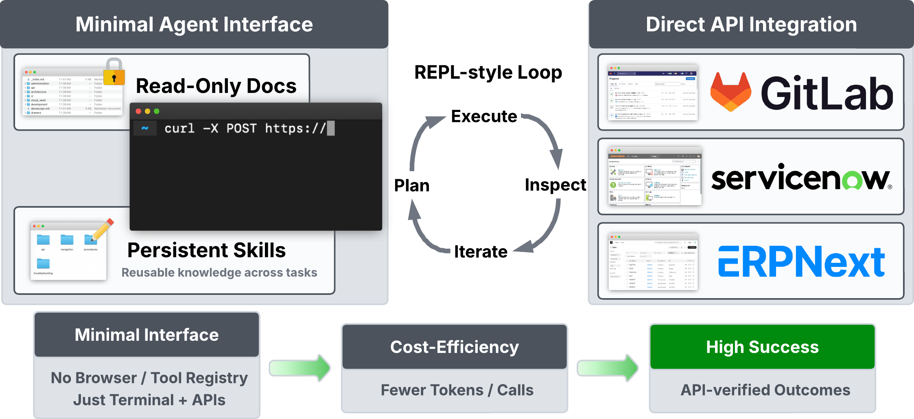

요즘 에이전트 이야기를 보면 자꾸 구조가 커집니다. MCP를 붙이고, 웹 UI를 조작하고, 툴 레지스트리를 만들고, 추상화를 더 얹습니다. 그런데 이번 논문 **_Terminal Agents Suffice for Enterprise Automation_**은 꽤 도발적인 질문을 던집니다.

> **정말 그렇게 복잡해야만 할까?**

결론부터 말하면, 이 논문은 **강한 기본 모델과 터미널, 파일시스템, 그리고 직접적인 API 접근만으로도 많은 기업 자동화 작업을 충분히 해결할 수 있다**고 주장합니다. 더 흥미로운 건, 이게 단순한 의견이 아니라 실제 엔터프라이즈 플랫폼에서 비교 실험으로 검증됐다는 점입니다.

## 왜 이 논문이 중요할까

이 논문이 중요한 이유는 하나입니다. **에이전트 설계의 기본 전제를 다시 묻게 만들기 때문**입니다.

보통은 이렇게 생각합니다.

- GUI를 조작할 수 있어야 진짜 에이전트다
- 툴을 잘게 쪼개 MCP처럼 연결해야 안전하다
- 추상화가 많을수록 더 똑똑하고 범용적이다

그런데 논문은 반대로 말합니다.

- 안정적인 API가 있는 플랫폼이라면 굳이 GUI를 돌 필요가 없다
- 미리 정해 둔 도구 목록은 오히려 표현력을 제한할 수 있다
- 복잡한 구조보다 **직접 API를 다루는 단순한 코딩 에이전트**가 더 잘할 수 있다

이 메시지는 실전 자동화 관점에서 꽤 큽니다. 특히 저처럼 OpenClaw, Claude Code, 로컬 자동화, 업무용 에이전트에 관심 있는 사람에게는 더 그렇습니다.

## 세 가지 접근을 한 번에 비교했다

논문은 기업 환경에서 많이 쓰는 플랫폼을 대상으로 세 가지 접근을 비교합니다.

1. **웹 에이전트**
   - 브라우저에서 클릭, 입력, 이동 같은 GUI 조작으로 작업 수행
2. **MCP/도구 기반 에이전트**
   - 미리 정의한 도구를 호출해서 작업 수행
3. **터미널 에이전트**
   - 터미널과 파일시스템을 기반으로 직접 코드를 작성하고 API를 호출

핵심은 여기서 세 번째, 즉 **터미널 에이전트**가 생각보다 훨씬 강했다는 점입니다.

*Figure 1. 같은 주문 작업을 MCP 에이전트, 웹 에이전트, 터미널 에이전트가 어떻게 다르게 수행하는지 보여주는 그림. 논문은 터미널 에이전트가 오류를 복구하면서도 더 낮은 비용으로 작업을 끝낼 수 있음을 강조한다.*

위 그림이 이 논문의 메시지를 거의 다 말해줍니다.

- **MCP 에이전트**는 필요한 도구가 없으면 멈춥니다
- **웹 에이전트**는 UI 복잡성 때문에 긴 trajectory를 만들고 비용이 커집니다
- **터미널 에이전트**는 JSON quoting 에러나 잘못된 API endpoint를 만나도 직접 수정하고 다시 시도할 수 있습니다

즉, **복원력(resilience)** 이 다릅니다. 실전에서는 이게 엄청 중요합니다.

## 결과는 꽤 직설적이다

논문의 핵심 메시지를 한 줄로 줄이면 이렇습니다.

> **복잡한 에이전트 스택보다, 터미널에서 API를 직접 다루는 에이전트가 더 싸고 더 잘할 수 있다.**

특히 비용 측면이 인상적입니다.

논문 요약 기준으로 보면 웹 에이전트 대비 터미널 에이전트는 플랫폼에 따라 **5배에서 9배까지 저렴**했습니다. 성공률도 뒤지지 않았고, 어떤 플랫폼에서는 오히려 더 좋았습니다.

이 결과가 말해주는 건 단순합니다.

- 에이전트를 만들 때 화려한 외형보다
- **실제 작업이 API 중심인지**
- **에이전트가 직접 탐색하고 복구할 자유가 있는지**
- **도구 추상화가 병목이 되지 않는지**

이 세 가지를 먼저 봐야 한다는 겁니다.

## MCP는 왜 약해질 수 있을까

이 논문에서 특히 흥미로웠던 대목은 **도구가 많다고 반드시 좋은 게 아니라는 점**입니다.

직관적으로는 이렇게 생각하기 쉽습니다.

- 도구가 많다
- 에이전트가 할 수 있는 일이 많아진다
- 성능이 좋아진다

하지만 현실은 다릅니다. 도구가 많아도 **그 작업에 꼭 필요한 조합이나 표현력**이 없으면 오히려 약합니다. 논문은 일부 환경에서 도구 수가 많아도 성공률이 낮았고, 반대로 범용 CRUD 중심의 단순한 인터페이스에서는 성능이 더 잘 나오는 현상을 보여줍니다.

이건 실무자에게 중요한 메시지입니다.

> **툴을 많이 만드는 것보다, 에이전트가 직접 API를 읽고 조합할 수 있게 하는 편이 나을 수 있다.**

즉, MCP를 무조건 부정하는 게 아니라 **MCP가 잘 맞는 문제와 아닌 문제를 구분해야 한다**는 이야기입니다.

## 문서를 더 주면 무조건 좋아질까

이 논문은 또 하나 재미있는 역설을 보여줍니다. **문서 접근이 항상 도움이 되지는 않는다**는 점입니다.

플랫폼에 따라 결과가 달랐습니다.

- 어떤 경우엔 문서를 읽게 하니 성능이 올라감
- 어떤 경우엔 문서를 읽게 하니 오히려 비용만 늘고 성능은 떨어짐

왜 그럴까요?

제 해석은 이렇습니다.

1. 모델이 이미 잘 아는 플랫폼이면 문서가 새로운 정보보다 **잡음**이 될 수 있음
2. 문서가 작업 중심이 아니라 UI/제품 설명 중심이면 실제 수행에는 별 도움이 안 됨
3. 길고 구조가 나쁜 문서는 RAG를 붙여도 오히려 reasoning 비용만 키움

이 포인트는 요즘 많이들 하는 “문서 넣고 RAG 붙이면 성능 오른다”는 접근에 좋은 반론이 됩니다.

> **문서가 중요한 게 아니라, 작업에 직접 도움이 되는 구조화된 문서가 중요하다.**

## 이 논문의 진짜 실전 포인트: Skills

개인적으로 가장 반가웠던 건 **Skills 디렉토리 같은 축적형 메모리**를 다룬 부분입니다.

터미널 에이전트는 단순히 한 번 잘하는 걸 넘어서, 작업하면서 배운 걸 재사용 가능한 형태로 저장할 수 있습니다. 예를 들면 이런 것들입니다.

- 특정 플랫폼의 API 필드명
- 자주 나는 quoting 실수 회피법
- 인증 방식
- 특정 워크플로우 처리 순서
- 실패했을 때 우회 절차

이게 왜 중요하냐면, 이게 바로 실전에서 말하는 **“배우는 에이전트”**의 가장 현실적인 구현이기 때문입니다.

*Figure 2. 논문이 제안한 StarShell 구조. 터미널과 파일시스템을 중심으로, 필요하면 문서와 persistent skills를 활용해 직접 API를 탐색하고 호출한다.*

논문에서 말하는 StarShell 구조는 사실 엄청 화려한 게 아닙니다. 오히려 단순합니다.

- 터미널
- 파일시스템
- 문서(선택)
- persistent skills
- 직접적인 API 상호작용

그런데 이 단순함이 강합니다. 에이전트가 실제 업무에서 부딪히는 문제를 우회하고, 배운 것을 저장하고, 다음 작업에서 더 싸게 더 빨리 처리할 수 있기 때문입니다.

## 코난쌤식 실전 해석

이 논문을 읽고 나면 에이전트 설계에서 먼저 던져야 할 질문이 바뀝니다.

### 1. API가 있나?
있다면 **브라우저보다 먼저 터미널**을 생각해볼 만합니다.

### 2. 툴을 잘게 쪼개야 하나?
정말 필요한 경우가 아니라면, 오히려 **직접 코드로 조합하는 자유**가 더 중요할 수 있습니다.

### 3. 문서를 넣을까?
무조건 넣기보다, **그 문서가 작업 중심으로 구조화돼 있는지** 먼저 봐야 합니다.

### 4. 학습은 어떻게 쌓을까?
세션 안에서만 끝내지 말고, **skills나 메모리 파일처럼 재사용 가능한 형식으로 남겨야** 합니다.

교육 관점에서도 메시지가 좋습니다. 초보자에게 에이전트를 가르칠 때도 처음부터 복잡한 아키텍처를 보여주기보다 이렇게 설명할 수 있습니다.

- API가 있는 서비스면 터미널 기반으로 먼저 접근해보자
- 도구를 많이 만드는 것보다, 문제를 정확히 이해하고 직접 호출해보자
- 에이전트가 배운 걸 파일로 남기게 하자

이게 훨씬 실전적입니다.

## 결론: Less is More, 진짜로

이 논문은 에이전트 설계에서 자주 놓치는 사실을 다시 상기시켜 줍니다.

> **더 많은 추상화가 더 좋은 에이전트를 보장하지는 않는다.**

오히려 안정적인 API와 충분히 강한 기본 모델이 있다면,

- 터미널
- 파일시스템
- 직접 호출
- 재사용 가능한 skills

이 네 가지만으로도 상당히 많은 기업 자동화가 가능합니다.

화려한 UI 조작이나 복잡한 도구 레지스트리가 필요한 경우도 물론 있습니다. 하지만 그건 **기본값이 아니라 예외 상황**일 수 있습니다.

그래서 저는 이 논문의 메시지를 이렇게 정리하고 싶습니다.

> **에이전트를 복잡하게 시작하지 말자. API가 있다면, 터미널부터 보자.**

실전 자동화는 멋있어 보이는 구조보다, **싸고, 튼튼하고, 복구 가능하고, 계속 배울 수 있는 구조**가 이깁니다.

## 논문 정보

- 논문: *Terminal Agents Suffice for Enterprise Automation*
- 링크: <https://huggingface.co/papers/2604.00073>
- 원문: <https://arxiv.org/html/2604.00073>

관련해서 다음에는 이 논문을 바탕으로 **OpenClaw/Claude Code 스타일 실전 아키텍처를 어떻게 짜면 되는지**도 정리해보면 재밌을 것 같습니다.
