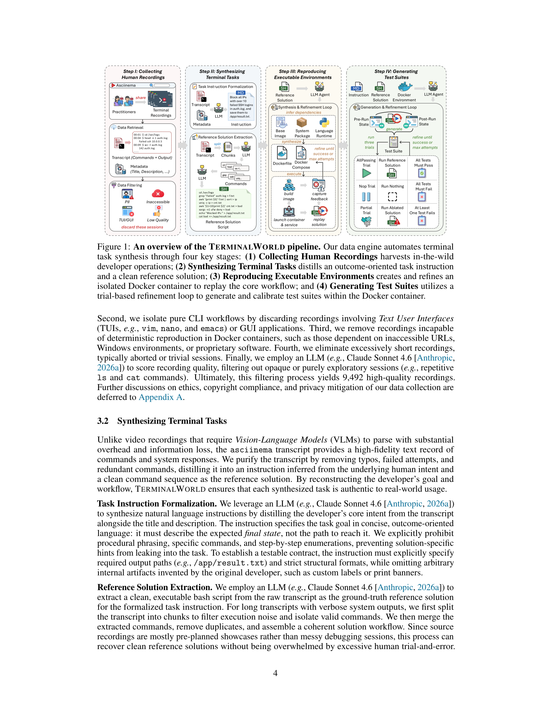
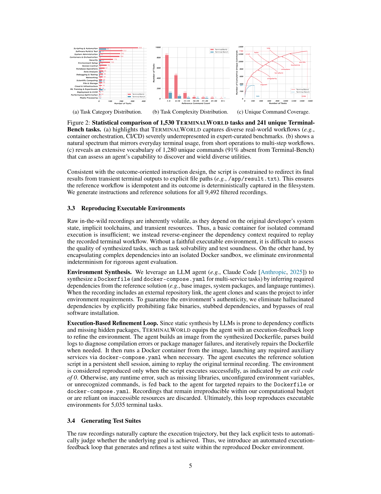
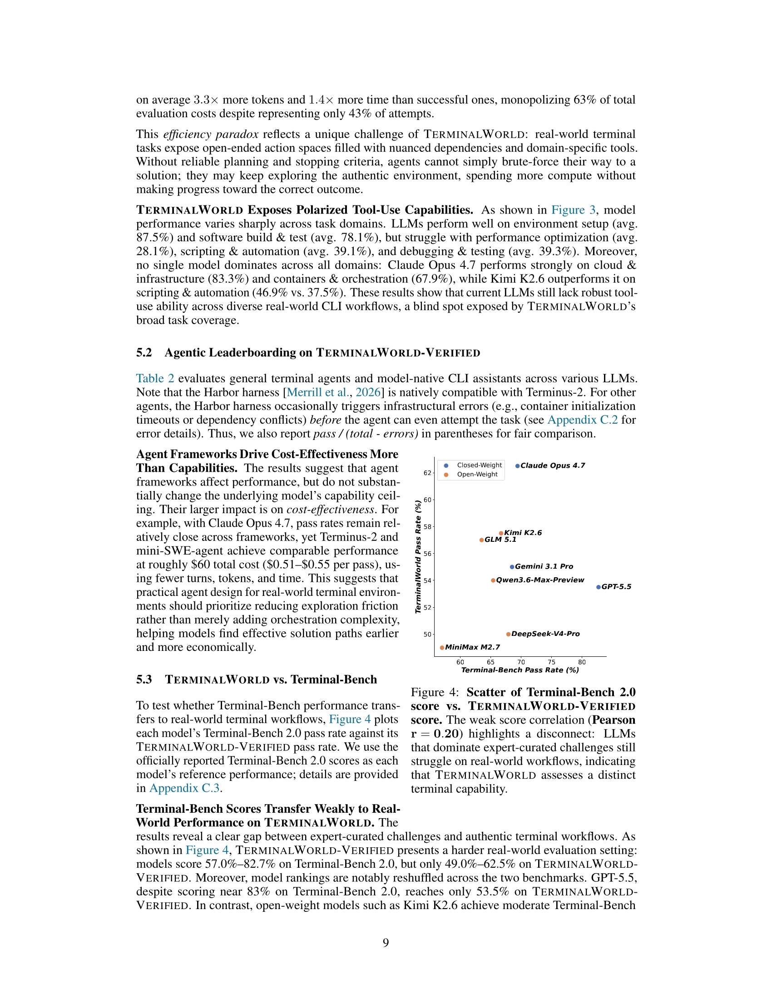

## 인터뷰: TerminalWorld, "실제 개발자가 터미널에서 하는 일"을 벤치마크로 만들다

CLI 에이전트가 빠르게 발전하고 있습니다. Claude Code, Codex CLI, Gemini CLI 같은 도구들이 터미널 환경에서 자율적으로 명령을 내리고, 도구를 조합하고, 피드백을 해석합니다. 하지만 이 에이전트들이 **실제 개발자가 매일 하는 터미널 작업**에서 얼마나 잘 동작하는지를 제대로 평가한 벤치마크는 없었습니다.

UCL, 난징대, 텐센트 연구진이 발표한 **TerminalWorld**는 이 빈틈을 메우는 프로젝트입니다. 이번 포스트에서는 논문의 핵심을 Q&A 형식으로 정리해봤습니다.

---

### Q: TerminalWorld가 기존 벤치마크와 다른 접근 방식은 뭔가요?

기존 Terminal-Bench 같은 벤치마크는 도메인 전문가가 직접 문제를 만듭니다. 전문가들은 난이도를 최대화하려는 경향이 있어서, 실제 개발자가 일상에서 겪는 문제와는 거리가 멀어지는 문제가 있습니다. 또 수작업이다 보니 새로운 도구나 워크플로우가 나와도 따라가지 못하죠.

TerminalWorld는 발상을 뒤집었습니다. **asciinema**라는 플랫폼에서 개발자들이 자발적으로 공유한 터미널 세션 녹화 80,870개를 수집해서, 이걸 역추적해 평가용 작업으로 변환합니다. "실제 인간이 한 일"에서 출발하니 진정성(authenticity)이 구조적으로 보장되는 거죠.

### Q: 녹화본을 그대로 벤치마크로 쓸 수는 없나요?

안 됩니다. 녹화본에는 오타, 실패한 시도, 불필요한 명령어가 섞여 있고, 개발자의 의도가 명시되어 있지도 않습니다. 실행 환경(어떤 패키지가 설치되어 있었는지)도 알 수 없고요.

TerminalWorld는 이 문제를 4단계 파이프라인으로 해결합니다.

1. **수집 및 필터링** — 개인정보 노출, 악성 명령어, TUI/GUI 세션을 제거해 9,492개 고품질 녹화본 선별
2. **작업 합성** — LLM이 녹화본에서 개발자의 의도를 추론해 "결과 중심" 지시문을 만들고, 깔끔한 참조 솔루션을 추출
3. **환경 재현** — LLM 에이전트가 Docker 이미지를 생성하고, 실행 피드백을 바탕으로 반복 수정하여 참조 솔루션이 재현 가능한 환경을 구축
4. **테스트 스위트 생성** — 세 가지 시험(전체 실행, 빈 실행, 부분 실행)을 통해 거짓 양성과 거짓 음성을 제거

이 과정을 거쳐 **1,530개의 검증된 작업**이 탄생했습니다.

### Q: 1,530개 작업, 규모가 꽤 크네요. 어떤 내용이 들어있나요?

18개 카테고리에 걸쳐 있고, 몇 단계짜리 간단한 작업부터 50단계가 넘는 복잡한 워크플로우까지 포함합니다. 커버하는 고유 명령어는 **1,280개**인데, Terminal-Bench과 겹치는 건 9%에 불과합니다. 컨테이너 오케스트레이션, CI/CD, 클라우드 인프라 같이 기존 벤치마크가 거의 다루지 않았던 영역이大量으로 포함되어 있습니다.

여기서 200개를 수동 교차 검토한 **VERIFIED 서브셋**을 따로 큐레이션했습니다. 이게 벤치마크의 핵심 평가 세트입니다.

### Q: 최신 모델들의 성과는 어땠나요?

결론부터 말하면, **최고 모델인 Claude Opus 4.7도 62.5%**밖에 통과하지 못했습니다. 8개 프론티어 모델을 테스트했는데 평균이 54.8%였습니다.

흥미로운 점 두 가지:

- **오픈웨이트 모델의 약진** — Kimi K2.6(57.5%), GLM 5.1(57.0%)이 GPT-5.5(53.5%), Gemini 3.1 Pro(55.0%)를 역전했습니다. 비용 효율은 4~8배 좋고요.
- **효율성의 역설** — 더 많은 토큰과 턴을 쓴다고 성적이 오르지 않습니다. GPT-5.5와 MiniMax M2.7이 가장 많은 리소스를 소모했지만 성적은 하위권이었습니다. 실패한 시도가 성공한 시도보다 평균 3.3배 더 많은 토큰을 썼습니다.

### Q: Terminal-Bench 점수가 높은 모델이 TerminalWorld에서도 잘하나요?

아닙니다. 상관관계가 **Pearson r = 0.20**으로 매우 약합니다. GPT-5.5는 Terminal-Bench 2.0에서 ~83%를 기록했지만 TerminalWorld에서는 53.5%에 그쳤습니다. 반대로 Kimi K2.6은 Terminal-Bench에서 66.7%였지만 TerminalWorld에서 GPT-5.5를 역전했습니다.

전문가가 만든 퍼즐을 잘 푼다고 해서 실제 터미널 환경에서도 잘한다고 보장할 수 없다는 뜻입니다.

### Q: 에이전트는 인간이 한 방식과 비슷하게 문제를 풀었나요?

아니요, 전혀 다른 길로 갔습니다. 명령어 집합의 중복도(Jaccard 유사도) 중앙값이 **21.4%**에 불과했습니다. 예를 들어 pcap 파일에서 HTTP 인증 정보를 추출하는 작업에서, 인간은 `ettercap`을 썼지만 에이전트는 `tshark`와 Python을 조합했습니다. 둘 다 정답이지만 완전히 다른 도구를 사용한 거죠.

이건 TerminalWorld의 설계 철학을 잘 보여줍니다. 작업이 "어떻게"가 아니라 "무엇을 달성해야 하는지"를 명시하므로, 어떤 올바른 경로든 받아들입니다.

### Q: 이 벤치마크의 의의는 뭘로 정리할 수 있을까요?

세 가지로 요약하겠습니다.

1. **진정성** — 실제 개발자 기록에서 출발하니 인공적인 난이도 인플레이션이 없습니다
2. **확장성** — 파이프라인이 완전 자동화되어 있어 asciinema에 새 녹화가 쌓일 때마다 벤치마크를 갱신할 수 있습니다
3. **차별성** — 기존 벤치마크와 측정하는 능력이 다르다는 걸 통계적으로 보여줬습니다

CLI 에이전트가 실제 현장에서 얼마나 유용한지를 평가하려면, 실제 현장의 데이터가 필요합니다. TerminalWorld는 바로 그 "현장의 데이터"를 체계적으로 모으고 검증한 첫 시도입니다.

---

> **논문**: Zhaoyang Chu et al., "TerminalWorld: Benchmarking Agents on Real-World Terminal Tasks," arXiv:2605.22535, May 2026.
> **코드**: [github.com/EuniAI/TerminalWorld](https://github.com/EuniAI/TerminalWorld)
