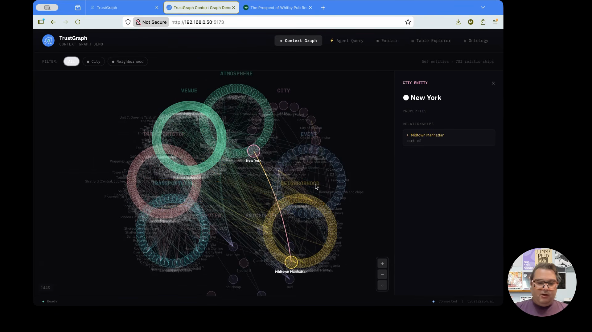
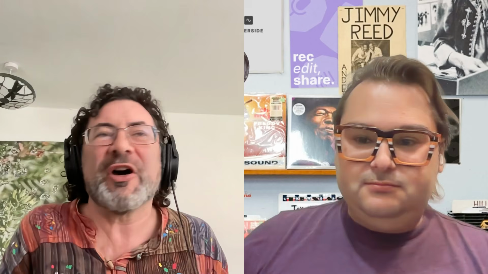
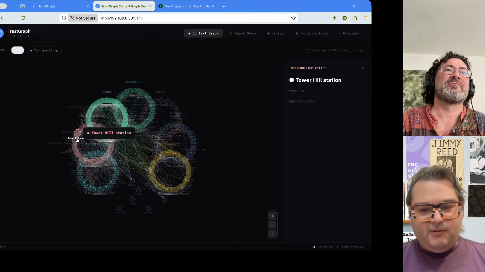
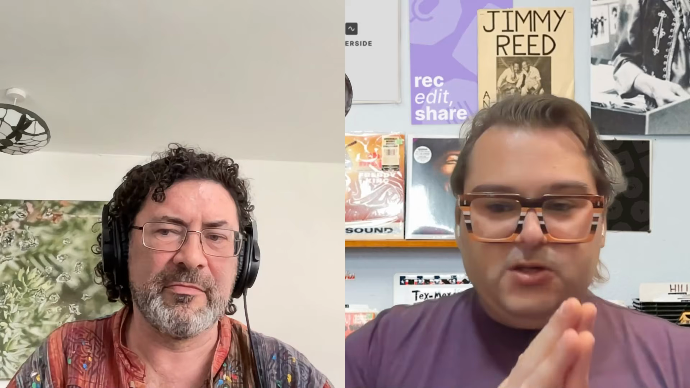

# 컨텍스트 그래프와 설명 가능한 AI: TrustGraph 2 데모 분석

최근 "컨텍스트 그래프(Context Graph)"라는 용어가 AI 업계에서 화두가 되고 있습니다. 하지만 정확히 무엇이고, 왜 중요할까요? TrustGraph 2의 데모 영상을 통해 이 기술이 실제로 어떻게 작동하는지 분석해 보겠습니다.

## 컨텍스트 그래프가 보여주는 것

TrustGraph 팀은 런던 지역의 펍, 레스토랑, 이벤트 공간 데이터를 기반으로 컨텍스트 그래프를 구축했습니다. 단순히 노드와 엣지로 연결된 그래프가 아니라, **LLM이 질문에 답할 때 어떤 데이터를 참조했는지 추적할 수 있는 구조**입니다.

> "You've heard all the hype around context graphs and you're probably wondering what are they? Well, you're looking at one. We built a context graph based on data from London area pubs, restaurants, event spaces, and here you can see how all of those are connected to each other and interrelated."
>
> — Daniel, TrustGraph 공동 창업자

### 핵심: 설명 가능성(Explainability)

간단한 질문 하나가 그래프를 통해 어떻게 처리되는지 보여줍니다:
- "어디서 크래프트 맥주를 마실 수 있나요?"
- 답변뿐만 아니라 **어떤 개념이 매핑되었는지**, **어떤 소스에서 정보가 왔는지** 추적 가능

## 두 가지 질문, 다른 결과

흥미로운 점은 **비슷해 보이는 질문이 완전히 다른 결과를 낳는다**는 것입니다:

1. **"펍에서 크래프트 맥주를 마실 수 있는 곳은 어디인가요?"**
   - 결과: 펍만 필터링, 좁은 범위의 개념

2. **"어디서 크래프트 맥주를 마실 수 있나요?"**
   - 결과: 바, 맥주 정원, 축제, 이벤트 등 훨씬 넓은 범위

인간에게는 같은 질문처럼 들리지만, **언어 모델에게는 완전히 다른 의미**를 가집니다. 이것이 바로 컨텍스트 그래프가 해결하려는 문제입니다.

> "What's really interesting is when we can see this answer — what if we ask this question in a slightly different way? Instead of asking specifically 'where can I drink craft beer in a pub?', now that we've broadened the question, we still get the same answer. But if we look in the response, we see that the grounding has actually broadened the concepts that were available to us."
>
> — Mark Adams, TrustGraph 공동 창업자

## 그래프 탐색기: 내부 구조 시각화

TrustGraph 워크벤치를 통해 그래프 내부를 들여다볼 수 있습니다:
- **개념 간 연결**: 버몬디 역 → 주빌리 라인 → 교통 노선
- **관계 유형**: 펍의 가격대, 분위기, 위치 정보
- **3D 시각화**: 복잡한 관계를 입체적으로 표현

물론 이 탐색기는 개발자용 도구입니다. 최종 사용자 앱은 훨씬 직관적인 인터페이스를 제공합니다.

## 온톨로지: 정밀도의 비결

### 온톨로지가 필요한 이유

온톨로지 없이는 언어 모델이 자유롭게 관계를 정의합니다. 같은 개념이 다른 이름으로 중복되거나, 일관성 없는 구조가 생깁니다.

TrustGraph의 온톨로지는 다음을 정의합니다:
- **클래스**: 장소, 이벤트, 분위기, 도시
- **관계**: 위치, 가격대, 제공 메뉴
- **타입**: 교통 정거장, 수송 노선, 예산/중간/고가

### 결과: 정밀한 지식 그래프

> "Ontologies have turned out to be very effective for AI graph RAG algorithms. We started off building without ontologies — just using language models to determine the concepts free form without having to be locked into an ontology. It's interesting to be able to compare. We've got multiple techniques that work well for different domains."
>
> — Mark Adams

온톨로지 적용 전후 비교:
| 구분 | 프리폼 그래프 | 온톨로지 기반 |
|------|-------------|-------------|
| 정확도 | 낮음 | 높음 |
| 일관성 | 불안정 | 안정적 |
| 추적 가능성 | 제한적 | 완전 |

## RDF vs 속성 그래프

TrustGraph는 **RDF(자원 기술 프레임워크)** 생태계를 기반으로 합니다. Neo4j 같은 속성 그래프와 무엇이 다를까요?

### RDF의 장점

1. **다국어 지원**: 여러 언어를 쉽게 표현
2. **메타데이터 풍부**: 엣지에도 정보를 연결 가능 (출처, 시간, 신뢰도)
3. **표준화**: W3C 표준, 도구 호환성

### 속성 그래프와의 공존

> "The world has been kind of ruled by tabular information and structured databases. What really is the most complex part is like building graphs is actually quite hard. It's much easier to force things into a tabular structure, but language models have just suddenly caused this technology to be just so much more relevant again."
>
> — Mark Adams

두 방식 모두 AI와 결합할 수 있습니다. TrustGraph가 RDF를 선택한 이유는 **설명 가능성과 출처 추적**에 더 적합하기 때문입니다.

## 결정 추적(Decision Trace): AI의 사고 과정 시각화

> "The headline feature of TrustGraph 2 is explainability. Making sure that as documents are ingested into the system, the full source graph — there's a knowledge graph which tracks all of the source components through to the chunks through to the information that was extracted out of those documents."
>
> — Mark Adams

TrustGraph 2의 핵심 기능인 **결정 추적**은 다음을 보여줍니다:

1. **질문 분석**: 어떤 개념을 추출했는지
2. **그래프 매핑**: 어떤 노드가 관련 있는지
3. **엣지 탐색**: 어떤 관계가 답변에 기여했는지
4. **최종 종합**: 어떻게 답변이 생성되었는지

이것이 바로 **Neurosymbolic AI**의 접근 방식입니다:

> "This is very much what I talked about with deep learning versus neurosymbolic AI. The deep learning approach was that you throw data at these neural nets. If you throw enough data and enough compute, we would be able to somewhat magically get to ground truth. And the neurosymbolic AI thinkers were always of the mindset that you would need richer semantic structures because of all the disambiguation in language."
>
> — Daniel

- 딥러닝: 데이터와 패턴 인식
- 심볼릭 AI: 의미 구조와 추론

## 소스 증명(Source Provenance): 정보의 출처 추적

답변에 포함된 각 정보는 원본 문서까지 추적할 수 있습니다:
- **청크(Chunk)**: 문서의 어느 부분에서 왔는지
- **수집 시점**: 언제 데이터가 들어왔는지
- **신뢰도 평가**: 이 소스를 믿을 수 있는지

이것이 왜 중요할까요? AI가 "환각"을 일으켰을 때, **어디서 잘못됐는지 디버깅**할 수 있기 때문입니다.

## "멍청한 질문은 멍청한 답을 얻는다"

영상에서 인상적인 통찰이 있었습니다:

> "If you ask a stupid question, you might get a stupid response. If you don't ask a well-formed question or if you ask a question with a lot of contextual ambiguity, should we be surprised that we don't necessarily get the answer that we were thinking?"
>
> — Daniel

> "Now we have that explainability, that traceability where we can go through every step of the process and being able to understand all those potential decisions, all those potential concepts that were related. Even I, when we asked the question 'where can I drink craft beer?' — all the concepts that we found, that's way more concepts than I would have ever thought of."
>
> — Daniel

사용자가 불만족스러운 답변을 받았을 때, 이제 이렇게 물을 수 있습니다:
- "왜 이런 답이 나왔나요?"
- "어떤 가정이 잘못되었나요?"
- "질문을 어떻게 개선해야 할까요?"

컨텍스트 그래프는 **질문의 품질을 진단**하는 도구가 됩니다.

## TrustGraph 2의 주요 기능 요약

| 기능 | 설명 | 활용 |
|------|------|------|
| 문서 수집 | PDF, 텍스트 → 그래프 변환 | 지식 베이스 구축 |
| 온톨로지 처리 | 구조화된 관계 정의 | 정밀한 검색 |
| 질문 분석 | 개념 추출 및 매핑 | 자연어 쿼리 |
| 결정 추적 | 답변 생성 과정 시각화 | 디버깅 |
| 소스 증명 | 원본 문서까지 추적 | 신뢰성 검증 |

## 결론: AI의 "왜"를 설명하는 시대

TrustGraph 2는 단순한 RAG 시스템이 아닙니다. **AI의 의사결정 과정을 투명하게 만드는 도구**입니다.

> "We have agents making decisions and executing tasks. If I asked 'where can I drink craft beer?' and then 'what's a pub that serves craft beer?' — if I get a different answer and I don't like that answer, now we have the capability to actually go through and say, why did that seemingly similar question give us different responses?"
>
> — Daniel

컨텍스트 그래프가 중요한 이유:
1. **신뢰**: AI가 왜 그런 답을 줬는지 이해 가능
2. **디버깅**: 잘못된 가정을 찾아 수정 가능
3. **개선**: 질문 품질을 높이는 피드백 가능
4. **책임**: 의료, 금융 등 중요 분야에서 필수

LLM 시대에 "블랙박스"는 더 이상 선택지가 아닙니다. TrustGraph 같은 도구가 **설명 가능한 AI**의 표준이 될 것입니다.

---

## 참고 자료

- [TrustGraph 공식 사이트](https://trustgraph.ai)
- [TrustGraph GitHub (오픈소스)](https://github.com/trustgraph-ai)
- [원본 영상: Context Graphs & Explainable AI with TrustGraph 2](https://youtu.be/sWc7mkhITIo)

---

**질문이 있으신가요?** 댓글로 남겨주세요. 컨텍스트 그래프와 설명 가능한 AI에 대해 더 깊이 이야기 나눠요!
