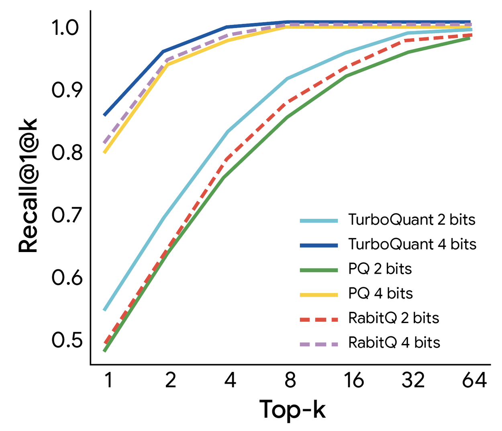

## 한 줄 요약

TurboQuant는 **학습 없이** LLM의 KV 캐시를 **3비트까지 압축**하면서도 **정확도 손실 없이**, H100 GPU에서 **최대 8배 빠른 추론**을 가능하게 하는 압축 알고리즘입니다. Google Research가 개발했으며 ICLR 2026에서 발표될 예정입니다.

---

## 배경: 왜 벡터 압축이 중요한가

벡터는 AI 모델이 정보를 이해하고 처리하는 기본 단위입니다. 이미지 특성, 단어 의미, 데이터 속성 같은 복잡한 정보를 담는 **고차원 벡터**는 매우 강력하지만, 동시에 엄청난 메모리를 소비합니다. 이는 LLM 추론에서 **KV 캐시 병목**을 유발하는 주요 원인입니다.

**벡터 양자화(Vector Quantization)**는 고차원 벡터의 크기를 줄이는 고전적 압축 기법입니다. 하지만 기존 방법들은 대부분 **메모리 오버헤드**를 유발합니다. 작은 데이터 블록마다 양자화 상수를 전체 정밀도로 계산하고 저장해야 하기 때문입니다. 이 오버헤드는 숫자당 1~2비트를 추가로 소비해 양자화의 목적을 부분적으로 무력화합니다.

---

## TurboQuant란

TurboQuant는 이 메모리 오버헤드 문제를 최적으로 해결하는 압축 알고리즘입니다. 두 가지 핵심 기술을 결합합니다:

- **Quantized Johnson-Lindenstrauss (QJL)**: 제로 오버헤드 1비트 트릭
- **PolarQuant**: 극좌표 변환을 이용한 새로운 압축 방식

ICLR 2026에서 발표될 예정이며, Google Research가 개발했습니다.

### 핵심 특징

- **모델 크기 크게 감소** + **정확도 손실 0**
- **KV 캐시 압축**과 **벡터 검색** 모두에 이상적
- 학습이나 파인튜닝 없이 즉시 적용 가능
- H100 GPU에서 최대 **8배 속도 향상**
- Gemma, Mistral 등 오픈소스 LLM에서 검증됨

---

## TurboQuant 작동 원리

TurboQuant는 두 단계로 동작합니다:

### 1단계: 고품질 압축 (PolarQuant)

데이터 벡터를 **무작위 회전**시킵니다. 이 영리한 단계는 데이터의 기하학적 구조를 단순화해 각 벡터 부분에 개별적으로 표준 양자화기를 적용하기 쉽게 만듭니다. 첫 번째 단계는 압축력의 대부분(비트의 대다수)을 사용해 원본 벡터의 주요 개념과 강도를 포착합니다.

### 2단계: 숨겨진 오류 제거 (QJL)

TurboQuant는 작은 잔여 압축력(단 1비트)을 사용해 첫 단계에서 남은 미세한 오류에 QJL 알고리즘을 적용합니다. QJL 단계는 수학적 오류 검사기처럼 작동해 편향을 제거하고 더 정확한 어텐션 점수를 이끌어냅니다.

---

## QJL: 제로 오버헤드 1비트 트릭

**Johnson-Lindenstrauss 변환**을 사용해 복잡한 고차원 데이터를 축소하면서도 데이터 포인트 간 필수적인 거리와 관계를 보존합니다. 결과 벡터의 각 숫자를 단일 **부호 비트**(sign bit, +1 또는 -1)로 줄입니다.

이 알고리즘은 본질적으로 **메모리 오버헤드가 0인 고속 약어**를 만듭니다. 정확도 유지를 위해 QJL은 고정밀 쿼리와 저정밀 단순화 데이터를 전략적으로 균형 맞추는 특별한 추정기를 사용합니다. 이를 통해 모델이 어텐션 점수를 정확히 계산할 수 있습니다.

---

## PolarQuant: 압축의 새로운 "각도"

PolarQuant는 메모리 오버헤드 문제를 완전히 다른 접근으로 해결합니다. 표준 좌표(즉, X, Y, Z) 대신 **극좌표**로 벡터를 변환합니다.

비유하면 "동쪽으로 3블록, 북쪽으로 4블록 가라"는 지시를 "37도 각도로 총 5블록 가라"로 바꾸는 것과 같습니다.

### 장점

- **반지름**: 핵심 데이터의 강도
- **각도**: 데이터의 방향 또는 의미

각도 패턴이 알려져 있고 고도로 집중되어 있어 모델은 비용이 많이 드는 **데이터 정규화** 단계를 수행할 필요가 없습니다. 데이터를 경계가 지속적으로 변하는 "사각형" 그리드 대신 경계가 이미 알려진 고정된 "원형" 그리드에 매핑하기 때문입니다.

이를 통해 PolarQuant는 전통적 방법들이 반드시 가져야 하는 메모리 오버헤드를 제거합니다.

---

## 실험 결과

### 롱 컨텍스트 벤치마크

TurboQuant는 표준 롱 컨텍스트 벤치마크에서 엄격하게 평가되었습니다:

- **LongBench**
- **Needle In A Haystack**
- **ZeroSCROLLS**
- **RULER**
- **L-Eval**

Gemma와 Mistral 오픈소스 LLM을 사용했습니다.

### 핵심 결과

- **내적 왜곡(dot product distortion)**과 **재현율(recall)** 모두에서 최적 점수 달성
- KV 메모리 공간을 **최소 6배 축소**
- 롱 컨텍스트 "바늘찾기" 작업에서 **완벽한 다운스트림 결과**
- PolarQuant도 이 작업에서 거의 무손실

### 속도 향상

- KV 캐시를 **3비트**로 양자화
- 학습이나 파인튜닝 없이 적용
- 모델 정확도 타협 없음
- 원본 LLM(Gemma, Mistral)보다 **더 빠른 런타임** 달성
- H100 GPU에서 4비트 TurboQuant가 32비트 비양자화 키 대비 **최대 8배 성능 향상**

---

## 벡터 검색에서의 성능

TurboQuant는 고차원 벡터 검색에서 최신 방법들(PQ, RabbiQ)과 비교 평가되었습니다.

**1@k 재현율 비율**(상위 k 근사치 내에서 실제 최상위 내적 결과를 포착하는 빈도 측정)을 사용했습니다.

### 결과

- 대형 코드북과 데이터셋별 튜닝을 사용하는 베이스라인 대비 **일관되게 우수한 재현율** 달성
- 고차원 검색 작업에서 견고성과 효율성 입증

---

## 왜 중요한가

TurboQuant, QJL, PolarQuant는 단순한 실용적 엔지니어링 솔루션이 아닙니다. **강력한 이론적 증명**이 뒷받침되는 근본적 알고리즘 기여입니다.

### 이론적 기반

- 실제 응용에서 잘 작동할 뿐만 아니라 **증명 가능한 효율성**
- **이론적 하한에 근접**하게 동작
- 이 엄격한 기반이 대규모 중요 시스템에서 견고하고 신뢰할 수 있게 만듦

### 실제 응용

주요 응용은 Gemini 같은 모델의 KV 캐시 병목 해결이지만, 효율적 온라인 벡터 양자화의 영향은 더 광범위합니다:

1. **의미적 검색**: 키워드를 넘어 의도와 의미를 이해하는 현대적 검색
2. **대규모 벡터 인덱싱**: 수십억 벡터 데이터베이스에서 "가장 가까운" 의미론적 유사 항목 찾기
3. **메모리 효율성**: 최소 메모리로 대형 벡터 인덱스 구축 및 쿼리
4. **전처리 시간**: 거의 제로에 가까운 전처리 시간
5. **정확도**: 최신 수준의 정확도 유지

---

## 미래 전망

AI가 모든 제품에 통합됨에 따라 LLM부터 의미적 검색까지, **근본적 벡터 양자화** 연구는 그 어느 때보다 중요해질 것입니다.

TurboQuant는 고차원 검색에서 변혁적 전환을 보여줍니다. 달성 가능한 속도의 새로운 벤치마크를 설정하고, **데이터 독립적 방식**으로 거의 최적의 왜곡율을 제공합니다. 이를 통해 최근접 이웃 엔진이 훨씬 무거운 모델의 정밀도를 유지하면서 **3비트 시스템의 효율성**으로 작동할 수 있습니다.

---

## 참고 자료

- [TurboQuant 논문 (arXiv)](https://arxiv.org/abs/2504.19874)
- [Quantized Johnson-Lindenstrauss (QJL)](https://dl.acm.org/doi/10.1609/aaai.v39i24.34773)
- [PolarQuant 논문 (arXiv)](https://arxiv.org/abs/2502.02617)
- [ICLR 2026](https://iclr.cc/)
- [AISTATS 2026](https://virtual.aistats.org/)

---

## 원문

[Google Research Blog - TurboQuant: Redefining AI efficiency with extreme compression](https://research.google/blog/turboquant-redefining-ai-efficiency-with-extreme-compression/)

---

## 태그

#ai #llm #quantization #compression #google-research #kv-cache #vector-search #iclr2026
