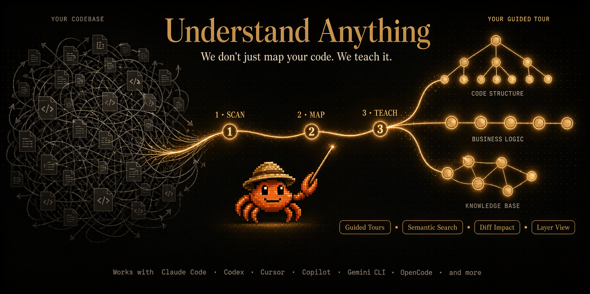

새 팀에 합류했다. 코드베이스가 20만 줄. 어디서부터 읽어야 할지 모르겠다. — 이 경험, 개발자라면 누구나 해봤을 거다.

1. **Understand Anything**은 이 문제를 정면으로 공략함. 코드베이스 전체를 스캔해서 파일·함수·클래스·의존성을 노드로, 관계를 엣지로 하는 지식그래프를 만듦. 그래프를 대시보드에서 시각적으로 탐색할 수 있음.

2. Claude Code 플러그인으로 시작했지만, 지금은 Cursor, VS Code + GitHub Copilot, Codex, Gemini CLI, OpenCode, Vibe CLI, Cline, KIMI CLI 등 14개 플랫폼을 지원함. 설치 한 줄이면 됨.

## 핵심 설계: Tree-sitter + LLM 하이브리드

3. 이 도구의 핵심 통찰은 "정적 분석과 LLM이 각각 잘하는 걸 나눠서 하자"는 거임.

4. **Tree-sitter(결정론적)** — 소스코드를 파싱해서 구문 트리를 만들고, import/export, 함수·클래스 정의, 호출 사이트, 상속 관계 같은 구조적 팩트를 추출함. 같은 입력 → 같은 출력. 매번 동일함. 지문(fingerprint) 기반 변경 감지도 담당.

5. **LLM(시맨틱)** — 파서가 뽑은 구조와 원본 소스를 함께 읽고, 파서가 할 수 없는 걸 함. 평이한 영어 요약, 태그, 아키텍처 레이어 배정, 비즈니스 도메인 매핑, 가이드 투어, 언어 개념 콜아웃.

6. 이 분리 덕분에 그래프의 구조적 측면은 재현 가능(같은 코드 → 같은 엣지)하고, 시맨틱 측면은 의도를 포착함. 파일이 뭘 *하는지*가 아니라 뭘 *위한* 건지를 알려줌.

## 멀티에이전트 파이프라인

7. `/understand` 명령 하나로 5개 전문 에이전트가 순차·병렬로 돌아감.

8. **project-scanner**: 파일 발견, 언어·프레임워크 감지
9. **file-analyzer**: 함수·클래스·import 추출, 그래프 노드·엣지 생성. 최대 5개 동시 실행, 배치당 20-30파일 처리
10. **architecture-analyzer**: 아키텍처 레이어 식별 (API, Service, Data, UI, Utility)
11. **tour-builder**: 의존성 순서대로 정렬된 가이드 투어 생성
12. **graph-reviewer**: 그래프 완전성·참조 무결성 검증

13. `/understand-domain`을 실행하면 6번째 에이전트인 **domain-analyzer**가 추가로 돌아감. 비즈니스 도메인, 플로우, 프로세스 스텝을 추출함.

14. `/understand-knowledge`는 Karpathy 패턴 LLM 위키를 입력으로 받아서, **article-analyzer**가 엔티티·클레임·암묵적 관계를 추출함. 위키를 탐색 가능한 아이디어 그래프로 바꿈.

## 대시보드: 그래프를 탐색하는 6가지 방법

15. **구조 그래프 뷰**: 파일·함수·클래스가 노드. 클릭하면 코드, 관계, 영어 요약이 나옴. 아키텍처 레이어별로 색상 구분.
16. **도메인 뷰**: 코드가 실제 비즈니스 프로세스에 어떻게 매핑되는지 보여줌. 도메인·플로우·스텝이 수평 그래프로 배치됨.
17. **퍼지 & 시맨틱 검색**: 이름이나 의미로 검색. "인증 담당하는 부분이 어디야?" 같은 자연어 쿼리가 그래프 전체에서 결과를 반환.
18. **가이드 투어**: 의존성 순서로 정렬된 자동 생성 워크스루. 올바른 순서로 코드베이스를 배울 수 있음.
19. **Diff 임팩트 분석**: 변경사항이 시스템의 어느 부분에 영향을 미치는지 커밋 전에 확인. 리플 이펙트를 시각화.
20. **페르소나 적응형 UI**: 주니어 개발자, PM, 파워유저 — 누구냐에 따라 상세 수준을 자동 조절.

## 실용적 디테일

21. **증분 업데이트**: 매번 전체를 다시 분석하지 않음. 변경된 파일만 재분석. `--auto-update` 플래그로 post-commit 훅을 설정하면 커밋마다 그래프가 자동 갱신됨.

22. **팀 공유**: 그래프는 JSON 파일임. `.understand-anything/` 디렉토리를 커밋하면 팀원들이 파이프라인을 돌리지 않아도 됨. 온보딩, PR 리뷰, docs-as-code에 활용 가능. 10MB 이상이면 git-lfs 권장.

23. **모노레포 지원**: `understand src/frontend`처럼 서브디렉토리만 스캔 가능.

24. **다국어**: `--language ko`로 노드 요약, 대시보드 UI, 가이드 투어를 한국어로 생성.

## 왜 주목하는가

25. 코드 이해(code understanding)는 AI 코딩 에이전트의 다음 전장임. 현재 에이전트들은 컨텍스트 윈도우 안에 파일을 때려 넣고 LLM이 이해하길 바라는 구조. 파일이 많아지면 어텐션이 흐려지고, 아키텍처 수준의 이해는 불가능에 가까움.

26. Understand Anything은 다른 접근을 함. 코드를 먼저 구조화된 그래프로 만들고, 에이전트(또는 사람)가 그래프를 탐색하게 함. 컨텍스트 윈도우 한계를 우회하는 방법.

27. SciAtlas가 논문 4,300만 편을 지식그래프로 만들어 연구 에이전트에 먹이는 거라면, Understand Anything은 코드베이스를 지식그래프로 만들어 코딩 에이전트에 먹이는 거. "지식그래프가 인지 지도가 된다"는 패턴이 반복됨.

28. Tree-sitter 기반 구조 분석이 결정론적이라는 게 중요함. LLM만 쓰면 같은 코드를 넣어도 매번 다른 그래프가 나옴. 구조는 확정하고, 의미만 LLM에 맡기는 설계가 신뢰성의 핵심.

---

**참고자료**
- [Understand Anything (GitHub)](https://github.com/Lum1104/Understand-Anything)
- [라이브 데모](https://understand-anything.com/demo/)
- [홈페이지](https://understand-anything.com/)
- [Community walkthrough by Better Stack (YouTube)](https://www.youtube.com/watch?v=VmIUXVlt7_I)
