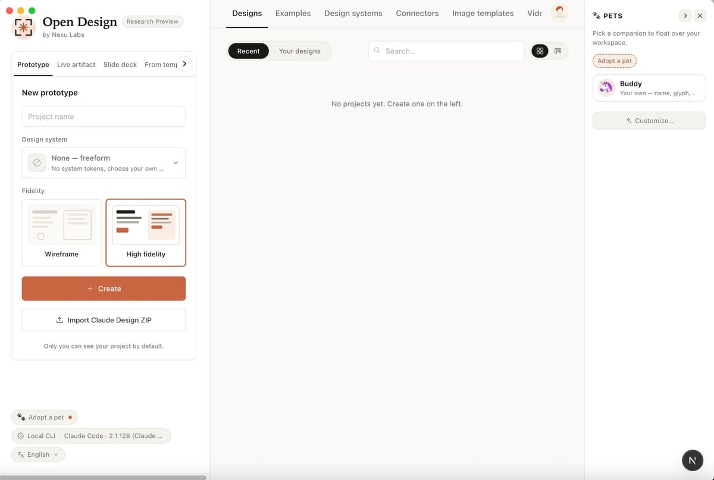
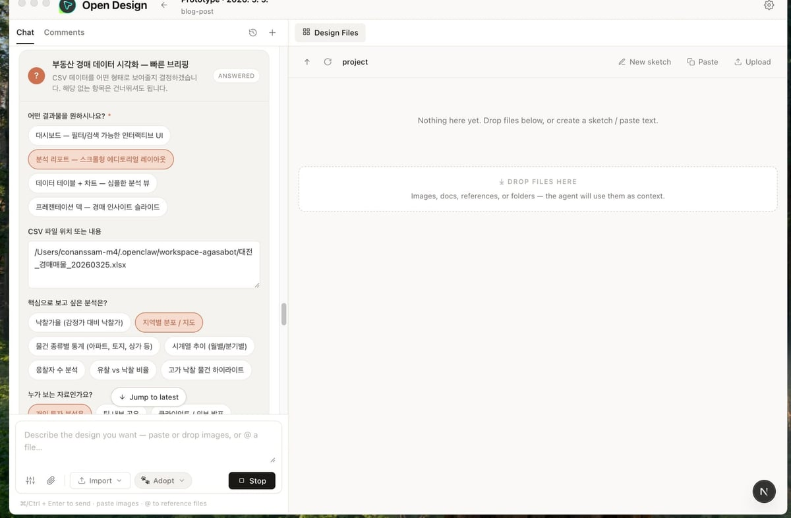
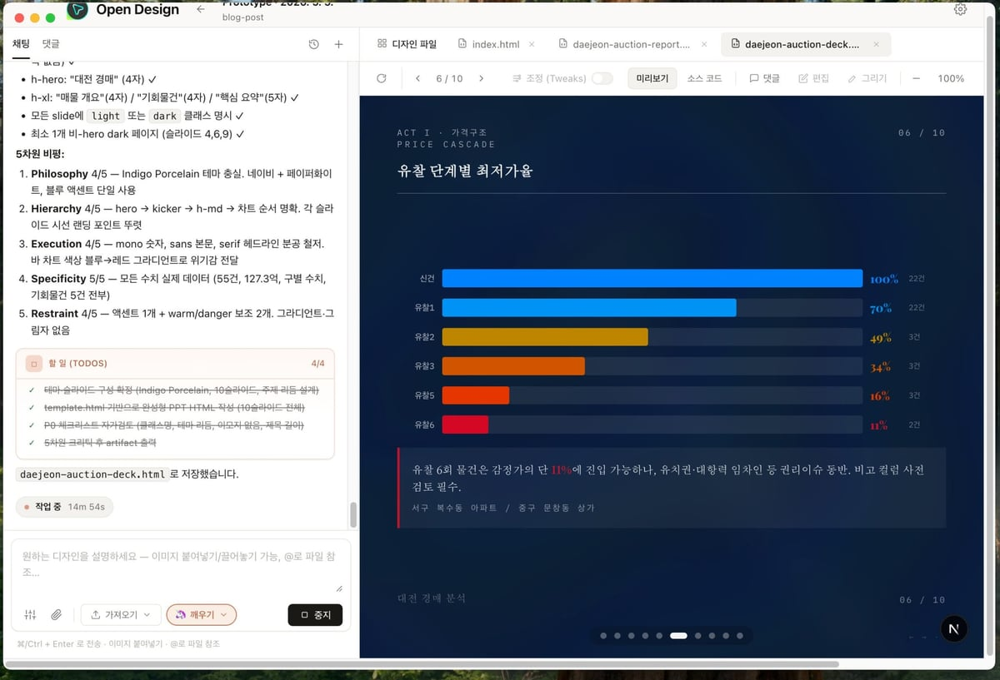
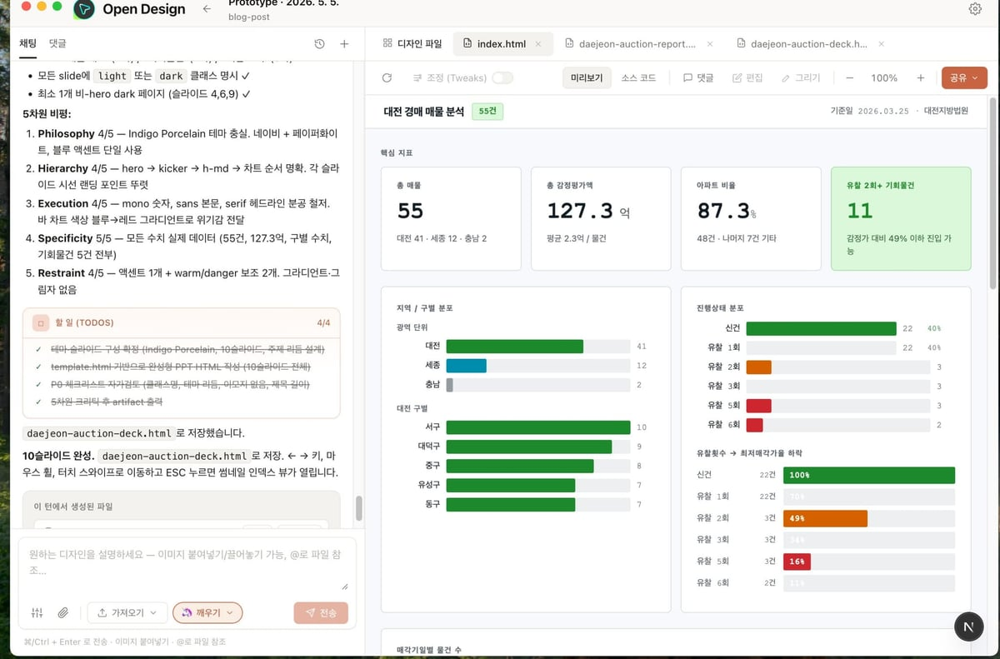
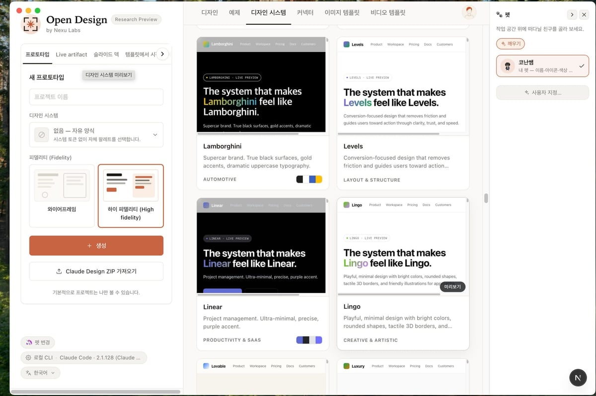

새 팀에 들어가서 받은 코드베이스가 20만 줄이라면?

폴더 구조부터 시작하면 끝이 안 난다. 어디가 진짜 중요한 부분인지, 함수 간 관계는 뭔지, 비즈니스 로직이 어디 숨어있는지 파악하는 데만 며칠이 걸린다.

**Understand Anything은 이 문제를 그래프로 푼다.**

1. Claude Code 플러그인으로 설치하면, `/understand` 명령 하나로 전체 코드베이스를 분석한다.

2. AI 에이전트 6개가 동시에 움직인다. 파일을 스캔하고, 함수와 클래스를 추출하고, 아키텍처 레이어를 파악하고, 비즈니스 로직까지 캐치한다.

3. 분석 결과가 `.understand-anything/knowledge-graph.json`에 저장되고, 이걸 바탕으로 인터랙티브 대시보드가 뜬다.

4. 이제 구조 그래프(structural graph)로 파일, 함수, 클래스를 시각적으로 탐색할 수 있다. 각 노드를 클릭하면 평문 설명, 관계도, 학습 경로까지 나온다.

5. 도메인 그래프(domain graph)로 전환하면? 코드가 실제 비즈니스 프로세스로 재구성된다. "결제 흐름이 어떻게 돌아가?"라는 질문에 그래프가 답한다.

6. 검색도 두 가지다. 이름으로 찾거나, 의미로 찾거나. "인증 처리하는 부분 어디?"라고 물으면 전체 그래프에서 관련된 모든 것을 건져낸다.

7. PR 리뷰할 때 `/understand-diff`를 쓰면, 당신의 변경사항이 전체 시스템에 미치는 영향을 미리 본다. 예상치 못한 부작용이 없는지 확인하고 나서 커밋한다.

8. 신입 온보딩? `/understand-onboard`로 자동 가이드를 생성한다. 아키텍처부터 데이터 흐름까지, 배워야 할 순서 그대로다.

**실제로 어떻게 보일까?**

간단한 이커머스 API 프로젝트를 예로 들어보자.

```
src/
├── main.js (시작점)
├── server.js (Express 설정)
├── auth.js (JWT 미들웨어)
├── db.js (MongoDB 연결)
├── routes/
│   ├── products.js (상품 CRUD)
│   └── orders.js (주문 + 결제)
└── services/
    ├── productService.js
    ├── orderService.js
    └── paymentService.js
```

이 코드를 `/understand`로 분석하면:

- **구조 그래프**: main.js → server.js → (auth.js + db.js + routes) → services 의존도가 화살표로 그려진다. 어느 파일이 몇 개의 다른 파일을 부르는지 시각적으로 보인다.

- **함수 레벨 추출**: orderRouter 안의 POST /orders 핸들러가 OrderService.create() → PaymentService.process() → OrderService.updateStatus() 순서로 호출되는 게 명확하다. 누군가 이 흐름을 이해해야 할 때, 텍스트로 설명하는 것보다 그래프가 훨씬 빠르다.

- **아키텍처 레이어링**: routes는 API 레이어, services는 비즈니스 로직 레이어, db.js는 데이터 레이어로 자동 분류된다. 신입 개발자는 이 계층화된 구조만 봐도 "아, 이 프로젝트는 3-tier 아키텍처네"라고 바로 안다.

- **가이디드 투어**: "주문 흐름 배우기"를 선택하면, main → server → orderRouter → OrderService → PaymentService 순서대로 자동 생성된 설명이 따라온다. 각 단계마다 "왜 이 파일이 중요한가"가 적혀있다.

9. 지원 플랫폼이 많다. Claude Code는 물론이고, Cursor, VS Code + Copilot, Gemini CLI, Codex까지. 당신이 어떤 에디터를 쓰든 플러그인으로 설치할 수 있다.

10. 생성된 그래프는 JSON 파일이라 깃에 커밋할 수 있다. 팀원들은 `/understand`를 다시 돌릴 필요 없이, 그 JSON을 읽어서 대시보드를 띄운다. CI/CD에 `/understand --auto-update`를 넣으면, 매 커밋마다 자동으로 그래프가 최신 상태로 유지된다.

11. 큰 프로젝트라면 git-lfs로 JSON을 관리한다. 그 정도면 무게가 10MB 이상이 될 텐데, 깃에 10MB 바이너리 파일을 계속 푸시하는 것보다는 LFS가 낫다.

12. 백엔드에서는 6개 에이전트가 병렬로 움직인다. project-scanner가 파일 목록을 먼저 잡아내고, file-analyzer들(최대 5개)이 동시에 코드를 파싱한다. architecture-analyzer가 레이어를 찾고, tour-builder가 학습 경로를 만들고, graph-reviewer가 정합성을 확인한다. 20만 줄도 몇 분이면 끝난다.

**핵심:**

1. 복잡한 코드는 텍스트로 설명하기 어렵다.
2. 그래프는 관계를 직관적으로 보여준다.
3. Understand Anything은 이 그래프를 AI가 자동으로 그려준다.
4. 온보딩, PR 리뷰, 아키텍처 이해 — 모두 그래프 하나로 해결된다.

[라이브 데모 (understand-anything.com/demo)](https://understand-anything.com/demo/)에서 실제로 움직이는 그래프를 만져볼 수 있다. 마우스로 드래그해서 팬하고, 줌으로 확대하고, 노드를 클릭해서 코드를 본다.

새로운 팀에 들어가기 전에, 한 번 써보자. "그 20만 줄이 정말 복잡할까?" 라는 질문에, 그래프가 답을 줄 거다.

**실제 활용 사례: 대전경매 분석 대시보드**

Understand Anything의 결과물은 단순한 텍스트 그래프가 아니다. Open Design 같은 도구로 한 번 더 시각화할 수 있다.

예를 들어, 부동산 경매 데이터를 분석하는 시스템이 있다면:

1. `/understand` 명령으로 전체 코드베이스를 분석한다. 데이터 수집 → 데이터 정제 → 분석 엔진 → API → 프론트엔드 같은 흐름이 그래프로 그려진다.



2. 이 그래프를 바탕으로 "실제 사용자가 보게 될 대시보드"를 만든다. Open Design에서 대시보드 프로토타입을 만들고, AI 에이전트와 협력해서 데이터 시각화를 완성한다.



3. 결과물은 이렇다:



   - **경매품 가격 추이**: 유찰 단계별로 최저가율이 어떻게 변하는지 한눈에 (1차 100% → 6차 11%)
   - **지역별 통계**: 대전시 전 구(동구, 서구, 유성구, 대덕구)별 경매품 개수와 성공률



   - **인기도 분석**: 어느 지역이 가장 경쟁이 치열한지, 누적 낙찰 비율로 확인
   - **인기 범위**: 가장 많이 거래되는 가격대가 몇억 대인지, 한눈에 파악

4. 이렇게 만든 대시보드는 단순한 보고서가 아니다. 사용자가 직접 조작할 수 있는 인터랙티브 페이지다. 특정 지역만 필터링하거나, 가격대별로 비교하거나, 성공률 추세를 따라가며 의사결정을 한다.



   각 프로젝트의 특성에 맞는 디자인 시스템(Lamborghini의 럭셔리함, Levels의 전환율 최적화, Linear의 미니멀한 프로젝트 관리)을 선택해서 대시보드를 구성한다. 데이터가 아무리 좋아도, UI가 못하면 누구도 안 쓴다.

5. 백엔드에서는 Understand Anything이 놓친 부분이 없도록 한다. 데이터 파이프라인이 제대로 작동하는지, API 응답이 예상 범위인지 확인하고, 프론트엔드에서 어떤 인터페이스를 기대하는지 미리 파악한다.

6. 신입 개발자가 들어오면, "경매 시스템이 어떻게 동작하는가"를 설명하는 대신 이 대시보드와 그래프를 함께 보여준다. 코드를 읽는 것보다, 그래프에서 의존도를 따라가고, 대시보드에서 결과물을 확인하는 게 훨씬 빠르다.

이게 Understand Anything의 진짜 가치다. **코드를 이해하기 위해 텍스트 설명이 필요 없어진다.** 그래프가 구조를 말하고, 대시보드가 목적을 말한다.

**정리:**

Understand Anything은 단순히 "코드 구조를 그려주는 도구"가 아니다. AI 기반 그래프 분석으로 전체 시스템을 이해하고, 그 이해를 바탕으로 사용자 친화적인 대시보드와 인터페이스를 만드는 시작점이다.

코드가 복잡할수록, 팀이 클수록, 새로운 사람이 들어올수록 — Understand Anything은 더 빛난다. 한 번 시도해보자.
