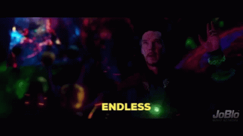
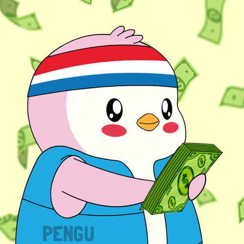

1996년에 한글 검색엔진 '까치네'를 만든 대학생이 있었음.
2026년에 그 사람이 1세대 포털 '다음'을 인수 추진함.

같은 사람임. 김성훈 업스테이지 대표.

## 이력부터 짚음

1972년 구미 출생. 구미전자공고 → 대구대.
1995년 대학 시절에 까치네 만듦.
UC Santa Cruz 박사, MIT CSAIL 박사후, 2009년 홍콩과기대 교수.

한국 AI 개발자면 한 번쯤 들어봤을 **'모두를 위한 딥러닝'(누적 600만 뷰)** 강의 만든 게 이 사람임.

2017년에 네이버 클로바 AI 헤드로 복귀함. 3명짜리 조직을 150명까지, AI 기술 100여 개랑 서비스 30여 개를 네이버에 이식함.

2020년 10월, 49세에 업스테이지 창업.
네이버 파파고 박은정, Visual AI 이활석이 같이 나옴.

지금 54세. KB증권·미래에셋 주관, 5월 예심 청구, 하반기 상장 목표.

## 다음 인수 구도

카카오는 2014년에 다음을 품었는데 검색 점유율이 계속 빠졌음.
2025년 5월에 AXZ로 분사시켰고, 정신아 대표 체제가 계열사를 132개에서 80개 수준으로 줄이는 중.

2026년 1월 29일 업스테이지랑 주식 교환 MOU 체결. 지금은 본 실사 단계.
**카카오 AXZ 100% ↔ 업스테이지 일부 지분**. 현금은 오가지 않음.

네이버보다 먼저 한글 검색엔진 만든 사람이 1세대 포털을 품는 그림임.

## 회수 구조가 까졌음

이번에 투자 배수가 다 공개됐음.

| 라운드 | 투자자 | 단가 | 배수 |
|---|---|---|---|
| 시드 (2020) | 프라이머사제 | 2만 1천 원 | **71.4배** |
| 시리즈A | 컴퍼니케이 | 9만 7,991원 | 15.3배 |
| 시리즈A (2023) | KT | 15만 4,180원 | 9.7배 |
| 시리즈B~C | SK네트웍스 | 평균 28만 5천 원 | 5배 |

누적 투자금 2천억짜리 회사가 6년 만에 돌려주는 숫자임.
국내 AI 스타트업 회수 구조가 이렇게 공개된 건 처음.

## SK네트웍스 구도가 눈에 띔

2024년 시리즈B에 250억으로 합류.
2026년 2월 콜옵션 행사 470억, 3월 시리즈C 500억 추가.
지분 13%까지 끌어올려서 상장 시 지분 가치 **6,430억**.

AMD도 시리즈B 브릿지에 전략적 투자자로 이미 들어와 있음.
재무적 투자자만 모인 판이 아님. 작정하고 짠 구도임.

## 업스테이지가 이 거래로 얻는 건 두 가지

**하나, 매출.** 연 매출 3,320억이 외형에 얹힘. 업스테이지 138억의 24배.
2023년 46억 → 2024년 138억으로 세 배 뛰었지만, 조 단위 밸류를 정당화하기엔 턱없이 부족한 매출이었음. 그 공백을 메우는 카드가 다음.

**둘, 데이터.** 다음 뉴스·검색·카페·티스토리 **30년 치**가 솔라 LLM에 들어감.

김성훈 대표가 지난달 AMD 리사 수랑 회동에서 말했음.
> "다음 인수 마무리되면 하루 1조 토큰 처리가 목표."

## 근데 서사가 너무 매끄러움. 짚어야 할 지점 세 개

### 하나, 밸류 멀티플

업스테이지 2024 매출 138억. 목표 밸류 5조. **매출의 354배**임.
다음 매출을 더해도 3,460억인데, 이 매출이 3년 연속 줄고 있음.

포털비즈 부문 기준 2022년 4,240억 → 2023년 3,440억 → 2024년 3,320억.
2025년에 3,000억 선도 무너짐. 다음 검색 점유율 **2.72%**.

AI 얹어서 반등할지는 별개 문제임.

### 둘, 올해 1월 택갈이 논란

사이오닉AI 고석현 대표가 1월 1일 LinkedIn에 올렸음.
> "솔라 오픈 100B가 중국 Z.ai의 GLM-4.5-Air 기반으로 파생된 것으로 추정된다."

김성훈은 같은 날 오후 3시에 공개 검증회를 엶.
**학습 로그를 통째로 풀어버림.**
업스테이지는 이걸 'AI의 육아일기'라고 부름. 모델이 아무것도 모르던 초기부터 뭘 배워왔는지가 전부 남아있다는 의미임.

정부가 받아들였고 독파모 통과. 의혹 제기자 사과로 종결됨.

비교할 케이스가 있음.
같은 시기 **네이버 SEED는 가중치 수치가 중국 모델과 흡사하다는 이유로 독파모에서 탈락함.**

결과물만 놓고 싸우냐, 과정 자체를 펼쳐 보이냐.
증명 방식 하나가 두 회사 운명을 갈랐음.

### 셋, 솔라 프로3 체감

2026년 3월 24일 공개. 1,020억 매개변수 MoE(전문가 혼합) 모델임.
Tau2-all 벤치가 전작 36.0점에서 72.3점으로 두 배 뛰었음.

근데 아카라이브 LLM 채널 반응이 싸늘함.
> "GPT3.5 수준", "벤치 대비 실성능이 황당하게 낮다", "맥락 못 잡고 환각도 있다".

벤치 점수랑 실사용 체감 사이가 벌어짐.
상장 심사 테이블에서 쟁점이 될 지점임.

## 그럼에도 이 상장이 중요한 이유

업스테이지는 2026년 4월 중순 시리즈C 1차 라운드에서 1,800억 투자 받으면서 국내 생성형 AI 기업 최초로 **유니콘(기업가치 1조 이상)** 에 올랐음.

상장 성사되면 생성형 AI 상장사 1호.
한 회사가 먼저 통과하면 뒤따르는 회사들한테 기준점이 생김.

그리고 또 하나.

홍콩과기대 교수 → 네이버 클로바 AI 헤드 → 업스테이지 창업 → 5조 상장.

한국에서 엔지니어가 기술 창업으로 IPO까지 가는 풀 코스가 **처음으로 완성형**이 됨.

개발자가 창업 고민 중이면 이 궤적이 참고 지표가 될 수도 있음.
71배, 15배, 9.7배, 5배라는 회수 구조는 앞으로 VC 협상 테이블에 기준점으로 얹힘.

## 30년이 한 바퀴 돎

1996년엔 까치네 만들었고, 2026년엔 다음을 품으려 함.
30년이 돌아서 5조 원 앞까지 왔음.

근데 상장은 끝이 아니라 출발선임.

매출 354배 멀티플을 지키려면 다음 2.72% 점유율 반등, 솔라 프로3 체감 논란, 독파모 결과물이 남아 있음.

다음 30년이 어떻게 쌓일지.
1호 상장사의 궤적이 지금 그 출발선에 서 있음.

---

## 출처

- [업스테이지 상장 ① — 넘버스](https://www.numbers.co.kr/news/articleView.html?idxno=20855)
- [Solar Pro 3 공식 블로그](https://www.upstage.ai/blog/ko/solar-pro-3-0323)
- [주식 교환 MOU — 한국경제](https://www.hankyung.com/amp/2026012921401)
- [다음 인수 배경 — ZDNet](https://zdnet.co.kr/view/?no=20260201001614)
- [밸류-실적 — 딜사이트](https://dealsite.co.kr/articles/159904/068020)
- [택갈이 논란 — 스마트투데이](https://www.smarttoday.co.kr/ko-kr/articles/100261)
- 원 소스: [@unclejobs.ai Threads](https://www.threads.com/@unclejobs.ai/post/DXYQYT4CaWM)
