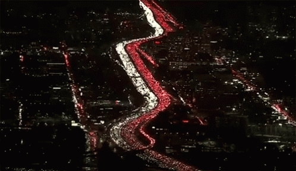
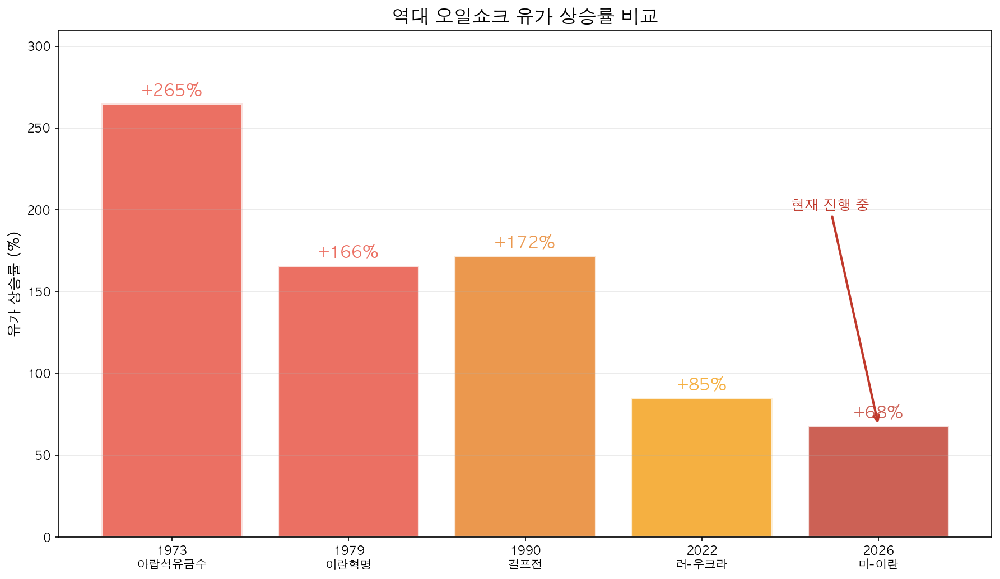
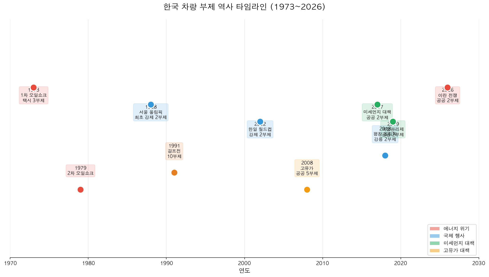
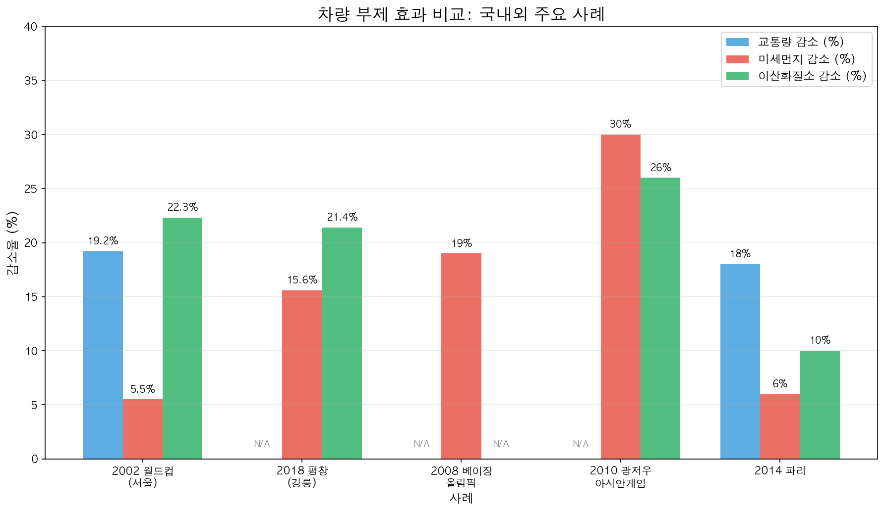
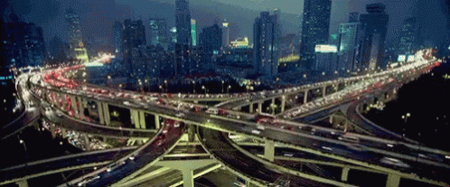

전쟁은 멀리서 벌어짐. 근데 유가는 바로 들어옴.

중동에서 긴장이 커지면 제일 먼저 반응하는 건 뉴스가 아니라 기름값임. 그다음은 물류비임. 그다음은 생산비, 전기요금, 생활물가임. 한국처럼 원유 수입 의존도가 높은 나라에서는 국제유가가 흔들리는 순간 경제 전체가 같이 흔들리는 구조임.

그래서 유가가 오를 때마다 꼭 다시 나오는 말이 있음. **차량 2부제**, **5부제**, **승용차 요일제** 같은 것들임. 겉으로 보면 교통 대책 같음. 근데 뿌리를 따라가 보면 이건 원래 **에너지 위기 대응 카드**에 가까웠음.

2026년도 마찬가지였음. 미-이란 전쟁 리스크가 커지고 국제유가 불안이 다시 올라오자 공공부문 승용차 5부제가 먼저 나오고, 이어서 2부제까지 거론됐음. 새로 나온 얘기처럼 보이지만 사실은 오래된 방식임. 한국은 유가가 크게 흔들릴 때마다 늘 자동차부터 건드려 왔음.

그래서 궁금해지는 지점이 딱 하나임.

> **차량 2부제는 한국에서 언제부터 시작됐고, 유가가 오를 때 실제로 효과가 있었나.**

결론부터 말하면 이렇다. **에너지 위기 대응 차원의 초기 부제는 1973년 오일쇼크 시기 택시 부제까지 올라감. 일반 승용차 강제 2부제의 대표적 출발점은 1988년 서울올림픽임.** 그리고 효과도 있었음. 근데 항상 같은 크기로 나온 건 아니었음. **짧고 강하게 할수록 효과가 컸고, 느슨하고 오래 갈수록 힘이 빠지는 쪽이었음.**

---

## 1. 왜 유가가 오르면 차량 2부제가 다시 나오나

이유는 단순함. 정부가 단기간에 줄여볼 수 있는 소비 가운데 자동차 연료가 크고, 눈에도 잘 보이기 때문임.

1973년 1차 오일쇼크는 4차 중동전쟁 뒤 아랍 산유국의 감산과 금수 조치로 시작됐음. 그때 세계가 배운 게 있음. 석유는 그냥 비싼 원자재가 아니라 경제 전체를 흔드는 스위치라는 점이었음. 그래서 각국 정부가 속도 제한, 운행 제한, 배급제 같은 조치를 한꺼번에 꺼냈음. 한국도 그 흐름 안에 있었음.

2026년의 미-이란 전쟁 리스크가 다시 크게 읽힌 이유도 같음. 호르무즈 해협이 흔들리면 국제유가가 흔들리고, 국제유가가 흔들리면 한국은 수입물가, 산업 비용, 민생 부담을 한 번에 떠안게 됨. 이럴 때 차량 부제는 보여주기용 구호라기보다 공공부문부터 연료 소비를 줄이겠다는 신호에 가까움.

현대경제연구원은 2026년 3월 보고서에서 미-이란 전쟁이 장기화해 국제유가가 배럴당 100달러 수준으로 오를 경우 한국 성장률이 최소 0.3%포인트 하락하고 소비자물가상승률은 1.1%포인트 높아질 수 있다고 봤음. 150달러 시나리오에서는 충격이 더 커진다고 봤음. 차량 2부제가 다시 소환되는 배경도 결국 여기임.

---

## 2. 한국은 언제부터 차량 부제를 했나

한국의 차량 부제는 하나의 제도가 길게 이어진 역사라기보다, 위기가 올 때마다 비슷한 방식으로 되살아난 역사에 가까움. 2부제만 있었던 것도 아님. 택시 부제, 10부제, 5부제, 공공기관 요일제가 같이 섞여 있었음.

| 연도 | 계기 | 형태 | 의미 |
|---|---|---|---|
| 1973 | 1차 오일쇼크 | 택시 부제 | 에너지 절약 목적의 초기 운행 제한 |
| 1988 | 서울올림픽 | 강제 2부제 | 일반 승용차 강제 2부제의 대표적 시작 사례 |
| 1991 | 걸프전 | 10부제 | 전국적 에너지 절약 대응 |
| 2002 | 한일월드컵 | 강제 2부제 | 교통량 감소와 속도 개선 효과 확인 |
| 2002 | 부산아시안게임 | 강제 2부제 | 대기질 개선 사례로 자주 인용 |
| 2008, 2011 | 고유가 | 공공부문 5부제 | 에너지 절감형 부제 재등장 |
| 2017~2019 | 미세먼지 대책 | 공공기관 2부제 | 비상저감조치, 계절관리제와 결합 |
| 2018 | 평창올림픽 강릉 | 강제 2부제 | PM10, PM2.5, NO2, CO 감소 확인 |
| 2026 | 미-이란 전쟁 리스크 | 공공 5부제 → 2부제 | 에너지 안보 불안 대응 |

여기서 기억할 포인트는 두 개임.

1. **1973년은 에너지 위기형 부제의 시작임**
2. **1988년은 일반 승용차 강제 2부제의 대표적 시작임**

이 두 장면만 잡아도 흐름이 정리됨. 유가가 튀거나, 국제행사가 열리거나, 대기질 압박이 커질 때 정부는 늘 자동차 운행 제한 카드를 다시 꺼냈음.

---

## 3. 그래서 실제 효과는 있었나

말보다 숫자가 빠름. 국내에서 가장 많이 인용되는 사례는 **2002 한일월드컵 서울**과 **2018 평창동계올림픽 강릉**임.

### 2002 한일월드컵 서울

연합뉴스가 2026년 팩트체크 기사에서 정리한 서울시 발표를 보면, 월드컵 기간 6일간 강제 2부제를 시행했을 때 서울에서는 이런 변화가 있었음.

- **교통량 평균 19.2% 감소**
- **통행속도 평균 32.1% 증가**
- **대중교통 수송인원 평균 6.02% 증가**

같은 시기를 다룬 2007년 한국대기환경학회지 연구에서는 배출량 변화도 이렇게 나왔음.

- **이산화질소(NO₂) 22.3% 감소**
- **미세먼지 5.5% 감소**
- **아황산가스(SO₂) 2.4% 감소**

이 정도면 그냥 체감의 문제가 아님. 차가 줄면 길이 조금 숨을 쉬고, 길이 숨을 쉬면 배출도 같이 내려감. 근데 여기에도 단서는 있음. 배출량 감소가 실제 대기 중 농도 감소와 완전히 똑같이 움직이진 않는다는 점임. 바람, 비, 기온역전 같은 기상 조건이 같이 작동하기 때문임.

### 2018 평창동계올림픽 강릉

강릉 사례는 더 직관적임. 실제 관측치가 꽤 선명하게 나왔기 때문임.

경향신문 보도에 따르면 원주지방환경청 분석 결과, 강릉시는 올림픽 기간 차량 2부제를 시행했을 때 2016~2017년 같은 기간과 비교해 이런 변화가 있었음.

- **PM10 15.6% 감소** (51㎍/㎥ → 43㎍/㎥)
- **PM2.5 10.7% 감소** (28㎍/㎥ → 25㎍/㎥)
- **NO₂ 21.4% 감소**
- **CO 28.5% 감소**

이 사례가 보여주는 건 꽤 명확함. **특정 지역**, **짧은 기간**, **강제 적용**. 이 세 조건이 맞아떨어지면 차량 부제는 숫자로 확인되는 변화를 만들 수 있었음.

---

## 4. 해외까지 같이 보면 패턴이 더 분명함

| 사례 | 교통량 감소 | 미세먼지 또는 PM 감소 | NO₂ 감소 | 비고 |
|---|---:|---:|---:|---|
| 2002 서울 월드컵 | 19.2% | 5.5% | 22.3% | 강제 2부제, 단기 시행 |
| 2018 강릉 평창올림픽 | - | 15.6%(PM10), 10.7%(PM2.5) | 21.4% | 측정망 기준 |
| 2008 베이징 올림픽 | - | 19% | - | 홀짝제 |
| 2010 광저우 아시안게임 | - | 30% | 26% | CO 42% 감소 |
| 2014 파리 | 18% | 6% | 10% | 하루 강제 2부제 |

이 표를 보면 패턴이 바로 보임.

1. **강제성이 높을수록 효과가 큼**
2. **짧고 굵게 시행할수록 수치가 잘 나옴**
3. **교통량은 빨리 줄지만 대기질 체감은 날씨 영향을 많이 받음**

결국 차량 2부제는 상시 해법이라기보다 **위기 때 짧게 세게 쓰는 카드**에 가까움.

---

## 5. 근데 왜 체감은 늘 엇갈리나

효과가 없어서가 아님. **효과가 나타나는 조건이 까다롭기 때문임.**

첫째, **자율 참여형은 약함.** 연합뉴스 팩트체크 기사에 따르면 2003년 도입된 자율 승용차 요일제의 교통량 감축 효과는 1.1% 수준에 그쳤음. 참여를 권하는 것과 실제로 차를 세우게 만드는 건 전혀 다른 문제임.

둘째, **오래 끌면 사람들이 적응함.** 해외 연구에서는 장기 시행 시 운행 시간을 바꾸거나, 다른 차량을 쓰거나, 제도를 우회하는 식으로 효과가 약해지는 경우가 반복적으로 나옴.

셋째, **미세먼지는 자동차만으로 설명되지 않음.** 발전, 난방, 산업, 국외 유입, 날씨가 같이 얽혀 있음. 그래서 차량 운행을 줄였는데도 하늘이 기대만큼 맑지 않을 수 있음.

그래서 차량 2부제를 볼 때 필요한 질문은 찬반이 아님. **언제, 어디서, 누구에게, 얼마나 강하게, 얼마나 짧게 적용할 것인가**임. 이게 성패를 가름함.

---

## 6. 결국 이 제도는 뭐였나

차량 2부제는 미세먼지 대책의 일부이기도 했음. 근데 더 오래된 본체는 **석유 충격이 왔을 때 꺼내 드는 에너지 절약 카드**였음.

1973년 오일쇼크, 1991년 걸프전, 2008년 고유가, 2026년 중동 리스크까지 흐름은 끊기지 않음. 국제유가가 급등하면 정부는 공공부문부터 움직이고, 자동차 운행을 줄이고, 사회 전체에 절약 신호를 보냄. 차량 부제가 반복해서 돌아온 이유임.

정리하면 이렇게 말할 수 있음.

> **한국에서 차량 부제는 1973년 오일쇼크 당시 택시 부제부터 시작된 에너지 위기 대응의 흐름 속에서 발전했고, 일반 승용차 강제 2부제는 1988년 서울올림픽을 거치며 대표적 제도로 자리 잡았음.**

효과도 이렇게 보는 게 맞음.

> **차량 2부제는 유가 급등이나 비상 상황에서 단기 강제 시행될 때는 분명한 효과를 보였지만, 자율 시행이나 장기 시행에서는 빠르게 힘이 빠졌음.**

만능은 아님. 근데 상징만도 아님. 기름값이 뛸 때마다 이 제도가 다시 소환되는 데에는 이유가 있었음. 역사도 그렇고 숫자도 그렇고 같은 쪽을 가리키고 있음.

---

## 자주 묻는 질문

### Q1. 차량 2부제는 원래 미세먼지 정책이었나
아님. 더 오래된 뿌리는 에너지 위기 대응에 있음. 오일쇼크와 고유가 국면에서 먼저 등장했고, 이후 미세먼지 대책과 결합해 다시 확장된 것임.

### Q2. 한국에서 일반 승용차 대상 강제 2부제는 언제부터였나
대표적 출발점은 1988년 서울올림픽으로 보는 게 가장 무난함. 다만 그 이전에도 1973년 오일쇼크 당시 택시 부제처럼 에너지 절약 목적의 운행 제한은 이미 있었음.

### Q3. 유가가 오르면 차량 2부제가 정말 도움이 되나
단기적으로는 도움이 되는 편임. 교통량과 연료 소비를 줄이고, 경우에 따라 일부 오염물질 배출도 낮출 수 있음. 근데 장기 정책으로 계속 밀고 가면 피로감과 우회 행동이 커짐.

### Q4. 앞으로 민간까지 다시 확대될 가능성도 있나
가능성은 있음. 근데 실제 확대 여부는 국제유가 수준, 에너지 수급 상황, 민생 부담, 예외 차량 범위, 집행 가능성을 같이 봐야 함. 과거에도 민간 전면 의무화는 매우 제한적으로만 이뤄졌음.

---

## 참고한 자료

- 현대경제연구원, 「오일 쇼크 발 스크루플레이션과 스태그플레이션에 대비해야 한다 - 미-이란 전쟁이 한국 경제에 미치는 영향과 시사점」(2026.03.03)
- 연합뉴스 팩트체크, 「차량 부제 효과는… 단기적 강제·전면 시행 때 효과 커」(2026.03.30)
- 서울시 미디어허브, 「미세먼지 특별기고, 차량2부제 필요성과 해외사례」
- 경향신문, 「차량 2부제 시행했던 강릉, 미세먼지 13% 감소」(2019.03.11)
- 정책브리핑, 「차량 2부제, 얼마나 효과 있나?」(2019.04.11)

## 원문 링크

- [현대경제연구원 보고서](https://test.hri.co.kr/kor/report/report-view.html?bmain=view&uid=97813)
- [연합뉴스 팩트체크](https://www.yna.co.kr/view/AKR20260327129800518)
- [서울시 미디어허브](https://mediahub.seoul.go.kr/archives/1136797)
- [경향신문 강릉 사례](https://www.khan.co.kr/article/201903110600025)
- [정책브리핑 카드뉴스](https://www.korea.kr/multi/visualNewsView.do?newsId=148859929)
