## TL;DR
- 이 글은 **현대 오픈웨이트 LLM에서 실제 채택된 어텐션 변형들**을 한 번에 정리한다: **MHA → GQA → MLA → SWA → DeepSeek Sparse Attention → Gated/Hybrid 계열**.
- 핵심 축은 두 가지다:  
  1) **품질(모델링 성능)** 유지, 2) **긴 컨텍스트 추론 비용(KV-cache/메모리/연산)** 절감.
- **GQA**는 구현/학습 난이도가 낮고 안정적이라 현재도 매우 널리 쓰인다.  
- **MLA**는 캐시를 잠재공간으로 압축해 대규모·장문맥에서 더 유리할 수 있지만 구현이 복잡하다.  
- **SWA/DeepSeek Sparse**는 “어디를 볼지(attention pattern)”를 줄이는 방향, **GQA/MLA**는 “무엇을 저장할지(cache representation)”를 줄이는 방향이다.  
- 최신 추세는 **Hybrid**: 비싼 풀 어텐션 층을 일부만 남기고, 나머지를 선형/상태공간 계열 블록으로 대체해 장문맥 효율을 크게 높인다.

---

## 1) 배경: 왜 어텐션 변형이 계속 나오는가
RNN 기반 encoder-decoder는 정보를 압축된 hidden state에 몰아넣어야 해서 긴 문장/장문맥에서 병목이 생겼다. 트랜스포머의 self-attention은 토큰 간 직접 참조를 가능하게 해 이를 완화했다. 하지만 컨텍스트 길이가 128k~1M으로 커지면서, 이제 병목은 **정확도보다 추론 비용(특히 KV-cache와 attention 계산)** 쪽으로 이동했다.

즉, 최근 변형은 대부분 아래 질문에 대한 설계 답변이다.
- **얼마나 많이 저장할 것인가?** (GQA, MLA)
- **어떤 토큰만 볼 것인가?** (SWA, Sparse)
- **어떤 층만 비싼 attention을 남길 것인가?** (Hybrid)

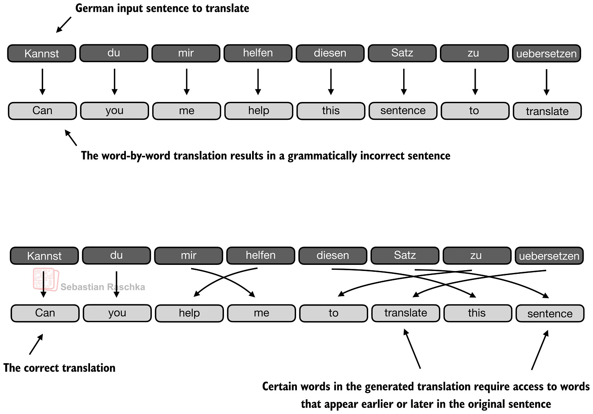

---

## 2) 기준점: Self-Attention / MHA
### 핵심 메커니즘
입력 임베딩 \(X\)를 통해
- \(Q = XW_Q\), \(K = XW_K\), \(V = XW_V\)
- score: \(QK^T\)
- 정규화: \(A = \text{softmax}(QK^T / \sqrt{d_k})\)
- 출력: \(Z = AV\)

디코더 LLM에서는 causal mask로 미래 토큰을 가린다. 길이 \(T\)일 때 attention 행렬은 기본적으로 \(T \times T\) 스케일을 가진다.

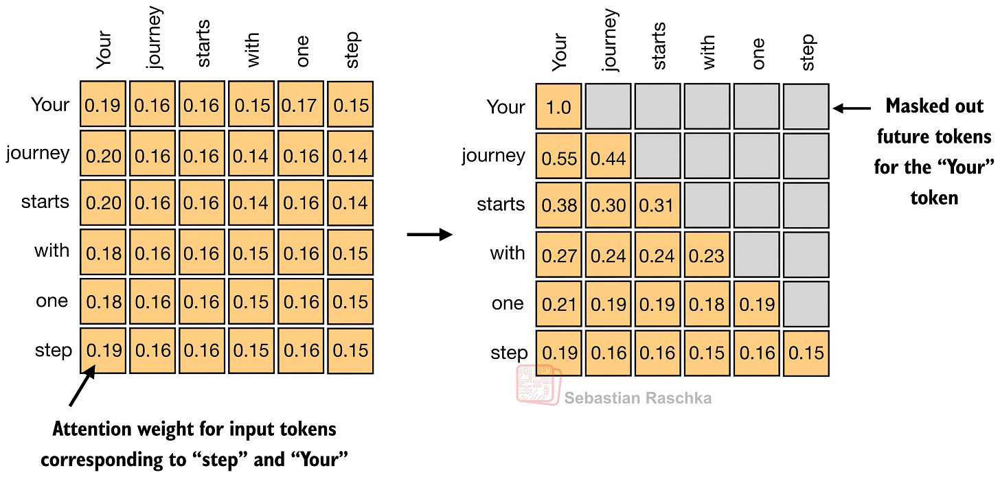

### MHA의 의미
MHA는 위 연산을 여러 head에서 병렬 수행해 서로 다른 관계(국소 의존, 의미적 연관, 구문 등)를 학습한다. 정확도 관점에서 강력하지만, 긴 컨텍스트 추론 시 KV 저장/대역폭 비용이 커진다.

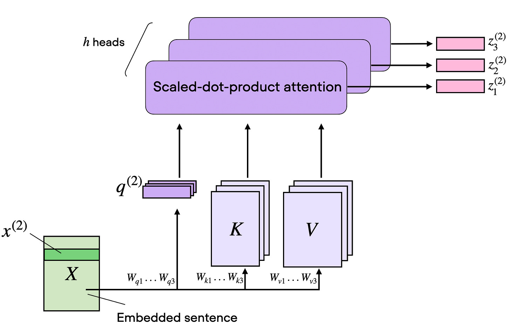

**장점**: 표현력 높고 표준적, 성숙한 생태계  
**단점**: 장문맥에서 메모리/연산 부담 큼

---

## 3) GQA (Grouped-Query Attention)
### 아이디어
MHA처럼 query head는 여러 개 유지하되, **여러 query head가 key/value를 공유**한다. 즉 K/V head 수를 줄인다.

- MHA: 각 Q head가 사실상 독립 K/V를 가짐
- GQA: 여러 Q head → 소수의 K/V 그룹 공유
- 극단: K/V를 1그룹으로 만들면 MQA(더 저렴하지만 품질 저하 위험 증가)

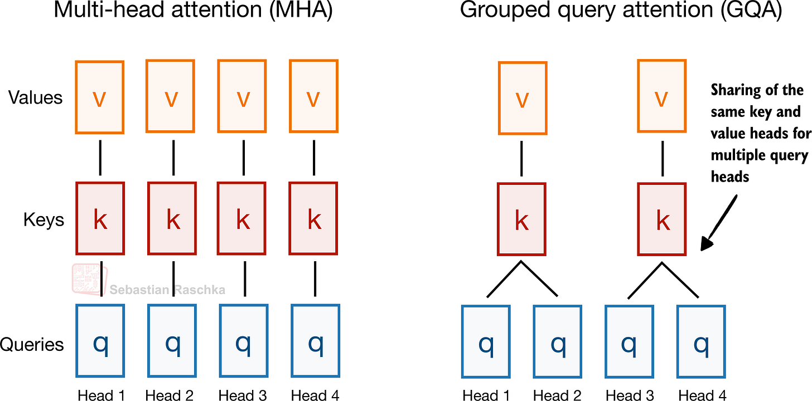

### 왜 많이 쓰이나
- **KV-cache 절감**이 매우 크고, 시퀀스 길이가 길수록 이득이 커진다.
- MHA 대비 구현 변경이 크지 않다.
- MLA 대비 **구현·학습 난이도 낮고 안정적**.

### 트레이드오프
- K/V 공유를 과하게 하면 모델링 성능 하락 가능
- 실무적으로는 MHA와 MQA 사이의 중간 지점(적절한 group 수)이 sweet spot

**요약**: “복잡도 대비 효율”이 좋아 여전히 사실상 표준 선택지.

---

## 4) MLA (Multi-head Latent Attention)
### 아이디어
GQA가 “head 공유”로 비용을 줄인다면, MLA는 **캐시 저장 자체를 잠재표현(latent)으로 압축**해 줄인다.

- GQA: K/V의 **개수**를 줄임
- MLA: 저장되는 K/V의 **표현 차원/형태**를 압축

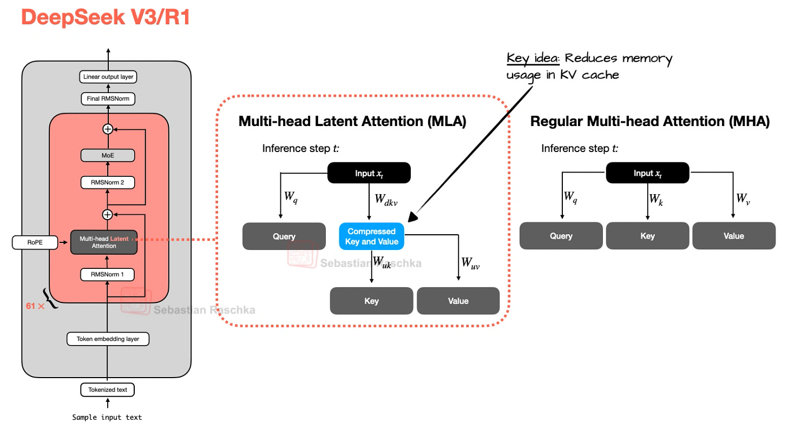

### 장점
- 대규모/장문맥에서 KV 병목이 큰 환경에서 매우 매력적
- DeepSeek-V2 계열 ablation에서, 동일 효율대에서 GQA보다 성능 유지가 좋거나 MHA를 넘는 사례가 제시됨(튜닝 전제)

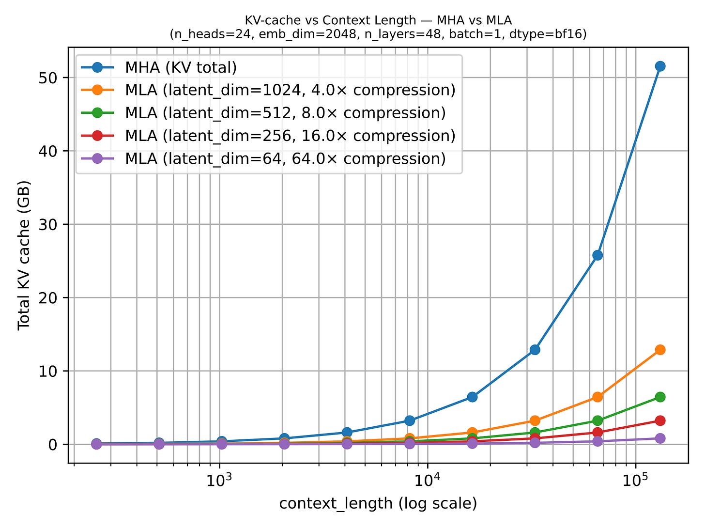

### 단점
- 구현/서빙 스택이 복잡
- 작은 모델(글에서 언급된 경험칙: 대략 100B 미만)에서는 GQA가 더 다루기 쉬울 수 있음

**요약**: 대형 모델로 갈수록 “복잡하지만 강력한” 업그레이드 경로.

---

## 5) SWA (Sliding Window Attention)
### 아이디어
각 토큰이 전체 prefix 대신 **최근 고정 창(window)** 만 보게 한다(로컬 어텐션).

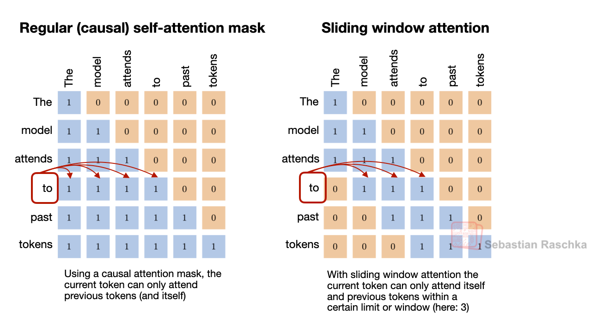

### 실전 포인트
“SWA를 쓴다”보다 중요한 것은:
1. **local:global 층 비율** (예: 5:1, 3:1)
2. **window 크기** (예: 1024 vs 128)

이 두 knob로 비용-성능 균형을 조절한다.

### 장단점
- 장점: 긴 문맥 비용 큰 폭 절감
- 단점: 전역 정보 회수가 어려워질 수 있어 global layer를 주기적으로 섞는 설계가 흔함

### GQA와의 관계
SWA는 “얼마나 많은 과거 토큰을 볼지”를 줄이고, GQA는 “토큰당 KV 저장량”을 줄이므로 상호보완적이다. 실제로 동시 채택 사례가 많다.

---

## 6) DeepSeek Sparse Attention
### SWA와의 공통점/차이
- 공통점: 전체 prefix가 아니라 **부분집합**만 본다.
- 차이점: SWA는 “최근 window”를 **하드코딩**, DeepSeek Sparse는 **학습 기반 선택**.

### 메커니즘(글 기준)
1. **Lightning Indexer**가 과거 토큰 relevance를 점수화
2. **Token Selector**가 상위 토큰(top-k 등)만 남겨 sparse mask 구성

즉, “로컬이라서 본다”가 아니라 “중요해서 본다”에 가깝다.

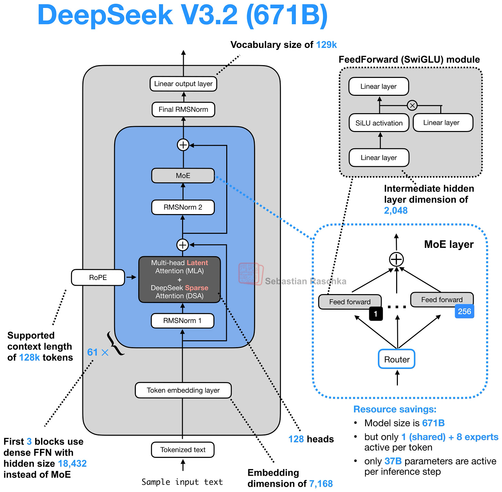

### MLA와의 결합 의미
- MLA: 캐시 표현 압축(무엇을 저장)
- Sparse: 참조 패턴 희소화(어디를 볼지)

서로 다른 축 최적화라 결합 시 장문맥 비용 절감 효과가 누적된다.

---

## 7) Gated Attention
Gated Attention은 독립 계열이라기보다, **풀 어텐션 블록을 안정화/제어하는 개조형**에 가깝다.

주요 변경:
- attention 출력에 **output gate** 적용(잔차 합류 전 스케일 제어)
- q/k 정규화에서 zero-centered QK-Norm 변형 사용
- partial RoPE

핵심은 MLA처럼 구조를 갈아엎는 것이 아니라, 하이브리드 스택 내 “남겨둔 풀 어텐션 층”을 더 예측 가능하게 만드는 것.

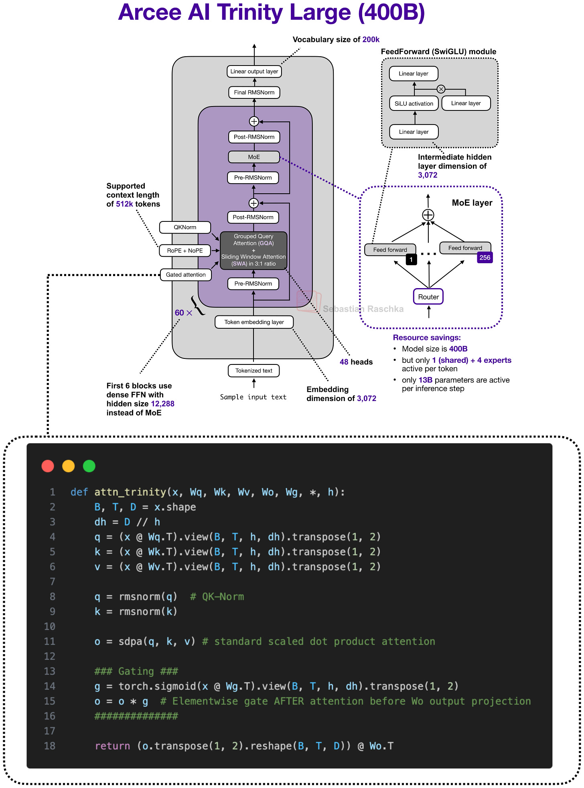

---

## 8) Hybrid Attention (최근 큰 흐름)
### 개념
하이브리드는 하나의 메커니즘이 아니라 **아키텍처 패턴**이다.
- 비싼 full attention 층은 소수 유지
- 다수 층은 선형/재귀/상태공간 계열 모듈로 대체

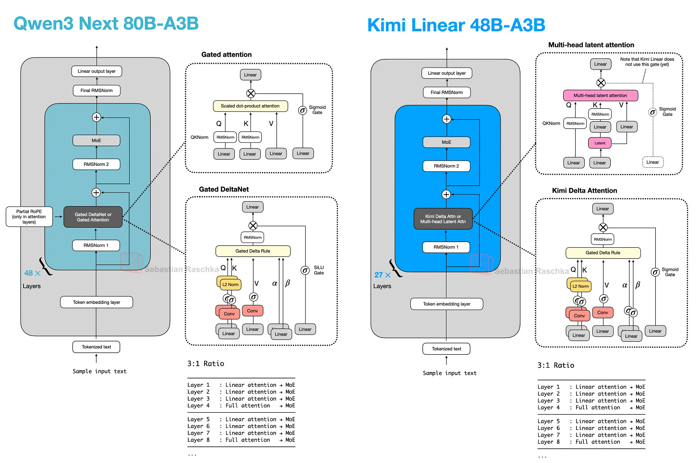

### 대표 패턴
- Qwen3-Next/3.5: (대체로) **3:1** 비율로 경량 블록 + Gated Attention
- Kimi Linear: 경량 측을 Kimi Delta Attention으로, 무거운 측을 gated MLA로 교체
- Ling 2.5: 경량 측을 Lightning Attention, 무거운 측은 MLA
- Nemotron: 더 과감하게 Mamba-2 중심 + 소수 attention 층

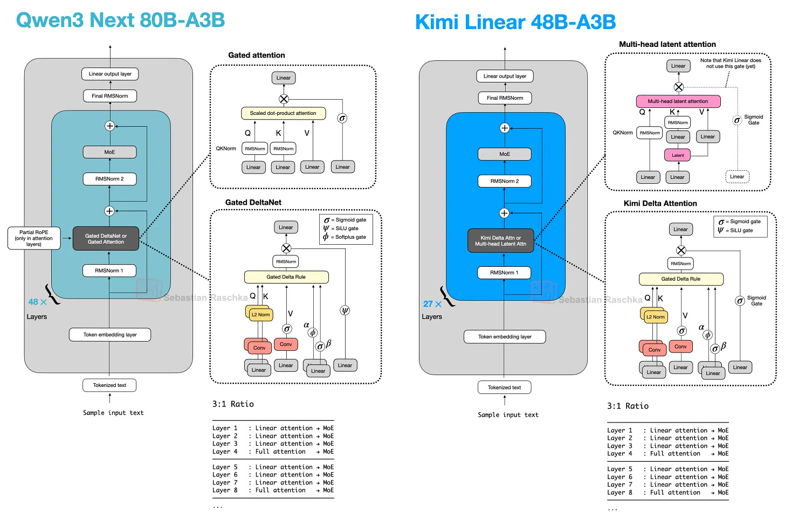
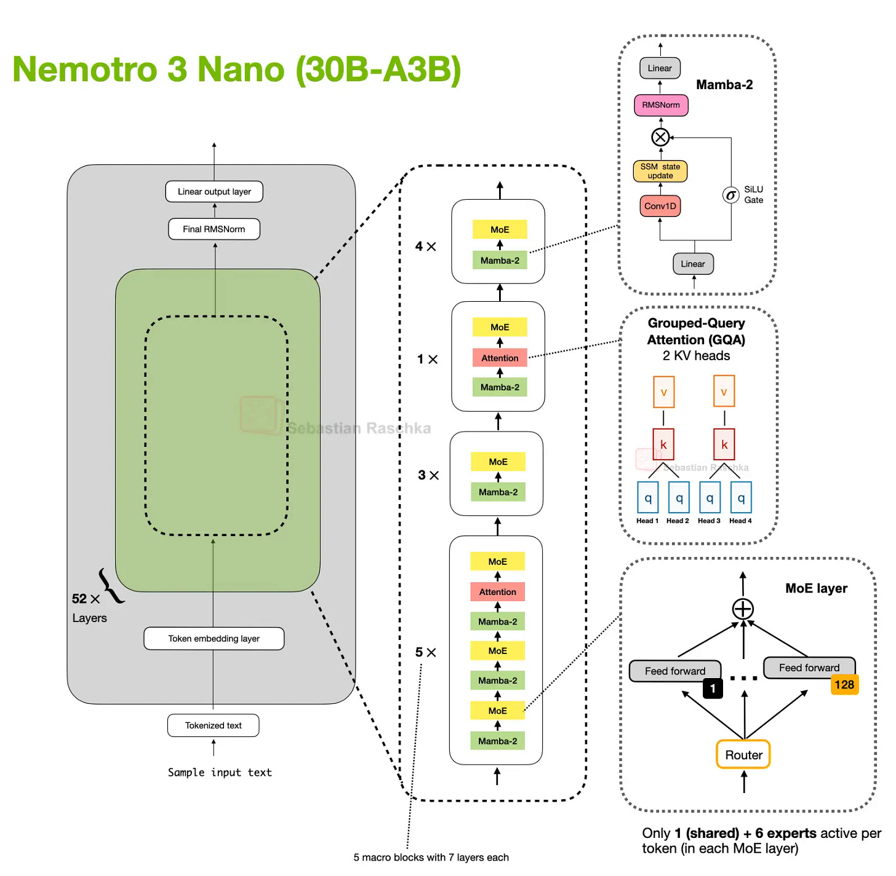

### 핵심 트레이드오프
- 장점: 컨텍스트 길이가 늘수록 메모리/연산 증가율 완화, 고처리량 목표에 유리
- 단점: 정확한 retrieval 성능/스택 성숙도/서빙 최적화에서 아직 변동성 존재

저자 관점도 동일: 하이브리드는 매우 유망하지만, 로컬 추론에서는 전통적 GQA 기반 스택이 토큰 처리량에서 유리한 경우가 여전히 있다.

---

## 9) 변형별 비교 요약 (실무 관점)
- **MHA**: 정확도 기준선, 장문맥 비용 큼
- **GQA**: 가장 실용적인 기본 효율화(안정·단순)
- **MLA**: 대규모에서 강력한 고급 효율화(복잡)
- **SWA**: 로컬 창 기반 비용 절감, 비율/창 크기 튜닝 핵심
- **DeepSeek Sparse**: 학습 기반 토큰 선택 희소화(신규·복잡)
- **Gated Attention**: 하이브리드 내 잔존 full attention 안정화
- **Hybrid**: 미래 지향적 큰 방향(효율 우선), 다만 스택 성숙도는 진행 중

---

## 10) 실전 적용 체크리스트
1. **중소형/빠른 제품화**: GQA + (필요 시) SWA부터 시작
2. **초장문맥/초대형 모델**: MLA(+Sparse) 후보 검토
3. **서빙 난이도 허용 가능 여부**: 복잡도(MLA/Hybrid) 대비 이득 검증
4. **평가셋 구성**: 단순 벤치마크 외 장문맥 retrieval·latency·메모리 동시 측정
5. **아키텍처 선택 기준**: “이론상 최고”보다, 데이터/인프라/지연 목표에 맞는 “학습된 모델”의 실제 성능

---

## 한 줄 결론
현재의 어텐션 진화는 “새로운 마법 레이어” 경쟁이라기보다, **장문맥 시대의 비용 병목을 어디서 줄일지**에 대한 체계적 분업(저장/참조/층구성)으로 수렴하고 있다.
