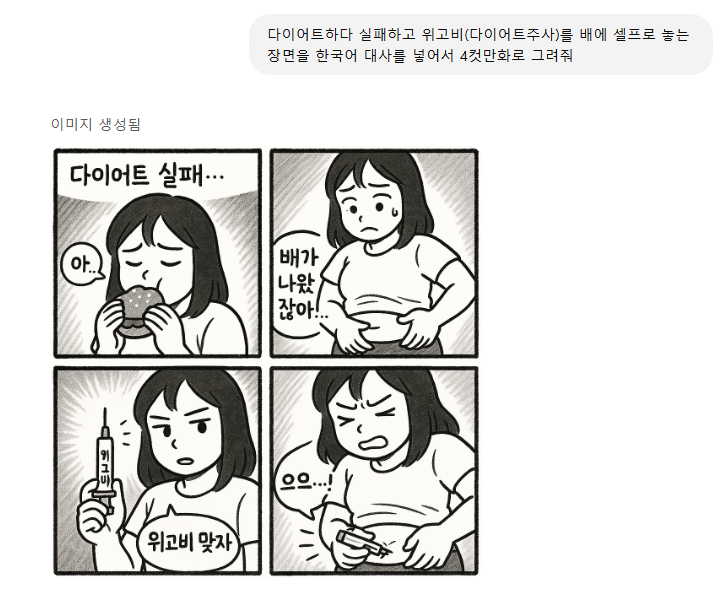

# 웹툰이(Webtooni)로 자동으로 캐릭터 만들기

> 참고: [Webtooni](https://webtooni.com) - AI 캐릭터 생성 서비스

웹툰이는 자연어 프롬프트를 입력하면 다양한 스타일의 캐릭터를 자동으로 생성해주는 AI 서비스입니다.

---

## 🎨 캐릭터 스타일 옵션

### 🔹 표정 (Facial Expressions)

- bright smiling
- slightly embarrassed
- winking
- surprised
- confused
- serious look
- sleepy eyes
- laughing with eyes closed

### 🔹 포즈 (Pose / Gesture)

- peace sign ✌️
- waving hand
- hand on chin (thinking)
- arms crossed
- holding a book
- reaching forward
- resting head on hand
- jumping in the air

### 🔹 의상 (Outfit)

- school uniform
- hoodie and jeans
- formal suit
- summer casual (short sleeves, shorts)
- winter coat and scarf
- apron (cooking style)
- lab coat (science/AI vibe)
- sportswear

### 🔹 배경 (Background)

- school classroom
- cherry blossom trees
- night city lights
- sunny park
- café setting
- cozy bedroom
- futuristic AI lab
- on a stage (presentation or performance)

### 🔹 아이템/소품 (Props)

- laptop
- headphones
- coffee cup
- sketchbook
- backpack
- smartphone
- robot assistant
- camera

### 🔹 스타일/무드 (Style / Mood)

- dreamy atmosphere
- soft pastel colors
- bold & vivid lighting
- watercolor texture
- comic book style
- retro anime feel
- minimal flat design

---

## 🎯 캐릭터 생성 프로세스

### 1. 4컷 만화 그리기

프롬프트에 캐릭터의 4장의 일러스트를 생성해달라고 요청합니다.

{width=600}

### 2. 투명 이미지 만들기

생성된 일러스트에서 투명 배경을 추출합니다.

{width=600}

### 3. 텍스트 레이어링

텍스트를 캐릭터에 자연스럽게 배치합니다.

{width=600}

### 4. 스케치 (Sketch)

캐릭터의 초기 스케치를 생성합니다.

{width=600}

### 5. 디테일드 디렉션 (Detailed Directions)

구체적인 디테일을 지시합니다:

```
1. 파란색 별 ⭐
2. 빨간색 삼각형 🔺
3. 초록색 사각형 ⬛
4. 분홍색 원 ⭕
5. 주황색 모래시계 ⏳
6. 보라색 무한 기호 ♾
7. ...
8. 부리부리 눈 👀
9. 엄지척 손가락 👍
10. 가위 ✂️
11. 파란색과 흰색 기린 🦒
12. "openAI"를 필기체로 작성
```

{width=600}

### 6. 캐릭터 일관성 유지

동일한 캐릭터가 여러 장면에서 등장하도록 요청합니다.

{width=600}

### 7. 완성된 캐릭터

최종적으로 완성된 캐릭터 이미지를 받습니다.

---

## 💡 팁

- **자연어 사용:** "화려한 학교 교복을 입고 웃는 소녀 캐릭터" 같이 구체적으로 묘사
- **참고 이미지 제공:** 원하는 스타일이 있다면 참고 이미지를 함께 제공
- **스타일 조합:** 여러 스타일 요소를 섞어 독착적인 캐릭터 생성
- **반복 생성:** 여러 버전을 만들어서 최고 결과물 선택

---

## 📝 결론

웹툰이는 자연어 프롬프트만으로 쉽게 다양한 스타일의 캐릭터를 생성할 수 있는 강력한 AI 도구입니다.

---

_작성일: 2025년 3월 26일_
