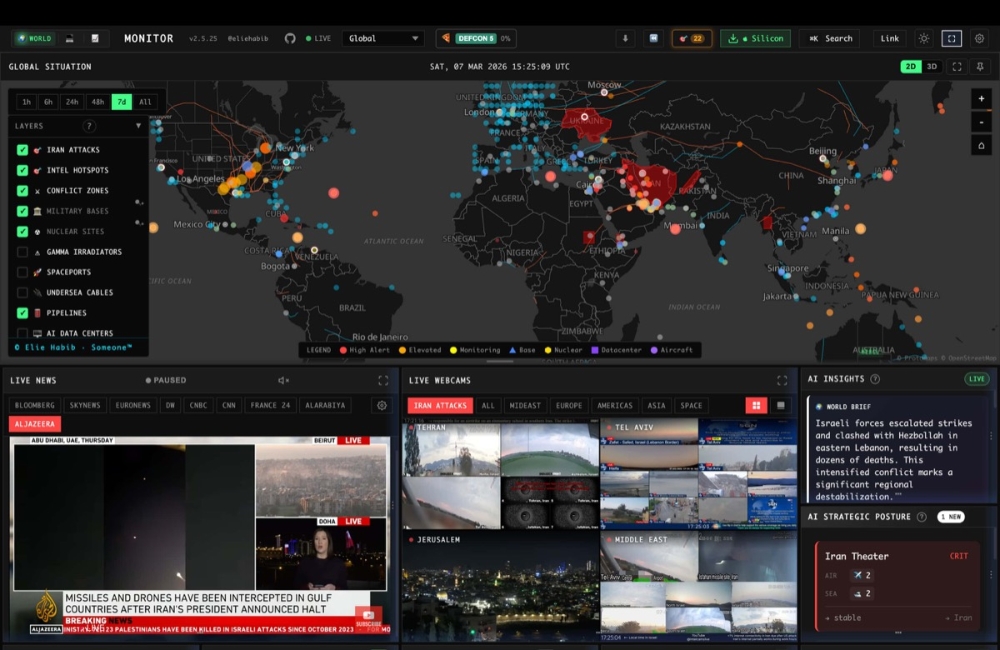
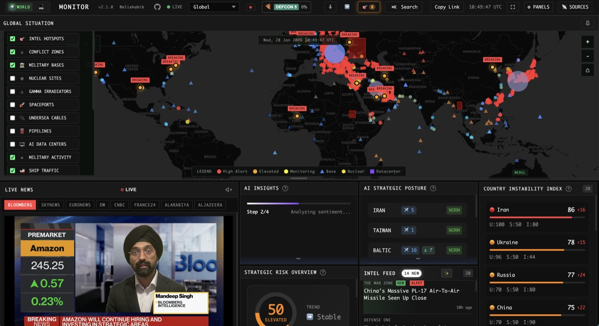

1. 월가에서 트레이더 한 명당 연 2만 4천 달러를 찍고 있는 기계가 있음. 블룸버그 터미널임. 원화로 연 3,300만원. 검정 바탕에 주황색 글씨, 마이클 블룸버그가 1981년부터 밀어붙인 그 단말기.

2. 전 세계 약 32만 명이 이걸 씀. 골드만삭스, JP모건, 헤지펀드, 중앙은행, IMF 다 이걸로 봄. 사실상 독점임. 리프닉스(현 런던증권거래소 Eikon) 정도가 경쟁자고, 나머지는 규모가 안 됨.

3. 근데 2026년 4월 현재 깃헙에 별 5만 개를 받은 오픈소스 프로젝트가 하나 있음. 이름은 worldmonitor. 실시간 글로벌 인텔리전스 대시보드를 무료로 풀어둠.

4. 만든 사람은 Elie Habib. 라이선스는 AGPL-3.0. 개인·연구·교육용은 그냥 공짜. 상업용으로 쓰려면 별도 계약이 필요함. 웹 앱, 맥·윈도우·리눅스 데스크톱 앱까지 다 있음.

5. 구성부터 봄. 500+개 뉴스 피드를 15개 카테고리로 AI가 요약해서 일일 브리프로 만들어줌. 3D 지구본이랑 WebGL 평면 지도 2개 엔진 위에 45개 데이터 레이어를 깔아둠. 지정학·군사·인프라·교통·자연재해가 한 화면에 들어옴.

6. 무기·경제·재난·위기 신호가 서로 수렴할 때 경고를 띄움. 국가별 불안정 지수는 12개 시그널 카테고리를 합성해서 점수로 매김. 팔란티어 느낌의 상황실 UI를 브라우저에서 구현해둔 거임.

7. 본토 Bloomberg 갬성 궁금한 사람을 위해 변형 사이트까지 다섯 개로 쪼개놨음. world / tech / finance / commodity / happy. 주식 관심사면 `finance.worldmonitor.app` 하나만 봐도 됨.

8. 금융 관련 숫자부터 까봄. 92개 주식 거래소, SPDR 섹터 11개, 원자재·암호화폐·ETF 다 들어감. 스테이블코인 5종(USDT, USDC, DAI, FDUSD, USDe)이랑 비트코인 현물 ETF 10종(IBIT, FBTC, ARKB, BITB 등)을 각각 2분·15분 캐시 주기로 추적함.

9. 시장 컴포짓 신호가 7개임. 유동성(JPY/USD 30일 변화율), 흐름 구조(BTC vs QQQ 5일 수익률), 거시 체제(QQQ vs XLP 20일 ROC), 기술 트렌드(BTC vs SMA50 + 30일 VWAP), 해시레이트 30일 변화, 채굴 비용 기준선, 공포-탐욕 지수. 블룸버그에서 여러 함수 나눠 쳐서 조합해야 나오는 수치를 한 화면에 묶어줌.

10. 중앙은행 13개 정책금리, BIS 원천 거시 데이터, 걸프 6개국(GCC) 경제지수, 64개 해외직접투자 프로젝트 추적, 9개 전략 해협 공급망 위험. 거시 투자자 관점에서 꽤 촘촘함.

11. AI가 들어가는 포인트가 재미있음. Ollama, Groq, OpenRouter 중 하나 골라서 붙일 수 있음. Ollama로 돌리면 API 키 없이 내 맥북에서 LLM이 돌면서 뉴스 요약·전략 포스처 해석·시장 브리프를 다 뽑아줌. 데이터가 외부로 안 나감.

12. Transformers.js로 브라우저 안에서 임베딩까지 돌리게 짰음. 개인 정보가 민감한 금융 업무에선 이게 꽤 큼. 블룸버그는 모든 쿼리가 블룸버그 서버로 감.

13. 근데 여기서 솔직해질 필요가 있음. 이게 블룸버그 터미널을 진짜 대체하냐? 대답은 "대체는 아니고, 상당 부분 겹침" 정도가 정확함.

14. 블룸버그가 단순 정보 단말기가 아님. 레벨2 호가창, 실시간 체결 데이터, Eikon 수준의 공시·법률문서 DB, 브로커 직통 IB 메신저, 주문 집행 터미널(EMSX), 신용 스프레드 프라이싱이 한 세트로 묶여 있음. worldmonitor는 여기서 정보·분석 레이어만 덮는 거임.

15. 구체적으로 뭐가 빠졌냐면 실시간 L2 호가·체결 데이터 없음, 주문 집행 없음, BBG 메신저·IB 채팅 없음, 채권·파생 프라이싱 라이브러리 없음, 공시·소송 문서 풀텍스트 검색 없음, 규제 감사 로그 없음. 이게 블룸버그가 비싼 진짜 이유임.

16. 반대로 worldmonitor가 더 강한 지점도 있음. 지정학 이벤트 시각화, AI 기반 크로스 스트림 상관(전쟁 뉴스 + 유가 + 스트레이트 해상 지연이 동시에 움직일 때 경고), 지구본 UI, 62개 전략 항구·86개 해저케이블·88개 파이프라인 같은 인프라 레이어. 블룸버그에선 이 그림을 이렇게 못 봄.

17. 그래서 타겟이 갈림. 프로 기관 트레이더가 블룸버그 빼고 이걸 쓰는 건 불가능. 체결 안 됨. 그러나 리테일 개인 투자자, 애널리스트, 거시 리서처, 크립토·커머디티 매크로 보는 사람, 대학원 연구자한테는 충분함. 솔직히 남음.

18. 특히 한국 개인 투자자가 3,300만원 찍을 이유는 0에 가까움. 내 포트폴리오가 100억 안쪽이면 블룸버그 비용이 수익률을 다 갉아먹음. worldmonitor + 증권사 MTS + TradingView 조합이 현실적임.

19. 설치는 3줄임. `git clone https://github.com/koala73/worldmonitor.git` → `cd worldmonitor && npm install` → `npm run dev`. 기본 작동에는 환경 변수 하나도 안 필요함. 바로 localhost:5173으로 뜸.

20. 데스크톱 앱을 쓰고 싶으면 worldmonitor.app에서 Windows exe, 맥 Apple Silicon/Intel, 리눅스 AppImage 각각 다운로드 링크가 있음. Tauri 2(Rust)로 만들어서 일렉트론보다 훨씬 가벼움.

21. 블룸버그의 법률·집행·전문가 네트워크 영역은 그대로 남음. 하지만 정보 취합·시각화·AI 요약 영역에서 오픈소스가 상용 단말기랑 맞붙는 장면이 처음으로 제대로 연출되고 있음.

22. 30년간 통신망 기반 독점이었던 시장이 AI랑 오픈소스 앞에서 한 번은 흔들릴 수 있다는 신호임. 개인 투자자 입장에선 일단 한 번 켜 볼 이유가 충분함. 공짜인데 안 써볼 이유가 없음.
